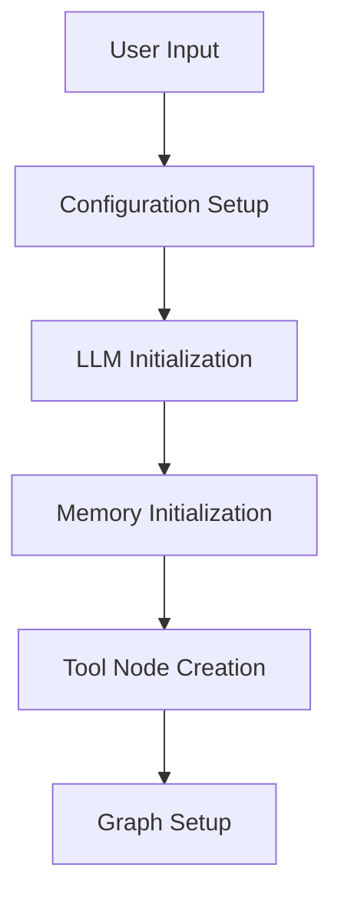
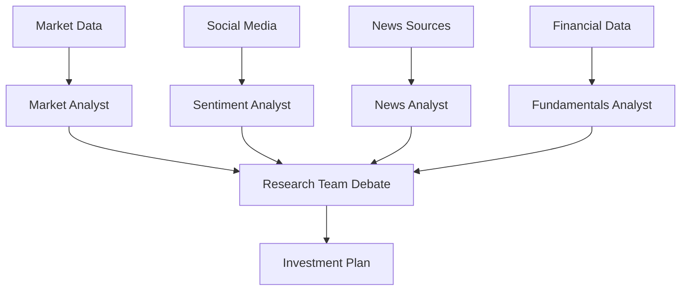
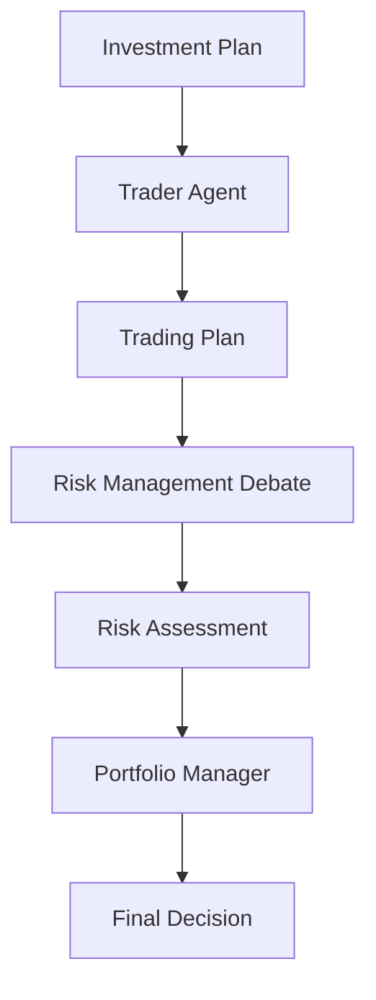

# TradingAgents: Comprehensive Technical Documentation

## Table of Contents
1. [Project Overview](#project-overview)
2. [Architecture & Design Patterns](#architecture--design-patterns)
3. [Technology Stack](#technology-stack)
4. [System Components](#system-components)
5. [Data Flow & Workflow](#data-flow--workflow)
6. [Configuration Management](#configuration-management)
7. [API & Integration](#api--integration)
8. [Development Patterns](#development-patterns)
9. [Deployment & Scaling](#deployment--scaling)
10. [Troubleshooting](#troubleshooting)

---

## Project Overview

TradingAgents is a sophisticated multi-agent trading framework that simulates the collaborative decision-making process of a real-world trading firm. The system employs specialized LLM-powered agents that work together to analyze market conditions, debate investment strategies, and make informed trading decisions.

### Key Features
- **Multi-Agent Architecture**: Specialized agents for different aspects of trading analysis
- **Collaborative Decision Making**: Agents engage in structured debates and discussions
- **Real-time & Historical Data**: Integrates multiple data sources for comprehensive analysis
- **Modular Design**: Easily extensible and configurable components
- **Research-Focused**: Designed for academic and research purposes

---

## Architecture & Design Patterns

### 1. Multi-Agent System (MAS) Pattern
The core architecture follows a Multi-Agent System pattern where autonomous agents collaborate to achieve a common goal:

```
┌─────────────────────────────────────────────────────────┐
│                 TradingAgentsGraph                      │
│  ┌─────────────┐  ┌─────────────┐  ┌─────────────┐     │
│  │   Analyst   │  │ Researcher  │  │   Trader    │     │
│  │    Team     │→ │    Team     │→ │   Agent     │     │
│  └─────────────┘  └─────────────┘  └─────────────┘     │
│         │                                    │         │
│         ▼                                    ▼         │
│  ┌─────────────┐                    ┌─────────────┐     │
│  │ Risk Mgmt   │◄───────────────────│ Portfolio   │     │
│  │    Team     │                    │  Manager    │     │
│  └─────────────┘                    └─────────────┘     │
└─────────────────────────────────────────────────────────┘
```

### 2. State Machine Pattern
The system uses LangGraph's state machine pattern to manage the flow between different agent interactions:

```python
class AgentState(MessagesState):
    company_of_interest: str
    trade_date: str
    market_report: str
    sentiment_report: str
    news_report: str
    fundamentals_report: str
    investment_plan: str
    trader_investment_plan: str
    final_trade_decision: str
```

### 3. Strategy Pattern
Different LLM providers are supported through the Strategy pattern:

```python
# LLM Provider Strategy
if config["llm_provider"].lower() == "openai":
    self.deep_thinking_llm = ChatOpenAI(...)
elif config["llm_provider"].lower() == "anthropic":
    self.deep_thinking_llm = ChatAnthropic(...)
elif config["llm_provider"].lower() == "google":
    self.deep_thinking_llm = ChatGoogleGenerativeAI(...)
```

### 4. Observer Pattern
The CLI implements an observer pattern for real-time status updates:

```python
class MessageBuffer:
    def update_agent_status(self, agent, status):
        if agent in self.agent_status:
            self.agent_status[agent] = status
            self.current_agent = agent
```

### 5. Factory Pattern
Tool nodes are created using the Factory pattern for different data sources:

```python
def _create_tool_nodes(self) -> Dict[str, ToolNode]:
    return {
        "market": ToolNode([...]),
        "social": ToolNode([...]),
        "news": ToolNode([...]),
        "fundamentals": ToolNode([...]),
    }
```

---

## Technology Stack

### Core Framework
- **Python 3.10+**: Primary programming language
- **LangGraph 0.4.8**: Multi-agent orchestration framework
- **LangChain 0.3.25**: LLM integration and chaining

### Large Language Models
- **OpenAI GPT-4o/GPT-4o-mini**: Quick thinking agents
- **OpenAI o1/o3**: Deep thinking agents
- **Anthropic Claude**: Alternative LLM provider
- **Google Gemini**: Alternative LLM provider

### Data Sources & APIs
- **Yahoo Finance (yfinance)**: Stock price data
- **Finnhub**: Financial news and insider data
- **Reddit API (PRAW)**: Social sentiment analysis
- **Google News**: Global news aggregation
- **StockStats**: Technical indicators

### Data Management
- **Pandas**: Data manipulation and analysis
- **ChromaDB**: Vector database for memory storage
- **Redis**: Caching and session management

### Development Tools
- **Rich**: CLI interface and formatting
- **Typer**: Command-line interface framework
- **Questionary**: Interactive CLI prompts
- **TQDM**: Progress bars
- **UV**: Package management

### Deployment
- **Docker**: Containerization
- **Chainlit**: Web interface
- **FastAPI**: API endpoints (implied in dependencies)

---

## System Components

### 1. Agent Hierarchy

#### Analyst Team
```
tradingagents/agents/analysts/
├── market_analyst.py          # Technical analysis
├── news_analyst.py           # News impact analysis
├── social_media_analyst.py   # Sentiment analysis
└── fundamentals_analyst.py   # Financial metrics analysis
```

#### Research Team
```
tradingagents/agents/researchers/
├── bull_researcher.py        # Bullish perspective
└── bear_researcher.py        # Bearish perspective
```

#### Management Team
```
tradingagents/agents/managers/
├── research_manager.py       # Coordinates research debate
└── risk_manager.py          # Risk assessment
```

#### Trading Team
```
tradingagents/agents/trader/
└── trader.py                # Makes trading decisions
```

#### Risk Management Team
```
tradingagents/agents/risk_mgmt/
├── aggressive_debator.py    # High-risk perspective
├── conservative_debator.py  # Low-risk perspective
└── neutral_debator.py       # Balanced perspective
```

### 2. Data Flow Components

#### Data Interfaces
```
tradingagents/dataflows/
├── interface.py              # Main data access layer
├── yfin_utils.py            # Yahoo Finance integration
├── finnhub_utils.py         # Finnhub API integration
├── reddit_utils.py          # Reddit API integration
├── googlenews_utils.py      # Google News integration
└── stockstats_utils.py      # Technical indicators
```

#### Configuration Management
```
tradingagents/
├── default_config.py        # Default configuration
└── dataflows/config.py      # Runtime configuration
```

### 3. Graph Orchestration

#### Core Graph Components
```
tradingagents/graph/
├── trading_graph.py         # Main orchestration class
├── setup.py                 # Graph setup and initialization
├── conditional_logic.py     # Decision routing logic
├── propagation.py           # State propagation
├── reflection.py            # Agent reflection capabilities
└── signal_processing.py     # Trading signal processing
```

---

## Data Flow & Workflow

### 1. Initialization Phase


### 2. Analysis Phase


### 3. Decision Phase


### 4. Execution Flow

#### Step 1: Data Collection
```python
# Each analyst collects relevant data
market_data = toolkit.get_YFin_data_online(ticker, start_date, end_date)
news_data = toolkit.get_finnhub_news(ticker, curr_date, lookback_days)
social_data = toolkit.get_reddit_stock_info(ticker, curr_date)
```

#### Step 2: Analysis & Reporting
```python
# Analysts generate reports
market_report = market_analyst.analyze(market_data)
sentiment_report = sentiment_analyst.analyze(social_data)
news_report = news_analyst.analyze(news_data)
fundamentals_report = fundamentals_analyst.analyze(financial_data)
```

#### Step 3: Research Debate
```python
# Bull vs Bear debate
investment_debate_state = InvestDebateState(
    bull_history="",
    bear_history="",
    history="",
    current_response="",
    judge_decision="",
    count=0
)
```

#### Step 4: Trading Decision
```python
# Trader makes investment plan
trader_plan = trader.create_plan(investment_plan, market_context)
```

#### Step 5: Risk Assessment
```python
# Risk management team evaluates
risk_debate_state = RiskDebateState(
    risky_history="",
    safe_history="",
    neutral_history="",
    judge_decision="",
    count=0
)
```

#### Step 6: Final Decision
```python
# Portfolio manager makes final call
final_decision = portfolio_manager.decide(trader_plan, risk_assessment)
```

---

## Configuration Management

### 1. Environment Variables
```bash
# Required API Keys
OPENAI_API_KEY=your_openai_api_key
FINNHUB_API_KEY=your_finnhub_api_key

# Optional Environment Variables
TRADINGAGENTS_RESULTS_DIR=./results
ANTHROPIC_API_KEY=your_anthropic_key
GOOGLE_API_KEY=your_google_key
```

### 2. Default Configuration
```python
DEFAULT_CONFIG = {
    "project_dir": "path/to/project",
    "results_dir": "./results",
    "data_dir": "path/to/data",
    "data_cache_dir": "path/to/cache",
    
    # LLM settings
    "llm_provider": "openai",
    "deep_think_llm": "o1-preview",
    "quick_think_llm": "gpt-4o",
    "backend_url": "https://api.openai.com/v1",
    
    # Debate settings
    "max_debate_rounds": 5,
    "max_risk_discuss_rounds": 5,
    "max_recur_limit": 100,
    
    # Tool settings
    "online_tools": True,
}
```

### 3. Runtime Configuration
```python
# Custom configuration example
config = DEFAULT_CONFIG.copy()
config.update({
    "deep_think_llm": "gpt-4o-mini",  # Cost-effective option
    "max_debate_rounds": 3,           # Faster execution
    "online_tools": False,            # Use cached data
})

# Initialize with custom config
ta = TradingAgentsGraph(config=config)
```

---

## API & Integration

### 1. Core API Interface
```python
from tradingagents.graph.trading_graph import TradingAgentsGraph

# Initialize
ta = TradingAgentsGraph(
    selected_analysts=["market", "social", "news", "fundamentals"],
    debug=True,
    config=config
)

# Execute analysis
final_state, decision = ta.propagate("AAPL", "2024-01-15")
```

### 2. CLI Interface
```bash
# Interactive CLI
python -m cli.main

# Available commands
python -m cli.main --help
```

### 3. Web Interface (Chainlit)
```python
# Chainlit integration for web interface
import chainlit as cl
from tradingagents.graph.trading_graph import TradingAgentsGraph

@cl.on_message
async def main(message: cl.Message):
    # Process trading request
    pass
```

### 4. Data Provider Integrations

#### Yahoo Finance
```python
def get_YFin_data_online(symbol, start_date, end_date):
    ticker = yf.Ticker(symbol)
    data = ticker.history(start=start_date, end=end_date)
    return data
```

#### Finnhub
```python
def get_finnhub_news(ticker, curr_date, look_back_days):
    # Fetch news data from Finnhub API
    pass
```

#### Reddit
```python
def get_reddit_stock_info(ticker, curr_date):
    # Fetch social sentiment from Reddit
    pass
```

---

## Development Patterns

### 1. Agent Development Pattern
```python
class BaseAgent:
    def __init__(self, llm, toolkit, memory):
        self.llm = llm
        self.toolkit = toolkit
        self.memory = memory
    
    def analyze(self, data):
        # Agent-specific analysis logic
        pass
    
    def generate_report(self, analysis):
        # Generate structured report
        pass
```

### 2. Memory Management Pattern
```python
class FinancialSituationMemory:
    def __init__(self, name, config):
        self.client = OpenAI(base_url=config["backend_url"])
        self.chroma_client = chromadb.Client()
        self.collection = self.chroma_client.create_collection(name=name)
    
    def add_situations(self, situations_and_advice):
        # Store financial situations and advice
        pass
    
    def retrieve_similar_situations(self, query):
        # Vector similarity search
        pass
```

### 3. Tool Integration Pattern
```python
class Toolkit:
    def __init__(self, config):
        self.config = config
        self.online_tools = config.get("online_tools", True)
    
    def get_data(self, source, *args, **kwargs):
        if self.online_tools:
            return self._get_online_data(source, *args, **kwargs)
        else:
            return self._get_cached_data(source, *args, **kwargs)
```

### 4. State Management Pattern
```python
def update_state(current_state, new_data):
    """Update agent state with new information"""
    updated_state = current_state.copy()
    updated_state.update(new_data)
    return updated_state
```

---

## Deployment & Scaling

### 1. Local Development
```bash
# Setup virtual environment
uv venv .venv
source .venv/bin/activate

# Install dependencies
uv sync

# Run CLI
python -m cli.main
```

### 2. Docker Deployment
```dockerfile
FROM python:3.10-slim

WORKDIR /app
COPY . .

RUN pip install -r requirements.txt

CMD ["python", "-m", "cli.main"]
```

### 3. Scaling Considerations

#### Horizontal Scaling
- Agent parallelization for multiple stocks
- Distributed data fetching
- Load balancing across multiple instances

#### Vertical Scaling
- Memory optimization for large datasets
- GPU acceleration for LLM inference
- Caching strategies for frequent data access

#### Performance Optimization
```python
# Concurrent data fetching
with ThreadPoolExecutor(max_workers=4) as executor:
    futures = [
        executor.submit(get_market_data, ticker),
        executor.submit(get_news_data, ticker),
        executor.submit(get_social_data, ticker),
        executor.submit(get_fundamentals_data, ticker)
    ]
    results = [future.result() for future in futures]
```

---

## Troubleshooting

### 1. Common Issues

#### API Key Issues
```bash
# Check environment variables
echo $OPENAI_API_KEY
echo $FINNHUB_API_KEY

# Load from .env file
source .env
```

#### Memory Issues
```python
# Monitor memory usage
import psutil
print(f"Memory usage: {psutil.Process().memory_info().rss / 1024 / 1024:.2f} MB")
```

#### Rate Limiting
```python
# Implement exponential backoff
import time
import random

def retry_with_backoff(func, max_retries=3):
    for attempt in range(max_retries):
        try:
            return func()
        except RateLimitError:
            wait_time = (2 ** attempt) + random.uniform(0, 1)
            time.sleep(wait_time)
    raise Exception("Max retries exceeded")
```

### 2. Debugging Tips

#### Enable Debug Mode
```python
ta = TradingAgentsGraph(debug=True, config=config)
```

#### Logging Configuration
```python
import logging
logging.basicConfig(level=logging.DEBUG)
```

#### State Inspection
```python
# Inspect intermediate states
for chunk in ta.graph.stream(initial_state):
    print(chunk)
```

### 3. Performance Monitoring

#### Execution Time Tracking
```python
import time

start_time = time.time()
final_state, decision = ta.propagate("AAPL", "2024-01-15")
execution_time = time.time() - start_time
print(f"Execution time: {execution_time:.2f} seconds")
```

#### Memory Profiling
```python
from memory_profiler import profile

@profile
def run_analysis():
    ta = TradingAgentsGraph()
    return ta.propagate("AAPL", "2024-01-15")
```

---

## Best Practices

### 1. Configuration Management
- Use environment variables for sensitive data
- Implement configuration validation
- Provide sensible defaults
- Document configuration options

### 2. Error Handling
- Implement comprehensive error handling
- Use structured logging
- Provide meaningful error messages
- Implement retry mechanisms

### 3. Testing
- Unit tests for individual agents
- Integration tests for the full pipeline
- Mock external API calls
- Performance testing

### 4. Security
- Never commit API keys to version control
- Use secure credential management
- Implement rate limiting
- Validate all inputs

### 5. Documentation
- Maintain up-to-date documentation
- Include code examples
- Document API changes
- Provide troubleshooting guides

---

This documentation provides a comprehensive overview of the TradingAgents framework, covering its architecture, technologies, design patterns, and operational aspects. The system represents a sophisticated approach to algorithmic trading using multi-agent AI systems, designed for research and educational purposes. 