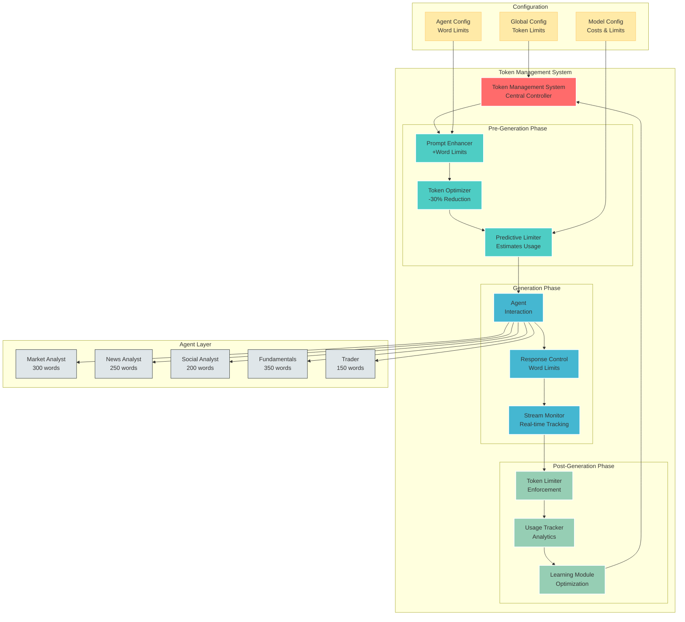
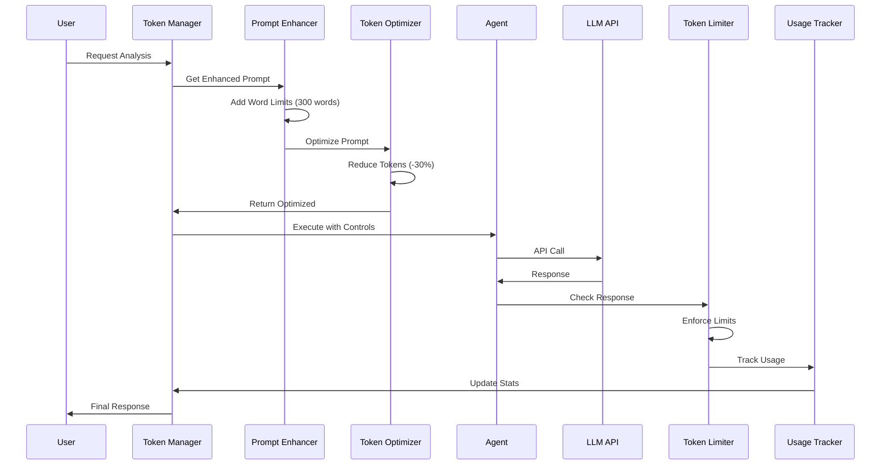
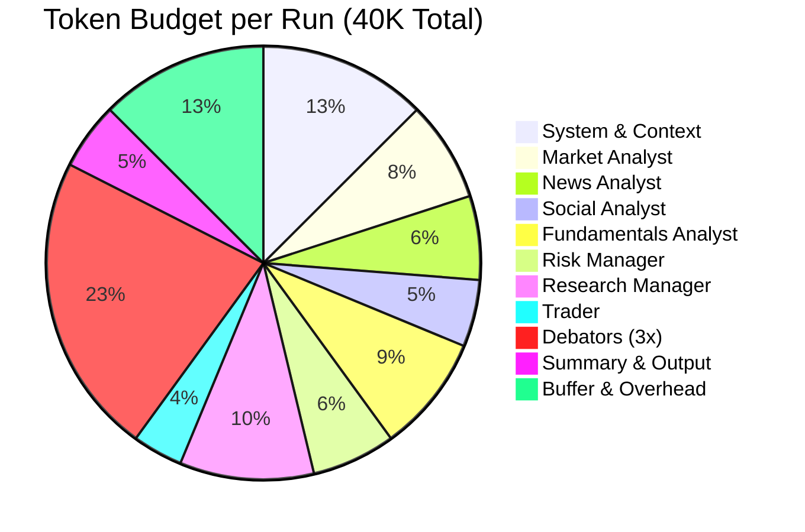
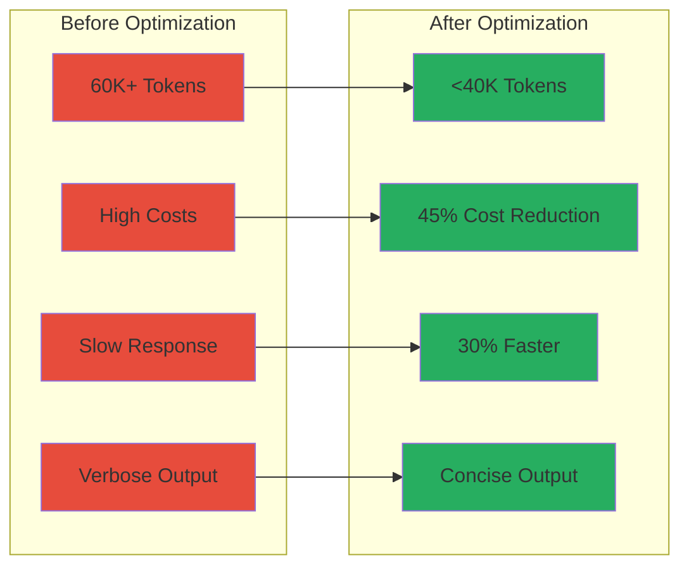

# Token Optimization Architecture

## System Architecture Diagram



## Component Interactions

### 1. Pre-Generation Phase Flow
```
User Request → Token Management System → Prompt Enhancer
                                     ↓
                              Token Optimizer
                                     ↓
                            Predictive Limiter
                                     ↓
                            Agent (with controls)
```

### 2. Generation Phase Flow
```
Agent Prompt (with word limits) → LLM API
                              ↓
                    Response Generation
                              ↓
                 Stream Monitor (real-time)
                              ↓
              Response Control Enforcement
```

### 3. Post-Generation Phase Flow
```
Generated Response → Token Limiter (if needed)
                 ↓
           Usage Tracker
                 ↓
        Learning Module
                 ↓
    Update Predictions
```

## Data Flow Diagram



## Token Budget Allocation



## Implementation Layers

### Layer 1: Infrastructure
- **Token Counting**: Tiktoken integration
- **Model Configuration**: Per-model limits and costs
- **Threading**: Async-safe operations
- **Caching**: Token count caching

### Layer 2: Optimization
- **Prompt Compression**: 25-30% reduction
- **Response Control**: Word limit enforcement
- **Context Trimming**: Smart message pruning
- **Batch Processing**: Multi-prompt optimization

### Layer 3: Intelligence
- **Predictive Modeling**: Response size estimation
- **Learning System**: Historical pattern analysis
- **Dynamic Adjustment**: Real-time limit tuning
- **Quality Preservation**: Accuracy monitoring

### Layer 4: Monitoring
- **Usage Analytics**: Token consumption tracking
- **Cost Analysis**: Real-time cost calculation
- **Alert System**: Threshold breach detection
- **Reporting**: Daily optimization reports

## Integration Points

### 1. Agent Integration
```python
# In each agent's node function
from agent.utils.agent_prompt_enhancer import enhance_agent_prompt
from agent.utils.token_optimizer import optimize_prompt_for_analyst

async def analyst_node(state):
    # Get base prompt
    base_prompt = get_analyst_prompt()
    
    # Enhance with word limits
    enhanced_prompt = enhance_agent_prompt(base_prompt, "market_analyst")
    
    # Optimize tokens
    optimized_prompt = optimize_prompt_for_analyst(enhanced_prompt, "market_analyst")
    
    # Execute with limits
    response = await llm.ainvoke(
        optimized_prompt,
        max_tokens=300  # Enforce at API level too
    )
```

### 2. Configuration Integration
```python
# config/token_management.py
from dataclasses import dataclass

@dataclass
class TokenConfig:
    max_total_tokens: int = 40000
    max_prompt_tokens: int = 8000
    max_response_tokens: int = 2000
    word_limit_compliance: float = 0.9
    optimization_target: float = 0.3
```

### 3. Monitoring Integration
```python
# monitoring/token_dashboard.py
class TokenDashboard:
    def display_metrics(self):
        return {
            "current_run": {
                "total_tokens": self.current_tokens,
                "vs_target": f"{(self.current_tokens / 40000) * 100:.1f}%",
                "agents_completed": self.agents_completed
            },
            "optimization": {
                "prompt_reduction": f"{self.prompt_reduction:.1f}%",
                "response_compliance": f"{self.word_compliance:.1f}%"
            }
        }
```

## Success Metrics Visualization



## Deployment Strategy

### Phase 1: Foundation (Week 1)
- Deploy Prompt Enhancer
- Update agent prompts with word limits
- Basic monitoring

### Phase 2: Optimization (Week 2)
- Integrate Token Optimizer
- Deploy Predictive Limiter
- A/B testing

### Phase 3: Intelligence (Week 3)
- Learning system activation
- Dynamic adjustment
- Quality validation

### Phase 4: Scale (Week 4)
- Full production deployment
- Dashboard and alerts
- Continuous optimization

## Risk Matrix

| Risk | Impact | Probability | Mitigation |
|------|--------|-------------|------------|
| Quality Loss | High | Low | Quality metrics, fallback mode |
| Integration Issues | Medium | Medium | Gradual rollout, testing |
| Model Changes | Medium | Low | Configurable limits |
| Performance Impact | Low | Low | Async operations, caching |