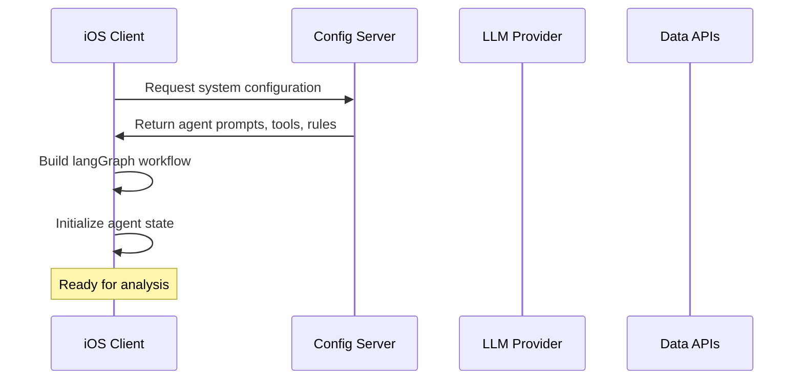
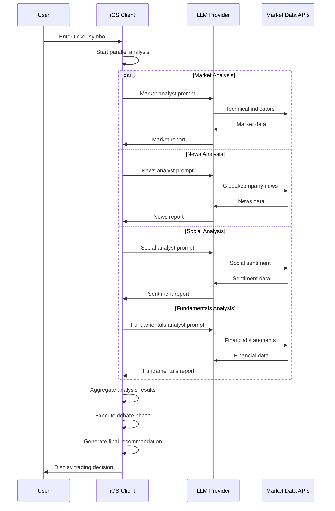

# TradingAgents iOS Client-Side Architecture Design

## Executive Summary

This document outlines the migration of TradingAgents graph execution from a centralized FastAPI server to distributed iOS clients using langGraph-swift. This architectural shift addresses server bottlenecks and enables horizontal scaling to support 5000+ concurrent users.

## 1. Current Architecture Analysis

### 1.1 Existing Server-Side Architecture

**Current Flow:**
```
iOS Client → FastAPI Server → TradingAgents Graph → LLM Provider
                ↓
            Single Worker Bottleneck
```

**Components:**
- **FastAPI Server**: Single-threaded graph execution
- **TradingAgents Graph**: Complex multi-agent workflow
- **Agents**: Market, News, Social, Fundamentals, Bull/Bear Researchers, Risk Management
- **Memory System**: ChromaDB for learning from past decisions
- **Tool Integration**: Market data, news APIs, financial data sources

**Current Limitations:**
- Single worker = single concurrent user
- Server resource constraints
- Network latency for complex workflows
- Expensive server scaling

### 1.2 Agent Workflow Complexity

The current system orchestrates 10+ specialized agents:
```
Parallel Analysis Phase:
├── Market Analyst (Technical indicators)
├── News Analyst (Global/company news)
├── Social Media Analyst (Sentiment analysis)
└── Fundamentals Analyst (Financial statements)

Sequential Decision Phase:
├── Bull Researcher ↔ Bear Researcher (Debate)
├── Research Manager (Investment decision)
├── Trader (Transaction proposal)
├── Risk Analysts (Risky ↔ Safe ↔ Neutral debate)
└── Risk Manager (Final decision)
```

## 2. Proposed Client-Side Architecture

### 2.1 New Architecture Overview

**Proposed Flow:**
```
iOS Client (langGraph-swift) → Direct LLM Provider Calls
     ↓
Configuration Server (Stateless)
```

**Benefits:**
- **Horizontal Scaling**: 5000+ concurrent users
- **Reduced Server Costs**: Stateless configuration server
- **Lower Latency**: Direct LLM calls, no server proxy
- **Improved Reliability**: Client-side fault isolation
- **Better UX**: Real-time progress updates

### 2.2 Architecture Components

```swift
// iOS App Architecture (MVVM)
TradingAgentsApp/
├── Models/
│   ├── TradingAgent.swift
│   ├── AgentState.swift
│   ├── AnalysisResult.swift
│   └── TradingDecision.swift
├── ViewModels/
│   ├── TradingGraphViewModel.swift
│   ├── AnalysisViewModel.swift
│   └── ConfigurationViewModel.swift
├── Views/
│   ├── TradingDashboardView.swift
│   ├── AnalysisProgressView.swift
│   └── ResultsView.swift
├── Services/
│   ├── TradingGraphService.swift
│   ├── ConfigurationService.swift
│   ├── LLMService.swift
│   └── MemoryService.swift
└── Graph/
    ├── TradingAgentsGraph.swift
    ├── AnalystNodes.swift
    ├── DecisionNodes.swift
    └── ConditionalLogic.swift
```

## 3. Implementation Details

### 3.1 Swift/SwiftUI Client Implementation

#### 3.1.1 Core Models

```swift
// MARK: - Agent State Management
struct AgentState {
    let companyOfInterest: String
    let tradeDate: Date
    
    // Analysis Reports
    var marketReport: String = ""
    var sentimentReport: String = ""
    var newsReport: String = ""
    var fundamentalsReport: String = ""
    
    // Debate States
    var investmentDebateState: InvestmentDebateState
    var riskDebateState: RiskDebateState
    
    // Final Outputs
    var investmentPlan: String = ""
    var finalTradeDecision: String = ""
}

// MARK: - Trading Decision Model
struct TradingDecision {
    let recommendation: TradingAction
    let confidence: Double
    let reasoning: String
    let riskAssessment: RiskLevel
    let timestamp: Date
}

enum TradingAction: String, CaseIterable {
    case buy = "BUY"
    case sell = "SELL"
    case hold = "HOLD"
}
```

#### 3.1.2 langGraph-Swift Integration

```swift
import LangGraphSwift

class TradingAgentsGraph {
    private let llmService: LLMService
    private let configService: ConfigurationService
    private let memoryService: MemoryService
    
    // MARK: - Graph Construction
    func buildGraph() -> Graph<AgentState> {
        let graph = GraphBuilder<AgentState>()
        
        // Parallel Analysis Phase
        graph.addNode("market_analyst", marketAnalystNode)
        graph.addNode("news_analyst", newsAnalystNode)
        graph.addNode("social_analyst", socialAnalystNode)
        graph.addNode("fundamentals_analyst", fundamentalsAnalystNode)
        
        // Aggregation
        graph.addNode("analysis_aggregator", aggregateAnalysis)
        
        // Debate Phase
        graph.addNode("bull_researcher", bullResearcherNode)
        graph.addNode("bear_researcher", bearResearcherNode)
        graph.addNode("research_manager", researchManagerNode)
        
        // Trading Phase
        graph.addNode("trader", traderNode)
        
        // Risk Management Phase
        graph.addNode("risky_analyst", riskyAnalystNode)
        graph.addNode("safe_analyst", safeAnalystNode)
        graph.addNode("neutral_analyst", neutralAnalystNode)
        graph.addNode("risk_manager", riskManagerNode)
        
        // Define edges and conditionals
        setupGraphFlow(graph)
        
        return graph.build()
    }
    
    // MARK: - Node Implementations
    private func marketAnalystNode(state: AgentState) async -> AgentState {
        let prompt = await configService.getPrompt(for: .marketAnalyst)
        let tools = await configService.getTools(for: .marketAnalyst)
        
        var updatedState = state
        updatedState.marketReport = await executeAnalysis(
            prompt: prompt,
            tools: tools,
            context: state
        )
        return updatedState
    }
    
    private func executeAnalysis(prompt: String, tools: [Tool], context: AgentState) async -> String {
        // Direct LLM call with tool usage
        return await llmService.executeWithTools(
            prompt: prompt,
            tools: tools,
            context: context
        )
    }
}
```

#### 3.1.3 MVVM ViewModel Implementation

```swift
@MainActor
class TradingGraphViewModel: ObservableObject {
    @Published var currentState: AgentState?
    @Published var isExecuting = false
    @Published var progress: Double = 0.0
    @Published var currentStep: String = ""
    @Published var finalDecision: TradingDecision?
    @Published var error: TradingError?
    
    private let tradingGraph: TradingAgentsGraph
    private let progressTracker: ProgressTracker
    
    init() {
        self.tradingGraph = TradingAgentsGraph()
        self.progressTracker = ProgressTracker()
    }
    
    func analyzeTicker(_ ticker: String) async {
        isExecuting = true
        error = nil
        progress = 0.0
        
        do {
            let initialState = AgentState(
                companyOfInterest: ticker,
                tradeDate: Date(),
                investmentDebateState: .initial,
                riskDebateState: .initial
            )
            
            let graph = tradingGraph.buildGraph()
            
            // Execute graph with progress tracking
            let finalState = await graph.execute(
                initialState: initialState,
                progressCallback: { [weak self] step, progress in
                    await MainActor.run {
                        self?.currentStep = step
                        self?.progress = progress
                    }
                }
            )
            
            self.currentState = finalState
            self.finalDecision = TradingDecision(from: finalState)
            
        } catch {
            self.error = TradingError.executionFailed(error)
        }
        
        isExecuting = false
    }
}
```

### 3.2 Server-Side Configuration API

#### 3.2.1 Simplified FastAPI Server

```python
# Stateless Configuration Server
from fastapi import FastAPI
from pydantic import BaseModel
from typing import Dict, List, Any

app = FastAPI(title="TradingAgents Configuration Server")

class AgentConfig(BaseModel):
    agent_type: str
    prompt_template: str
    tools: List[str]
    parameters: Dict[str, Any]

class SystemConfig(BaseModel):
    agents: List[AgentConfig]
    llm_settings: Dict[str, Any]
    tool_configurations: Dict[str, Any]
    workflow_rules: Dict[str, Any]

@app.get("/config/system")
async def get_system_config() -> SystemConfig:
    """Return complete system configuration"""
    return SystemConfig(
        agents=get_agent_configurations(),
        llm_settings=get_llm_settings(),
        tool_configurations=get_tool_configs(),
        workflow_rules=get_workflow_rules()
    )

@app.get("/config/prompts/{agent_type}")
async def get_agent_prompt(agent_type: str) -> Dict[str, str]:
    """Return prompt template for specific agent"""
    return {
        "prompt": get_prompt_template(agent_type),
        "version": get_prompt_version(agent_type)
    }

@app.get("/config/tools/{agent_type}")
async def get_agent_tools(agent_type: str) -> List[Dict[str, Any]]:
    """Return tool configurations for specific agent"""
    return get_tools_for_agent(agent_type)

# Health and monitoring endpoints
@app.get("/health")
async def health_check():
    return {"status": "healthy", "timestamp": datetime.utcnow()}
```

#### 3.2.2 Configuration Management

```swift
class ConfigurationService: ObservableObject {
    private let baseURL = "https://api.tradingagents.com"
    private let urlSession: URLSession
    
    init() {
        let config = URLSessionConfiguration.default
        config.timeoutIntervalForRequest = 30
        self.urlSession = URLSession(configuration: config)
    }
    
    func getSystemConfig() async throws -> SystemConfig {
        let url = URL(string: "\(baseURL)/config/system")!
        let (data, _) = try await urlSession.data(from: url)
        return try JSONDecoder().decode(SystemConfig.self, from: data)
    }
    
    func getPrompt(for agentType: AgentType) async throws -> String {
        let url = URL(string: "\(baseURL)/config/prompts/\(agentType.rawValue)")!
        let (data, _) = try await urlSession.data(from: url)
        let response = try JSONDecoder().decode(PromptResponse.self, from: data)
        return response.prompt
    }
    
    func getTools(for agentType: AgentType) async throws -> [Tool] {
        let url = URL(string: "\(baseURL)/config/tools/\(agentType.rawValue)")!
        let (data, _) = try await urlSession.data(from: url)
        return try JSONDecoder().decode([Tool].self, from: data)
    }
}
```

### 3.3 LLM Service Integration

```swift
class LLMService {
    private let apiKey: String
    private let baseURL: String
    private let model: String
    
    init(apiKey: String, baseURL: String = "https://api.openai.com/v1", model: String = "gpt-4") {
        self.apiKey = apiKey
        self.baseURL = baseURL
        self.model = model
    }
    
    func executeWithTools(prompt: String, tools: [Tool], context: AgentState) async throws -> String {
        let messages = buildMessages(prompt: prompt, context: context)
        
        let request = ChatCompletionRequest(
            model: model,
            messages: messages,
            tools: tools.map { $0.toChatTool() },
            toolChoice: "auto"
        )
        
        var response = try await sendChatCompletion(request)
        
        // Handle tool calls
        while let toolCalls = response.choices.first?.message.toolCalls, !toolCalls.isEmpty {
            let toolResults = try await executeToolCalls(toolCalls)
            
            // Add tool results to conversation
            messages.append(response.choices.first!.message)
            messages.append(contentsOf: toolResults.map { $0.toMessage() })
            
            // Continue conversation
            let followUpRequest = ChatCompletionRequest(
                model: model,
                messages: messages,
                tools: tools.map { $0.toChatTool() }
            )
            response = try await sendChatCompletion(followUpRequest)
        }
        
        return response.choices.first?.message.content ?? ""
    }
}
```

## 4. Data Flow Architecture

### 4.1 Client Initialization Flow



### 4.2 Analysis Execution Flow



## 5. Implementation Plan

### Phase 1: Foundation (Weeks 1-2)
- [ ] Set up iOS project with MVVM architecture
- [ ] Implement basic SwiftUI views and navigation
- [ ] Create core data models (AgentState, TradingDecision)
- [ ] Set up configuration service for server communication
- [ ] Implement LLM service for direct API calls

### Phase 2: Core Graph Implementation (Weeks 3-4)
- [ ] Integrate langGraph-swift framework
- [ ] Implement analyst nodes (Market, News, Social, Fundamentals)
- [ ] Create tool integration layer for data sources
- [ ] Build graph orchestration logic
- [ ] Implement progress tracking and state management

### Phase 3: Advanced Features (Weeks 5-6)
- [ ] Implement debate phase (Bull/Bear researchers)
- [ ] Add risk management analysts
- [ ] Create memory service for learning from decisions
- [ ] Implement error handling and retry logic
- [ ] Add offline capabilities and caching

### Phase 4: Server Migration (Weeks 7-8)
- [ ] Simplify FastAPI server to configuration-only
- [ ] Migrate prompts and configurations to server
- [ ] Implement configuration versioning
- [ ] Set up monitoring and analytics
- [ ] Performance testing and optimization

### Phase 5: Testing & Deployment (Weeks 9-10)
- [ ] Comprehensive unit and integration testing
- [ ] Load testing with multiple concurrent clients
- [ ] Security audit (API key management)
- [ ] App Store submission preparation
- [ ] Documentation and user guides

## 6. Technical Considerations

### 6.1 Security & API Key Management

```swift
// Secure API Key Storage
class SecureCredentialsManager {
    private let keychain = Keychain(service: "com.tradingagents.app")
    
    func storeAPIKey(_ key: String, for provider: LLMProvider) throws {
        try keychain.set(key, key: provider.rawValue)
    }
    
    func getAPIKey(for provider: LLMProvider) throws -> String? {
        return try keychain.get(provider.rawValue)
    }
    
    func deleteAPIKey(for provider: LLMProvider) throws {
        try keychain.remove(provider.rawValue)
    }
}

// Environment-based configuration
struct LLMConfiguration {
    let apiKey: String
    let baseURL: String
    let model: String
    let maxTokens: Int
    let temperature: Double
    
    static func production() -> LLMConfiguration {
        // Load from secure storage
    }
    
    static func development() -> LLMConfiguration {
        // Load from environment or config file
    }
}
```

### 6.2 Error Handling & Resilience

```swift
enum TradingError: LocalizedError {
    case configurationFailed(Error)
    case llmRequestFailed(Error)
    case toolExecutionFailed(String, Error)
    case networkUnavailable
    case rateLimitExceeded
    case invalidResponse(String)
    
    var errorDescription: String? {
        switch self {
        case .configurationFailed(let error):
            return "Configuration failed: \(error.localizedDescription)"
        case .llmRequestFailed(let error):
            return "LLM request failed: \(error.localizedDescription)"
        case .toolExecutionFailed(let tool, let error):
            return "Tool '\(tool)' failed: \(error.localizedDescription)"
        case .networkUnavailable:
            return "Network connection unavailable"
        case .rateLimitExceeded:
            return "Rate limit exceeded. Please try again later."
        case .invalidResponse(let message):
            return "Invalid response: \(message)"
        }
    }
}

// Retry logic with exponential backoff
class RetryManager {
    static func withRetry<T>(
        maxAttempts: Int = 3,
        delay: TimeInterval = 1.0,
        operation: @escaping () async throws -> T
    ) async throws -> T {
        var lastError: Error?
        
        for attempt in 1...maxAttempts {
            do {
                return try await operation()
            } catch {
                lastError = error
                
                if attempt < maxAttempts {
                    let backoffDelay = delay * pow(2.0, Double(attempt - 1))
                    try await Task.sleep(nanoseconds: UInt64(backoffDelay * 1_000_000_000))
                }
            }
        }
        
        throw lastError!
    }
}
```

### 6.3 Performance Optimization

```swift
// Concurrent execution manager
actor ConcurrentExecutionManager {
    private var runningTasks: [String: Task<Void, Error>] = [:]
    private let maxConcurrentTasks: Int
    
    init(maxConcurrentTasks: Int = 4) {
        self.maxConcurrentTasks = maxConcurrentTasks
    }
    
    func execute<T>(
        id: String,
        priority: TaskPriority = .medium,
        operation: @escaping () async throws -> T
    ) async throws -> T {
        // Ensure we don't exceed concurrent task limit
        while runningTasks.count >= maxConcurrentTasks {
            await Task.yield()
        }
        
        let task = Task(priority: priority) {
            try await operation()
        }
        
        runningTasks[id] = Task { _ = try await task.value }
        
        defer {
            Task { await self.removeTask(id: id) }
        }
        
        return try await task.value
    }
    
    private func removeTask(id: String) {
        runningTasks.removeValue(forKey: id)
    }
}
```

### 6.4 Monitoring & Analytics

```swift
// Analytics and monitoring
class AnalyticsManager {
    func trackGraphExecution(
        ticker: String,
        duration: TimeInterval,
        success: Bool,
        error: String? = nil
    ) {
        let event = AnalyticsEvent(
            name: "graph_execution",
            parameters: [
                "ticker": ticker,
                "duration": duration,
                "success": success,
                "error": error ?? ""
            ]
        )
        
        // Send to analytics service
        sendEvent(event)
    }
    
    func trackAgentPerformance(
        agentType: String,
        duration: TimeInterval,
        tokenUsage: Int,
        success: Bool
    ) {
        let event = AnalyticsEvent(
            name: "agent_performance",
            parameters: [
                "agent_type": agentType,
                "duration": duration,
                "token_usage": tokenUsage,
                "success": success
            ]
        )
        
        sendEvent(event)
    }
}
```

## 7. Benefits & Trade-offs

### 7.1 Benefits
- **Scalability**: Support for 5000+ concurrent users
- **Cost Efficiency**: Reduced server infrastructure costs
- **Performance**: Lower latency through direct LLM calls
- **Reliability**: Client-side fault isolation
- **User Experience**: Real-time progress updates and offline capabilities

### 7.2 Trade-offs
- **Complexity**: Increased client-side complexity
- **Security**: API keys stored on client devices
- **Consistency**: Potential version drift across clients
- **Debugging**: Distributed execution harder to monitor
- **Resource Usage**: Higher client device resource consumption

### 7.3 Risk Mitigation
- **Security**: Secure keychain storage, API key rotation
- **Consistency**: Configuration versioning, forced updates
- **Monitoring**: Client-side analytics, error reporting
- **Performance**: Resource monitoring, graceful degradation

## 8. Success Metrics

### 8.1 Performance Metrics
- **Concurrent Users**: Target 5000+ simultaneous analyses
- **Latency**: <30 seconds for complete analysis
- **Reliability**: >99.5% success rate
- **Resource Usage**: <100MB memory, <10% CPU average

### 8.2 Business Metrics
- **Cost Reduction**: 80% reduction in server costs
- **User Satisfaction**: >4.5 star app rating
- **Adoption**: 90% of users migrate to new architecture
- **Revenue Impact**: Maintain current user engagement levels

## 9. Conclusion

The migration to client-side graph execution represents a fundamental architectural shift that addresses current scalability limitations while providing enhanced user experience. The combination of langGraph-swift, MVVM architecture, and direct LLM integration creates a robust, scalable solution that can support thousands of concurrent users while reducing operational costs.

The phased implementation approach ensures minimal disruption during migration while allowing for iterative improvements and user feedback incorporation. Success depends on careful attention to security, performance optimization, and maintaining the sophisticated multi-agent decision-making capabilities that define the TradingAgents system.
