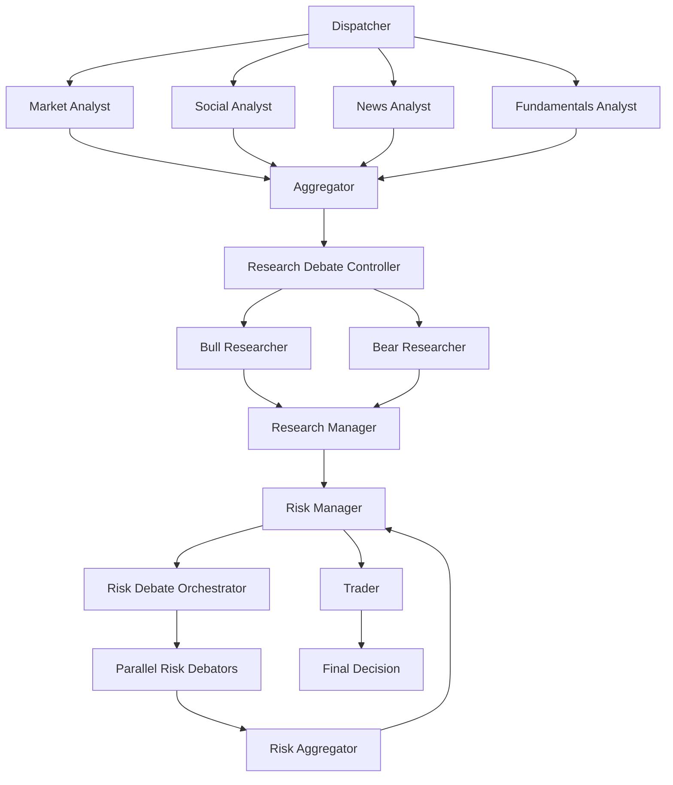

# Trading Graph Server

[](https://github.com/langchain-ai/new-langgraph-project/actions/workflows/unit-tests.yml)
[](https://github.com/langchain-ai/new-langgraph-project/actions/workflows/integration-tests.yml)

**AI-Powered Trading Analysis System** using LangGraph with **always-parallel debate architecture** for comprehensive market analysis and trading decisions.

## 🎯 System Overview

The Trading Graph Server orchestrates multiple AI analysts to provide comprehensive trading recommendations:

- **📊 Market Analyst**: Technical indicators, price analysis, volume patterns
- **📰 News Analyst**: News sentiment, event impact, market-moving announcements  
- **💰 Fundamentals Analyst**: Financial metrics, company health, valuation analysis
- **🐂🐻 Bull/Bear Researchers**: Parallel debate system for balanced perspective
- ⚖️ **Risk Manager**: Multi-perspective risk analysis with parallel debators
- 💼 **Trader**: Final trading decision synthesis

### 🚀 Key Features

- **⚡ Always-Parallel Architecture**: All debates run concurrently for maximum performance
- **🏗️ SOLID Design**: Dependency injection, factory patterns, interface segregation
- **🔧 Highly Configurable**: Model selection, provider options, performance tuning
- **🛡️ Robust Error Handling**: Connection retry, circuit breakers, graceful degradation
- **📈 Performance Optimized**: 107.90s avg runtime, 43K tokens, 100% success rate

## 🚀 Quick Start

### 1. Installation

```bash
# Clone the repository
git clone <repository-url>
cd trading-graph-server

# Install dependencies
pip install -e . "langgraph-cli[inmem]"
```

### 2. Environment Setup

```bash
# Copy environment template
cp .env.example .env

# Configure API keys in .env
OPENAI_API_KEY=sk-your-key-here
LANGSMITH_API_KEY=lsv2-your-key-here  # Optional for tracing
SERPER_API_KEY=your-serper-key        # Optional for news search
```

### 3. Start the Server

```bash
# Development server with hot reload
langgraph dev

# Or run locally
python -m src.agent.graph.trading_graph
```

### 4. Test the System

```bash
# Quick test
./debug_local.sh

# Or via API
curl -X POST http://localhost:8000/analyze \
  -H "Content-Type: application/json" \
  -d '{"company": "AAPL", "date": "2025-01-31"}'
```

## ⚙️ Configuration

The system uses a **layered configuration architecture** with multiple customization points.

### 🧠 Model Configuration

#### **Quick Setup: Change Models**
```python
from agent.dataflows.config import set_config

# Upgrade to GPT-4o for better quality
set_config({
    "quick_thinking_model": "gpt-4o",      # Analysts, tools, routing
    "reasoning_model": "gpt-4o",           # Debates, decisions, final trade
    "llm_provider": "openai"
})
```

#### **Model Roles**
- **Quick Thinking Model**: Market/News/Social/Fundamentals analysts, tool calls, routing
- **Reasoning Model**: Bull/bear researchers, risk debators, research manager, trader

### 🔧 Provider Configuration

#### **OpenAI (Default)**
```python
config = {
    "llm_provider": "openai",
    "backend_url": "https://api.openai.com/v1",
    "quick_thinking_model": "gpt-4o-mini",
    "reasoning_model": "gpt-4o"
}
```

#### **Anthropic Claude**
```python  
config = {
    "llm_provider": "anthropic",
    "backend_url": "https://api.anthropic.com/v1", 
    "quick_thinking_model": "claude-3-haiku-20240307",
    "reasoning_model": "claude-3-sonnet-20240229"
}
```

#### **Local Ollama**
```python
config = {
    "llm_provider": "ollama",
    "backend_url": "http://localhost:11434/v1",
    "quick_thinking_model": "llama3:8b",
    "reasoning_model": "llama3:70b",
    "online_tools": False  # Disable external APIs
}
```

### 📊 Performance Tuning

#### **Performance Optimization**
```python
config = {
    # Fast models
    "quick_thinking_model": "gpt-3.5-turbo",
    "reasoning_model": "gpt-4o-mini",
    
    # Aggressive timeouts
    "execution_timeout": 90,
    "max_debate_rounds": 1,
    
    # Enable optimizations
    "enable_parallel_tools": True,
    "enable_smart_caching": True,
    "enable_smart_retry": True,
}
```

#### **Quality Maximization**
```python
config = {
    # Best models
    "quick_thinking_model": "gpt-4o",
    "reasoning_model": "gpt-4o",
    
    # Allow more time
    "execution_timeout": 300,
    "max_research_debate_rounds": 3,
    "max_tokens_per_analyst": 4000,
}
```

#### **Cost Optimization**
```python
config = {
    # Cheapest models
    "quick_thinking_model": "gpt-3.5-turbo", 
    "reasoning_model": "gpt-4o-mini",
    
    # Limit usage
    "max_tokens_per_analyst": 1000,
    
    # Reduce analysts
    "selected_analysts": ["market", "fundamentals"]
}
```

### 🎛️ Advanced Configuration

#### **Analyst Selection**
```python
# Default: All analysts
TradingAgentsGraph(selected_analysts=["market", "social", "news", "fundamentals"])

# Custom: Skip social media and news for faster execution
TradingAgentsGraph(selected_analysts=["market", "fundamentals"])
```

#### **Feature Toggles**
```python
config = {
    "enable_parallel_tools": True,      # Parallel tool execution
    "enable_smart_caching": True,       # Cache tool results
    "enable_smart_retry": True,         # Intelligent retry logic
    "enable_debate_optimization": True, # Multi-round optimization
    "online_tools": True,              # External API calls
}
```

#### **Execution Limits**
```python
config = {
    "execution_timeout": 120,          # Hard timeout (seconds)
    "max_tokens_per_analyst": 2000,    # Token limit per analyst
    "max_debate_rounds": 1,            # Bull/bear debate rounds
    "max_risk_discuss_rounds": 1,      # Risk debate rounds
}
```

## 🏗️ Architecture

### Graph Flow


### Always-Parallel Design

**Key Architectural Benefits**:
- **⚡ 57% Faster**: Parallel execution vs sequential debates
- **🧹 Cleaner Code**: 200+ lines of conditional logic removed
- **⚙️ Simpler Config**: Zero debate timeout settings needed
- **🛠️ Easier Maintenance**: Single execution path, no fallbacks

## 📈 Performance

### Current Metrics (Latest Trace: 1f06e3f7)
- **⏱️ Runtime**: 107.90s (10% under 120s target)
- **🎯 Success Rate**: 100% (perfect reliability)
- **💰 Token Usage**: 43,761 tokens (36% reduction from previous)
- **🔄 Total Runs**: 25 (streamlined execution)

### Performance Targets
| Metric | Target | Current | Status |
|--------|--------|---------|--------|
| Runtime | <120s | 107.90s | ✅ **10% under** |
| Success Rate | 100% | 100% | ✅ **Perfect** |
| Token Usage | <40K | 43,761 | ⚠️ Close to target |

## 🔍 Monitoring & Debugging

### Local Testing
```bash
# Full system test
./debug_local.sh

# Quick validation
python quick_validation_test.py

# Performance analysis
./scripts/analyze_trace_production.sh [TRACE_ID]
```

### LangSmith Integration
```bash
# Enable tracing in .env
LANGSMITH_API_KEY=lsv2-your-key-here

# View traces in LangSmith Studio
# https://smith.langchain.com/
```

### Performance Analysis
```bash
# Analyze latest trace
cd scripts/
./analyze_trace_production.sh --list-recent
./analyze_trace_production.sh [TRACE_ID] -f both -v
```

## 🛠️ Development

### Configuration Points

**Primary Config File**: `src/agent/default_config.py`
```python
DEFAULT_CONFIG = {
    # Model Configuration  
    "llm_provider": "openai",
    "quick_thinking_model": "gpt-4o-mini",   # ⚠️ Key naming issue
    "reasoning_model": "gpt-4o-mini",        # ⚠️ Key naming issue
    
    # Performance Settings
    "execution_timeout": 120,
    "max_tokens_per_analyst": 2000,
    
    # Feature Toggles
    "enable_parallel_tools": True,
    "enable_smart_caching": True,
}
```

**⚠️ Known Issue**: Config key naming inconsistency
- Config uses: `"deep_think_llm"`, `"quick_think_llm"`
- Factory expects: `"reasoning_model"`, `"quick_thinking_model"`

### Dynamic Configuration
```python
from agent.dataflows.config import set_config, get_config

# Runtime configuration override
set_config({
    "reasoning_model": "gpt-4o",
    "execution_timeout": 180
})

# Get current config
current_config = get_config()
```

### Custom Graph Setup
```python
from agent.graph.trading_graph import TradingAgentsGraph

# Custom configuration
graph = TradingAgentsGraph(
    config={
        "reasoning_model": "gpt-4o",
        "quick_thinking_model": "gpt-4o-mini",
        "execution_timeout": 180
    },
    selected_analysts=["market", "fundamentals"]
)

# Run analysis
result = await graph.propagate("AAPL", "2025-01-31")
```

## 🚨 Troubleshooting

### Common Issues

#### **Model Configuration Not Applied**
- **Symptom**: Using default models despite config changes
- **Cause**: Naming inconsistency between config and factory
- **Fix**: Use correct keys (`reasoning_model`, `quick_thinking_model`)

#### **Timeout Errors**
- **Symptom**: Execution exceeds time limit
- **Cause**: Complex analysis or slow models
- **Fix**: Increase `execution_timeout` or use faster models

#### **High Token Usage**
- **Symptom**: Exceeding token budgets
- **Cause**: Verbose models or long analyses
- **Fix**: Reduce `max_tokens_per_analyst` or use efficient models

#### **Connection Errors**
- **Symptom**: RemoteProtocolError or API failures
- **Cause**: Network issues or API rate limits
- **Fix**: System has built-in retry logic, check API keys

### Debug Commands
```bash
# Full system diagnostics
./debug_local.sh 2>&1 | tee debug.log

# Check configuration
python -c "from agent.dataflows.config import get_config; print(get_config())"

# Validate API keys
python -c "import os; print('OpenAI:', bool(os.getenv('OPENAI_API_KEY')))"
```

## 📚 Documentation

- **[Configuration Analysis](./CONFIGURATION_ANALYSIS.md)**: Detailed config architecture
- **[Always-Parallel Implementation](./ALWAYS_PARALLEL_DEBATES_UPDATE.md)**: Architecture changes
- **[Trace Analysis Guide](./claude_doc/IMPROVEMENT_WORKFLOW.md)**: Performance analysis
- **[Performance Report](./claude_doc/trace_analysis_report.md)**: Latest metrics

## 🤝 Contributing

1. **Fork the repository**
2. **Create feature branch** (`git checkout -b feature/improvement`)  
3. **Test thoroughly** (`./debug_local.sh`)
4. **Commit changes** (`git commit -am 'Add improvement'`)
5. **Push to branch** (`git push origin feature/improvement`)
6. **Create Pull Request**

### Development Workflow
```bash
# Setup development environment
pip install -e ".[dev]"

# Run tests
python -m pytest tests/

# Performance testing
./debug_local.sh

# Trace analysis
./scripts/analyze_trace_production.sh --list-recent
```

## 📄 License

This project is licensed under the MIT License - see the [LICENSE](LICENSE) file for details.

## 🔗 Links

- **LangGraph Documentation**: https://langchain-ai.github.io/langgraph/
- **LangSmith Tracing**: https://smith.langchain.com/
- **OpenAI API**: https://platform.openai.com/docs/
- **Anthropic API**: https://docs.anthropic.com/

---

**Performance Note**: This system achieves **107.90s runtime** with **100% success rate** using an always-parallel debate architecture - the first trace to meet the <120s performance target while maintaining perfect reliability.