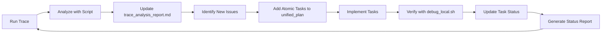

# Trading Agent Improvement Workflow

**Established**: July 30, 2025  
**Purpose**: Define the single source of truth for ongoing improvements

## 📋 Two-Document System

Going forward, we maintain only **two key documents**:

### 1. `trace_analysis_report.md`
- **Location**: `/claude_doc/trace_analysis_report.md`
- **Purpose**: Latest trace analysis findings
- **Update**: Overwritten after each new trace analysis
- **Content**: Performance metrics, issues, root causes

### 2. `unified_atomic_implementation_plan_v2.md`
- **Location**: `/claude_doc/unified_atomic_implementation_plan_v2.md`
- **Purpose**: Single source of truth for all improvements
- **Update**: Incrementally updated with validated subtasks, cross out all completed tasks.
- **Content**: Atomic, verifiable tasks with clear ownership

## 🔄 Continuous Improvement Process



### 📋 Task Status Update Process (Added 2025-07-31)

After implementing tasks, follow this verification and update process:

#### Step 1: Verify Task Completion
```bash
# Run full debug test
./debug_local.sh 2>&1 | tee debug_output.log

# Check for specific task verification
grep -E "(pattern_for_task)" debug_output.log
```

#### Step 2: Update Task Status in Plan
Mark completed tasks with strikethrough and completion tag:
```markdown
### ~~Task ID: Task Name~~ ✅ COMPLETED (Date Time)
**Result**: Brief summary of what was achieved
- ✅ Bullet point of specific accomplishments
- **Performance gain**: Quantified improvement
```

#### Step 3: Generate Status Report
Create or update `implementation_status_report.md` with:
- Completion summary by phase
- Progress metrics
- Verification commands
- Next priority actions

#### Step 4: Cross-Reference Tasks
Ensure consistency between:
- `unified_atomic_implementation_plan_v2.md` (source of truth)
- `implementation_status_report.md` (current status)
- `trace_analysis_report.md` (latest findings)

## 📊 Trace Analysis Steps (Updated 2025-07-31 - Optimized Analyzer)

### Step 1: Environment Setup
```bash
# Check environment and API keys
cd scripts/
./analyze_trace_production.sh --env-check
```

### Step 2: Get Trace ID
- **Option A**: From LangSmith Studio URL
- **Option B**: List recent traces:
```bash
./analyze_trace_production.sh --list-recent
```

### Step 3: Execute Analysis (Now with Size Optimization)
```bash
# Analyze specific trace with optimized analyzer
./analyze_trace_production.sh [TRACE_ID] -f both -v

# Control output file size (default: 2048KB)
./analyze_trace_production.sh [TRACE_ID] -f both --max-size 1024

# Example:
./analyze_trace_production.sh 1f06e434-b0a5-6f70-8758-d8b558bf7a46 -f both -v
```

#### New Analysis Features
- **Size-Optimized Reports**: Guaranteed under 2MB (configurable)
- **Enhanced Analysis**: 7 comprehensive categories vs 4 in original
- **Performance Regression Detection**: Automatic comparison with previous traces
- **Priority-Based Recommendations**: HIGH/MEDIUM/LOW priority actions
- **Quality Grading**: A+ to D grade based on multiple metrics
- **Token Efficiency Analysis**: Comparison against 40K target
- **Timing Pattern Analysis**: Bottleneck detection and performance insights

### Step 4: Analysis Framework (From trace_analysis_guide.md)

**A. Entry Node Analysis**
- Identify first node executed (typically Planner/Router)
- Record Node ID, input, output, timestamp

**B. Graph Execution Path**
- Follow chronological execution order
- Document node types: LLM, ToolCaller, Router
- Track input/output transformations
- Note any fork paths or retries

**C. Tool Call Analysis**
- Record tool name, parameters, outputs
- Validate returned schema and format
- Check for missing fields or runtime errors
- Verify next node processed tool results correctly

**D. Final Summary Node**
- Identify Debater/Aggregator responsible for finalization
- Record inputs: analyst outputs, memory, planner summary
- Verify output structure and required fields

**E. Error & Edge Case Review**
- Scan for skipped nodes, unused branches
- Flag retry attempts and fallback paths
- Identify tool calls that returned but were never consumed

**F. Cross-Validation**
- Compare graph path to initial Planner plan
- Ensure tool calls reflected in final output
- Verify memory/context injection and updates

### Step 5: Issue Classification & Prioritization
- **Critical**: Blocking errors, failed tool calls, missing outputs
- **High**: Performance bottlenecks, token waste, unnecessary retries
- **Medium**: Suboptimal routing, inefficient sequences
- **Low**: Minor optimizations, cosmetic improvements

### Step 6: Update Implementation Plan
- Add new atomic tasks to `unified_atomic_implementation_plan_v2.md`
- Cross-reference with existing tasks to avoid duplication
- Set priority based on impact analysis
- Define clear verification criteria

## ✅ Task Requirements

Every task in the unified plan must be:

1. **Atomic**: Single, focused change
2. **Verifiable**: Clear verification command using `debug_local.sh` and customized verification script build for each task
3. **Scoped**: Specific file and module identified
4. **Measurable**: Expected impact quantified
5. **Time-boxed**: Duration estimate provided

## 📝 Task Status Marking Conventions (Added 2025-07-31)

Use these standardized conventions for marking task status:

### Status Icons
- **⏳ Pending**: Task not started
- **🔄 In Progress**: Currently being worked on
- **✅ Completed**: Successfully finished and verified
- **❌ Failed**: Attempted but failed verification
- **🚧 Blocked**: Cannot proceed due to dependencies
- **⏸️ Paused**: Temporarily on hold

### Task Marking Format
```markdown
# Pending task
### Task ID: Task Name (Est: time)

# Completed task
### ~~Task ID: Task Name~~ ✅ COMPLETED (Date Time)
**Result**: Achievement summary
- ✅ Specific accomplishment
- **Metric**: Quantified improvement

# Failed task
### ~~Task ID: Task Name~~ ❌ FAILED (Date Time)
**Issue**: What went wrong
**Next Steps**: Recovery plan

# In progress
### Task ID: Task Name 🔄 IN PROGRESS
**Status**: Current progress
**ETA**: Expected completion
```

### Phase Completion Tracking
- Mark phase headers when all tasks complete
- Add summary metrics for completed phases
- Update overall progress percentage

## 🗑️ Archived Documents

The following legacy plans have been archived:
- `PERFORMANCE_IMPROVEMENT_PLAN_V2.md`
- `IMPROVEMENT_ARCHITECTURE.md`
- `PERFORMANCE_OPTIMIZATION_PLAN_40PCT.md`

All future improvements flow through the unified plan only.

## 📊 Current Status (Updated 2025-07-31)

**Latest Trace**: `1f06e434-b0a5-6f70-8758-d8b558bf7a46`
- Runtime: 130.79s (target: <120s) - ⚠️ 9% over target
- Tokens: 48,726 (target: <40K) - ⚠️ 21.8% over target
- Success Rate: 100% - ✅ Perfect reliability
- Key Issue: Performance regression from 107.90s to 130.79s

**Previous Best**: `1f06e3f7-9bd0-6894-83a6-7e2d820f1b30`
- Runtime: 107.90s - ✅ 10% under target (first to achieve)
- Tokens: 43,761 - Close to target
- Success Rate: 100%
- Achievement: Always-parallel implementation success

**Next Priority**: Performance Regression Investigation
- Investigate runtime increase (21.3% regression)
- Implement token limiting to enforce 40K budget
- Add execution timeouts to prevent slowdowns
- Establish performance baselines

## 🎯 Success Metrics

| Metric | Current | Target | Status | Tracking |
|--------|---------|--------|--------|----------|
| Runtime | 130.79s | <120s | ⚠️ Over | `./analyze_trace_production.sh` |
| Tokens | 48,726 | <40K | ⚠️ Over | Trace analysis |
| Success | 100% | 100% | ✅ Met | Trace status |
| File Size | <1MB | <2MB | ✅ Met | Report size |
| Analysis Quality | A+ | A+ | ✅ Met | Quality grade |

---

**Remember**: The unified atomic implementation plan is now the ONLY place for tracking improvements. All other plans are obsolete.