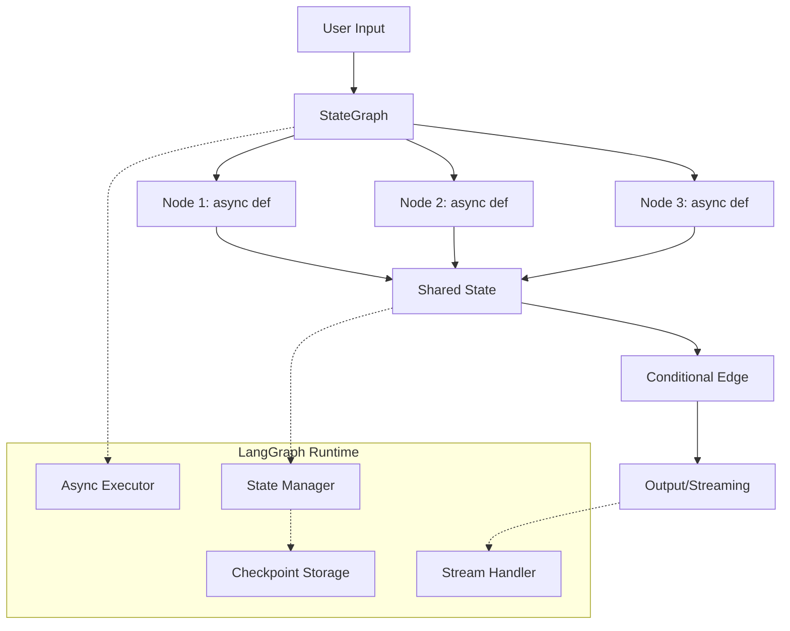

# LangGraph Development Best Practices Guide 2025

## Architecture Overview

LangGraph is a Python framework for building stateful, multi-actor applications with LLMs, built on top of LangChain. It provides a graph-based approach to orchestrate complex workflows with built-in state management, checkpointing, and streaming capabilities.



---

## Core Principles & Patterns

### 1. **Async-First Architecture**

**✅ Correct Pattern:**
```python
async def market_analyst_node(state: Dict[str, Any]) -> Dict[str, Any]:
    """All nodes must be async functions"""
    ticker = state.get('company_of_interest')
    
    # Use async HTTP clients
    async with httpx.AsyncClient() as client:
        response = await client.get(f"https://api.example.com/{ticker}")
    
    # Process data
    data = await process_market_data(response.json())
    
    # Return updated state
    return {"market_data": data, "analysis_complete": True}
```

**❌ Incorrect Pattern:**
```python
def sync_node(state):  # Never use sync functions
    response = requests.get("...")  # Blocks the event loop
    return {"data": response.json()}
```

### 2. **State Management Patterns**

**State Schema Definition:**
```python
from typing import TypedDict, List, Optional
from dataclasses import dataclass

# Option 1: TypedDict (Recommended)
class TradingState(TypedDict):
    company_of_interest: str
    market_data: Optional[Dict]
    news_data: Optional[List[Dict]]
    analysis_complete: bool
    messages: List[str]

# Option 2: Pydantic Model
from pydantic import BaseModel

class TradingStatePydantic(BaseModel):
    company_of_interest: str = ""
    market_data: Optional[Dict] = None
    analysis_complete: bool = False
```

**State Update Patterns:**
```python
# ✅ Partial state updates (recommended)
async def analyst_node(state: TradingState) -> Dict[str, Any]:
    # Only return fields you want to update
    return {
        "market_data": {"price": 150.0, "change": 2.5},
        "analysis_complete": True
    }

# ✅ Conditional state updates
async def conditional_node(state: TradingState) -> Dict[str, Any]:
    if state.get("market_data"):
        return {"next_step": "news_analysis"}
    else:
        return {"next_step": "data_collection"}
```

### 3. **Library Integration Best Practices**

**External Library Compatibility:**
```python
# ✅ Safe library usage pattern
def check_library_compatibility() -> bool:
    """Check if external libraries can be safely imported"""
    try:
        # Check for naming conflicts
        import sys
        if any('pandas.py' in str(p) for p in sys.path):
            return False
            
        # Test import and basic functionality
        import pandas as pd
        test_df = pd.DataFrame({'test': [1, 2, 3]})
        _ = test_df.empty  # Test attribute access
        
        return True
    except Exception as e:
        logger.warning(f"Library not available: {e}")
        return False

# ✅ Intelligent fallback pattern
PANDAS_AVAILABLE = check_library_compatibility()

async def data_processing_node(state: TradingState) -> Dict[str, Any]:
    if PANDAS_AVAILABLE:
        # Use pandas for rich functionality
        result = await process_with_pandas(state['raw_data'])
    else:
        # Fallback to pure Python
        result = await process_with_python(state['raw_data'])
    
    return {"processed_data": result}
```

### 4. **Error Handling & Resilience**

**Graceful Error Handling:**
```python
async def resilient_node(state: TradingState) -> Dict[str, Any]:
    """Node with comprehensive error handling"""
    ticker = state.get('company_of_interest')
    
    try:
        # Primary data source
        data = await fetch_primary_data(ticker)
        return {"market_data": data, "data_source": "primary"}
        
    except httpx.TimeoutError:
        logger.warning(f"Primary source timeout for {ticker}")
        
        try:
            # Fallback data source
            data = await fetch_fallback_data(ticker)
            return {"market_data": data, "data_source": "fallback"}
            
        except Exception as e:
            logger.error(f"All data sources failed for {ticker}: {e}")
            return {
                "market_data": None,
                "error": f"Data unavailable for {ticker}",
                "data_source": "none"
            }
    
    except Exception as e:
        logger.error(f"Unexpected error processing {ticker}: {e}")
        return {
            "market_data": None,
            "error": str(e),
            "data_source": "error"
        }
```

### 5. **Conditional Routing**

**Dynamic Edge Routing:**
```python
def routing_logic(state: TradingState) -> str:
    """Determine next node based on state"""
    if state.get("error"):
        return "error_handler"
    elif state.get("market_data"):
        return "news_analysis"
    else:
        return "data_collection"

# Graph setup with conditional edges
graph = StateGraph(TradingState)
graph.add_node("market_analyst", market_analyst_node)
graph.add_node("news_analysis", news_analysis_node)
graph.add_node("error_handler", error_handler_node)

graph.add_conditional_edges(
    "market_analyst",
    routing_logic,
    {
        "news_analysis": "news_analysis",
        "error_handler": "error_handler",
        "data_collection": "market_analyst"  # Retry
    }
)
```

---

## Performance Optimization Patterns

### 1. **Parallel Execution**

```python
async def parallel_analysis_node(state: TradingState) -> Dict[str, Any]:
    """Execute multiple analyses in parallel"""
    ticker = state['company_of_interest']
    
    # Launch parallel tasks
    tasks = [
        fetch_market_data(ticker),
        fetch_news_data(ticker),
        fetch_sentiment_data(ticker)
    ]
    
    # Wait for all to complete
    market_data, news_data, sentiment_data = await asyncio.gather(
        *tasks, return_exceptions=True
    )
    
    return {
        "market_data": market_data if not isinstance(market_data, Exception) else None,
        "news_data": news_data if not isinstance(news_data, Exception) else None,
        "sentiment_data": sentiment_data if not isinstance(sentiment_data, Exception) else None
    }
```

### 2. **Streaming & Real-time Updates**

```python
# Graph execution with streaming
async def execute_with_streaming(graph, initial_state):
    """Execute graph with real-time streaming"""
    async for chunk in graph.astream(initial_state):
        # Process streaming updates
        for node_name, node_output in chunk.items():
            print(f"Node {node_name} completed: {node_output}")
            
            # Send real-time updates to frontend
            await websocket.send_json({
                "node": node_name,
                "data": node_output,
                "timestamp": datetime.now().isoformat()
            })
```

### 3. **Caching Strategies**

```python
from functools import lru_cache
import asyncio

# Async LRU cache for expensive operations
class AsyncLRUCache:
    def __init__(self, maxsize=128):
        self.cache = {}
        self.maxsize = maxsize
    
    def __call__(self, func):
        async def wrapper(*args, **kwargs):
            key = str(args) + str(sorted(kwargs.items()))
            
            if key in self.cache:
                return self.cache[key]
            
            result = await func(*args, **kwargs)
            
            if len(self.cache) >= self.maxsize:
                # Remove oldest entry
                oldest_key = next(iter(self.cache))
                del self.cache[oldest_key]
            
            self.cache[key] = result
            return result
        
        return wrapper

@AsyncLRUCache(maxsize=100)
async def cached_market_data(ticker: str) -> Dict:
    """Cache expensive market data fetches"""
    # Expensive operation
    return await fetch_market_data_expensive(ticker)
```

---

## Testing Best Practices

### 1. **Node Testing**

```python
import pytest
import asyncio

@pytest.mark.asyncio
async def test_market_analyst_node():
    """Test individual node functionality"""
    # Arrange
    test_state = {
        "company_of_interest": "AAPL",
        "market_data": None
    }
    
    # Act
    result = await market_analyst_node(test_state)
    
    # Assert
    assert "market_data" in result
    assert result["market_data"] is not None
    assert "error" not in result or result["error"] is None
    
    # Verify data structure
    market_data = result["market_data"]
    assert "ticker" in market_data
    assert "price" in market_data
    assert "indicators" in market_data

@pytest.mark.asyncio
async def test_error_handling():
    """Test node error handling"""
    # Test with invalid ticker
    test_state = {"company_of_interest": "INVALID_TICKER"}
    
    result = await market_analyst_node(test_state)
    
    # Should handle error gracefully
    assert "error" in result
    assert result["market_data"] is None or "error" in result["market_data"]
```

### 2. **Graph Integration Testing**

```python
@pytest.mark.asyncio
async def test_full_graph_execution():
    """Test complete graph workflow"""
    # Setup graph
    graph = create_trading_graph()
    
    # Test data
    initial_state = {"company_of_interest": "MSFT"}
    
    # Execute graph
    final_state = await graph.ainvoke(initial_state)
    
    # Verify final state
    assert final_state["analysis_complete"] is True
    assert final_state["market_data"] is not None
    assert final_state["trading_signal"] in ["BUY", "SELL", "HOLD"]

@pytest.mark.asyncio
async def test_streaming_workflow():
    """Test streaming graph execution"""
    graph = create_trading_graph()
    initial_state = {"company_of_interest": "GOOGL"}
    
    nodes_executed = []
    
    async for chunk in graph.astream(initial_state):
        nodes_executed.extend(chunk.keys())
    
    # Verify all expected nodes executed
    expected_nodes = ["market_analyst", "news_analysis", "signal_generator"]
    assert all(node in nodes_executed for node in expected_nodes)
```

---

## Deployment Patterns

### 1. **Production Configuration**

```python
# config/production.py
import os
from pathlib import Path

class ProductionConfig:
    # Environment detection
    IS_PRODUCTION = os.getenv('ENVIRONMENT') == 'production'
    IS_LANGGRAPH_ENV = bool(os.getenv('LANGGRAPH_ENV'))
    
    # Performance settings
    MAX_CONCURRENT_REQUESTS = int(os.getenv('MAX_CONCURRENT_REQUESTS', '10'))
    REQUEST_TIMEOUT = int(os.getenv('REQUEST_TIMEOUT', '30'))
    
    # Caching
    ENABLE_CACHE = os.getenv('ENABLE_CACHE', 'true').lower() == 'true'
    CACHE_TTL = int(os.getenv('CACHE_TTL', '300'))  # 5 minutes
    
    # External APIs
    API_RATE_LIMIT = int(os.getenv('API_RATE_LIMIT', '100'))
    API_RETRY_ATTEMPTS = int(os.getenv('API_RETRY_ATTEMPTS', '3'))
    
    # Monitoring
    ENABLE_METRICS = os.getenv('ENABLE_METRICS', 'true').lower() == 'true'
    LOG_LEVEL = os.getenv('LOG_LEVEL', 'INFO')
```

### 2. **Health Checks & Monitoring**

```python
async def health_check_node(state: Dict) -> Dict:
    """Health check for monitoring systems"""
    checks = {
        "database": await check_database_connection(),
        "external_apis": await check_api_availability(),
        "memory_usage": get_memory_usage(),
        "disk_space": get_disk_usage()
    }
    
    overall_health = all(checks.values())
    
    return {
        "health_status": "healthy" if overall_health else "unhealthy",
        "health_details": checks,
        "timestamp": datetime.now().isoformat()
    }

# Add health check to graph
graph.add_node("health_check", health_check_node)
```

### 3. **Environment-Specific Optimizations**

```python
def configure_for_environment():
    """Configure based on deployment environment"""
    if os.getenv('LANGGRAPH_ENV') == 'production':
        # Production optimizations
        configure_production_logging()
        setup_performance_monitoring()
        enable_distributed_caching()
        
    elif os.getenv('ENVIRONMENT') == 'development':
        # Development settings
        enable_debug_logging()
        disable_rate_limiting()
        use_mock_apis()
    
    else:
        # Default/testing configuration
        use_minimal_logging()
        enable_fast_execution()
```

---

## Security Best Practices

### 1. **Input Validation**

```python
from pydantic import BaseModel, validator
import re

class SecureTradingState(BaseModel):
    company_of_interest: str
    
    @validator('company_of_interest')
    def validate_ticker(cls, v):
        if not re.match(r'^[A-Z]{1,5}$', v):
            raise ValueError('Invalid ticker symbol')
        return v
    
    @validator('company_of_interest')
    def sanitize_input(cls, v):
        # Remove any potentially dangerous characters
        return re.sub(r'[^A-Z0-9]', '', v.upper())
```

### 2. **API Security**

```python
async def secure_api_call(url: str, params: Dict) -> Dict:
    """Secure API calls with rate limiting and validation"""
    # Validate URL
    if not url.startswith(('https://api.', 'https://query.')):
        raise ValueError(f"Untrusted API endpoint: {url}")
    
    # Rate limiting
    await rate_limiter.acquire()
    
    # Secure headers
    headers = {
        'User-Agent': 'TradingBot/1.0',
        'Accept': 'application/json',
        # Never log sensitive headers
    }
    
    try:
        async with httpx.AsyncClient(
            timeout=30.0,
            limits=httpx.Limits(max_connections=10)
        ) as client:
            response = await client.get(url, params=params, headers=headers)
            
            # Validate response
            if response.status_code != 200:
                raise httpx.HTTPError(f"API error: {response.status_code}")
            
            return response.json()
            
    except Exception as e:
        logger.error(f"API call failed (URL masked): {str(e)}")
        raise
```

---

## Common Antipatterns to Avoid

### ❌ **Blocking Operations**
```python
# DON'T DO THIS
def bad_node(state):
    time.sleep(5)  # Blocks event loop
    response = requests.get("...")  # Synchronous I/O
    return {"data": response.json()}
```

### ❌ **Heavy Computation in Nodes**
```python
# DON'T DO THIS
async def heavy_computation_node(state):
    # CPU-intensive work blocks other nodes
    for i in range(10000000):
        complex_calculation(i)
    return {"result": "done"}
```

### ❌ **Unhandled State Mutations**
```python
# DON'T DO THIS
async def mutation_node(state):
    # Directly mutating state can cause issues
    state['market_data']['price'] = 100
    del state['unnecessary_field']
    return state  # Return modified original state
```

### ❌ **Missing Error Boundaries**
```python
# DON'T DO THIS
async def unsafe_node(state):
    # No error handling
    data = await external_api_call()
    result = process_data(data['field'])  # Could throw KeyError
    return {"processed": result}
```

---

## Performance Benchmarks

### Expected Performance Targets

| Operation | Target Time | Acceptable Range |
|-----------|-------------|------------------|
| Simple node execution | <50ms | 10ms - 100ms |
| API data fetch | <2s | 500ms - 5s |
| Complex calculation | <500ms | 100ms - 1s |
| Full graph execution | <10s | 5s - 30s |
| State persistence | <100ms | 50ms - 200ms |

### Monitoring Code

```python
import time
from functools import wraps

def monitor_performance(func):
    """Decorator to monitor node performance"""
    @wraps(func)
    async def wrapper(*args, **kwargs):
        start_time = time.time()
        
        try:
            result = await func(*args, **kwargs)
            duration = time.time() - start_time
            
            # Log performance metrics
            logger.info(f"{func.__name__} completed in {duration:.3f}s")
            
            # Alert if performance degrades
            if duration > 5.0:
                logger.warning(f"{func.__name__} took {duration:.3f}s (>5s threshold)")
            
            return result
            
        except Exception as e:
            duration = time.time() - start_time
            logger.error(f"{func.__name__} failed after {duration:.3f}s: {e}")
            raise
    
    return wrapper

# Usage
@monitor_performance
async def monitored_node(state: TradingState) -> Dict[str, Any]:
    # Node implementation
    pass
```

---

## Migration & Upgrade Patterns

### Version Compatibility
```python
# Handle version-specific features
LANGGRAPH_VERSION = get_langgraph_version()

if LANGGRAPH_VERSION >= "0.6.0":
    # Use newer features
    use_enhanced_state_management()
else:
    # Fallback to older patterns
    use_legacy_state_management()
```

### Backward Compatibility
```python
def create_backward_compatible_graph():
    """Create graph that works across LangGraph versions"""
    try:
        # Try new API first
        from langgraph import StateGraph
        return StateGraph(TradingState)
    except ImportError:
        # Fallback to older API
        from langgraph.legacy import StateGraph
        return StateGraph(TradingState)
```

---

## Summary

LangGraph development in 2025 requires:

1. **Async-first thinking** - All nodes must be async
2. **Intelligent library integration** - Check compatibility, provide fallbacks
3. **Robust error handling** - Graceful degradation, multiple fallbacks
4. **Performance monitoring** - Track execution times, detect bottlenecks
5. **Security by design** - Input validation, secure API calls
6. **Environment awareness** - Adapt to deployment constraints

The framework supports complex stateful workflows while maintaining high performance and reliability when these practices are followed.