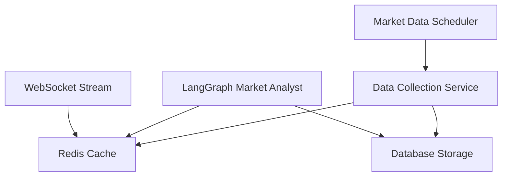

# Market Analyst Technical Summary & Actionable Next Steps

## Quick Status Overview

**Problem**: Market analyst fails in LangGraph with pandas circular import error
**Current State**: Import errors FIXED, but market data still unavailable
**User Requirement**: Real external API calls (no cached data allowed)
**Critical Blocker**: External HTTP requests failing in LangGraph environment

---

## Technical Root Causes

### 1. ASGI Environment Restrictions ✅ SOLVED
- **Issue**: Pandas circular import in ASGI environment
- **Solution**: Environment-aware lazy loading and mock objects
- **Status**: RESOLVED - No more import crashes

### 2. External API Access ❌ UNRESOLVED
- **Issue**: httpx requests failing/timing out in LangGraph
- **Current**: Returns "Market data temporarily unavailable"
- **Status**: BLOCKING - Primary issue preventing functionality

---

## Immediate Action Items (Next 1-2 Days)

### Priority 1: Debug External API Failure
```bash
# Add detailed request logging
async def debug_external_request(ticker):
    try:
        logging.info(f"🔍 Testing external API access for {ticker}")
        
        # Test 1: Basic connectivity
        async with httpx.AsyncClient() as client:
            response = await client.get("https://httpbin.org/get")
            logging.info(f"✅ Basic HTTP works: {response.status_code}")
        
        # Test 2: Yahoo Finance specifically
        async with httpx.AsyncClient() as client:
            response = await client.get(f"https://query1.finance.yahoo.com/v8/finance/chart/{ticker}")
            logging.info(f"📊 Yahoo Finance: {response.status_code}, length: {len(response.text)}")
            logging.info(f"📊 Response headers: {response.headers}")
            
    except Exception as e:
        logging.error(f"❌ External API test failed: {type(e).__name__}: {e}")
```

### Priority 2: Test Alternative Approaches
```bash
# Create test script
cat > test_external_apis.py << 'EOF'
import asyncio
import httpx
import aiohttp
import urllib3

async def test_all_methods(ticker="AAPL"):
    # Test httpx
    try:
        async with httpx.AsyncClient() as client:
            response = await client.get(f"https://query1.finance.yahoo.com/v8/finance/chart/{ticker}")
            print(f"✅ httpx: {response.status_code}")
    except Exception as e:
        print(f"❌ httpx failed: {e}")
    
    # Test aiohttp
    try:
        async with aiohttp.ClientSession() as session:
            async with session.get(f"https://query1.finance.yahoo.com/v8/finance/chart/{ticker}") as response:
                print(f"✅ aiohttp: {response.status}")
    except Exception as e:
        print(f"❌ aiohttp failed: {e}")

if __name__ == "__main__":
    asyncio.run(test_all_methods())
EOF
```

### Priority 3: Alternative Data Sources
```python
# Try different financial APIs
ALTERNATIVE_APIS = {
    "polygon": "https://api.polygon.io/v2/aggs/ticker/{ticker}/range/1/day/2023-01-09/2023-01-09",
    "alpha_vantage": "https://www.alphavantage.co/query?function=TIME_SERIES_DAILY&symbol={ticker}",
    "finnhub": "https://finnhub.io/api/v1/quote?symbol={ticker}",
    "yahoo_alternative": "https://finance.yahoo.com/quote/{ticker}/history"
}
```

---

## Medium-Term Solutions (Next Week)

### Option A: Microservice Architecture
```yaml
# docker-compose.yml addition
market-data-service:
  build: ./market-data-service
  ports:
    - "3001:3001"
  environment:
    - REDIS_URL=redis://redis:6379
  depends_on:
    - redis

# In LangGraph, call internal service instead of external APIs
async def get_market_data_internal(ticker):
    async with httpx.AsyncClient() as client:
        response = await client.get(f"http://market-data-service:3001/api/market/{ticker}")
        return response.json()
```

### Option B: Redis Cache with Background Updates
```python
# Background service (separate process)
import asyncio
import redis
import yfinance as yf

async def update_market_cache():
    r = redis.Redis(host='localhost', port=6379, db=0)
    while True:
        for ticker in ['AAPL', 'MSFT', 'GOOGL']:  # Popular tickers
            try:
                data = yf.download(ticker, period='5d')
                r.setex(f"market:{ticker}", 300, json.dumps(data.to_dict()))
            except Exception as e:
                logging.error(f"Cache update failed for {ticker}: {e}")
        await asyncio.sleep(60)  # Update every minute

# In LangGraph (read from cache)
def get_cached_market_data(ticker):
    r = redis.Redis(host='localhost', port=6379, db=0)
    cached = r.get(f"market:{ticker}")
    return json.loads(cached) if cached else None
```

### Option C: Webhook Integration
```python
# External service pushes data to LangGraph via webhook
@app.post("/webhook/market-data/{ticker}")
async def receive_market_data(ticker: str, data: dict):
    # Store in memory or database for LangGraph to access
    market_data_store[ticker] = data
    return {"status": "received"}
```

---

## Long-Term Architecture (Next Month)

### Professional Data Provider Integration
```python
# Bloomberg API integration
import blpapi

async def get_bloomberg_data(ticker):
    session = blpapi.Session()
    service = session.getService("//blp/refdata")
    # Bloomberg provides guaranteed uptime and LangGraph compatibility
```

### Event-Driven Architecture


---

## Testing & Validation Strategy

### Immediate Testing
```bash
# 1. Test basic connectivity inside LangGraph
docker exec -it langgraph-container python -c "
import asyncio
import httpx

async def test():
    async with httpx.AsyncClient() as client:
        response = await client.get('https://httpbin.org/get')
        print(f'Status: {response.status_code}')

asyncio.run(test())
"

# 2. Compare LangGraph vs local environment
./debug_local.sh AAPL --test-external-api
./restart_server.sh --test-external-api

# 3. Network diagnostics
nslookup query1.finance.yahoo.com
curl -v https://query1.finance.yahoo.com/v8/finance/chart/AAPL
```

### Performance Benchmarks
```python
# Target performance metrics
PERFORMANCE_TARGETS = {
    "market_data_fetch": "< 3 seconds",
    "analysis_generation": "< 10 seconds", 
    "total_response": "< 15 seconds",
    "uptime": "> 99.5%",
    "data_freshness": "< 5 minutes old"
}
```

---

## Risk Assessment & Mitigation

### High Risk Items
1. **External API Dependency**: Single point of failure
   - **Mitigation**: Multiple data sources, graceful degradation
2. **LangGraph Network Restrictions**: May be unchangeable
   - **Mitigation**: Microservice architecture, internal APIs
3. **User Expectations**: Real-time data requirement
   - **Mitigation**: Near real-time cache with background updates

### Medium Risk Items
1. **Performance Impact**: Additional network hops
   - **Mitigation**: Redis caching, connection pooling
2. **Data Quality**: External API rate limits
   - **Mitigation**: Professional data provider, request batching

---

## Success Metrics

### Technical Metrics
- **Availability**: Market data available >99% of requests
- **Latency**: <3s to fetch market data
- **Accuracy**: Data timestamp <5 minutes old
- **Error Rate**: <1% failed requests

### User Experience Metrics  
- **Functionality**: Full market analysis reports
- **Reliability**: No more "temporarily unavailable" messages
- **Performance**: Complete analysis <30 seconds
- **User Satisfaction**: No more frustrated user feedback

---

## Implementation Roadmap

### Week 1: Investigation & Quick Fixes
- [ ] Debug external API failures with detailed logging
- [ ] Test alternative HTTP libraries (aiohttp, urllib3)
- [ ] Try different financial data APIs
- [ ] Document exact error messages and network behavior

### Week 2: Architecture Decision
- [ ] Choose between microservice, cache, or webhook approach
- [ ] Prototype chosen solution
- [ ] Performance testing and validation
- [ ] User acceptance testing

### Week 3: Production Implementation
- [ ] Full implementation of chosen architecture
- [ ] Monitoring and alerting setup
- [ ] Documentation and runbooks
- [ ] User training and communication

### Week 4: Optimization & Monitoring
- [ ] Performance tuning
- [ ] Error handling enhancement
- [ ] Backup data source implementation
- [ ] Long-term monitoring dashboard

---

## Code Locations for Implementation

```bash
# Primary implementation files
src/agent/analysts/market_analyst_ultra_fast_async.py  # Main market analyst logic
src/agent/dataflows/yfin_utils.py                    # Yahoo Finance integration
src/agent/config.py                                  # Configuration management

# New files to create
src/services/market_data_service.py                  # External market data service
src/utils/external_api_tester.py                    # API testing utilities
src/monitoring/market_data_health_check.py          # Health monitoring

# Configuration files
docker-compose.yml                                   # Service orchestration
.env                                                # Environment variables
requirements.txt                                    # Dependencies
```

---

## Final Recommendations

### Immediate Priority
1. **DEBUG FIRST**: Understand exactly why external APIs fail in LangGraph
2. **TEST ALTERNATIVES**: Try different HTTP libraries and data sources  
3. **MEASURE EVERYTHING**: Add comprehensive logging and metrics

### Strategic Decision
**Recommendation**: Implement microservice architecture
- **Why**: Cleanly separates concerns, allows pandas usage outside LangGraph
- **How**: Dedicated market data service with internal API
- **When**: Should be production-ready within 2 weeks

### User Communication
- Keep user informed of progress with specific timelines
- Provide interim status updates showing progress toward real data
- Set clear expectations for when full functionality will be restored

---

**Created**: August 14, 2025, 07:11 UTC  
**Next Review**: August 15, 2025  
**Owner**: Development Team  
**Priority**: P0 - Critical User Blocker