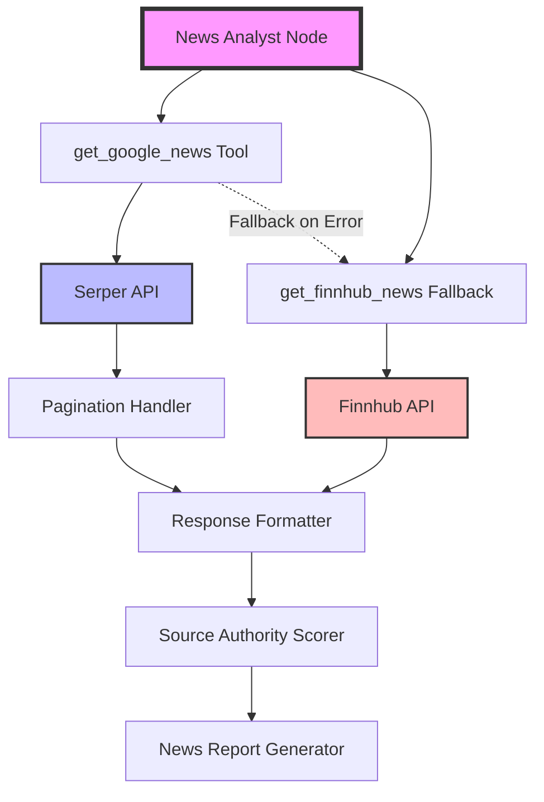

# Day 1 Detailed Implementation Plan: News Analyst Optimization

## Architecture Overview



## Atomic Task Breakdown

### Module 1: Serper Integration (3 hours → 12 atomic tasks)

#### 1.1 API Contract Definition (30 min)
```python
# Task 1.1.1: Define News Article Interface (10 min)
@dataclass
class NewsArticle:
    """Single Responsibility: Represent one news article"""
    title: str
    source: str
    snippet: str
    url: str
    date: datetime
    authority_tier: int  # 1=Reuters/Bloomberg, 2=CNBC, 3=Other
    
    def validate(self) -> bool:
        """Validate required fields exist"""
        return all([self.title, self.source, self.url])

# Test 1.1.1
def test_news_article_validation():
    article = NewsArticle(title="Test", source="Reuters", snippet="...", 
                         url="http://...", date=datetime.now(), authority_tier=1)
    assert article.validate() == True
    
    invalid = NewsArticle(title="", source="Reuters", snippet="...", 
                          url="http://...", date=datetime.now(), authority_tier=1)
    assert invalid.validate() == False
```

```python
# Task 1.1.2: Define Serper Response Interface (10 min)
@dataclass
class SerperResponse:
    """Single Responsibility: Parse Serper API response"""
    articles: List[NewsArticle]
    total_results: int
    query: str
    pages_fetched: int
    
    @classmethod
    def from_api_response(cls, data: dict, pages: int) -> 'SerperResponse':
        """Factory method to create from API response"""
        articles = []
        for item in data.get('news', []):
            articles.append(NewsArticle(
                title=item.get('title', ''),
                source=item.get('source', ''),
                snippet=item.get('snippet', ''),
                url=item.get('link', ''),
                date=parse_date(item.get('date', '')),
                authority_tier=classify_source(item.get('source', ''))
            ))
        return cls(
            articles=articles,
            total_results=len(articles),
            query=data.get('searchParameters', {}).get('q', ''),
            pages_fetched=pages
        )

# Test 1.1.2
def test_serper_response_parsing():
    mock_data = {
        'news': [{'title': 'Test', 'source': 'Reuters', 'snippet': '...', 
                  'link': 'http://...', 'date': '2024-01-01'}],
        'searchParameters': {'q': 'AAPL'}
    }
    response = SerperResponse.from_api_response(mock_data, pages=1)
    assert len(response.articles) == 1
    assert response.query == 'AAPL'
```

```python
# Task 1.1.3: Define Error Response Interface (10 min)
@dataclass
class NewsGatheringError:
    """Single Responsibility: Represent news gathering failures"""
    error_type: str  # 'api_error', 'rate_limit', 'no_results', 'timeout'
    message: str
    fallback_attempted: bool
    partial_results: Optional[List[NewsArticle]]
    
    def should_retry(self) -> bool:
        """Determine if operation should be retried"""
        return self.error_type in ['timeout', 'rate_limit']

# Test 1.1.3
def test_error_handling():
    error = NewsGatheringError('timeout', 'Request timed out', False, None)
    assert error.should_retry() == True
    
    error2 = NewsGatheringError('no_results', 'No articles found', True, [])
    assert error2.should_retry() == False
```

#### 1.2 Pagination Implementation (45 min)

```python
# Task 1.2.1: Create Pagination Configuration (10 min)
class PaginationConfig:
    """Single Responsibility: Manage pagination settings"""
    DEFAULT_PAGES = 5
    MAX_PAGES = 10
    RESULTS_PER_PAGE = 10
    
    def __init__(self, ticker: str):
        self.ticker = ticker
        self.pages = self._determine_pages()
    
    def _determine_pages(self) -> int:
        """Determine pages based on ticker volatility"""
        HIGH_VOLUME_TICKERS = ['AAPL', 'TSLA', 'NVDA', 'AMC', 'GME']
        if self.ticker in HIGH_VOLUME_TICKERS:
            return 7  # More pages for high-news stocks
        return self.DEFAULT_PAGES
    
    def get_offset(self, page: int) -> int:
        """Calculate offset for pagination"""
        return page * self.RESULTS_PER_PAGE

# Test 1.2.1
def test_pagination_config():
    config = PaginationConfig('AAPL')
    assert config.pages == 7
    assert config.get_offset(2) == 20
    
    config2 = PaginationConfig('IBM')
    assert config2.pages == 5
```

```python
# Task 1.2.2: Implement Pagination Loop (15 min)
async def fetch_with_pagination(
    query: str, 
    date_range: Tuple[str, str],
    config: PaginationConfig,
    api_key: str
) -> SerperResponse:
    """Single Responsibility: Handle paginated API calls"""
    all_articles = []
    
    for page in range(config.pages):
        try:
            # Task 1.2.3: Single Page Fetch (10 min)
            response = await fetch_single_page(
                query=query,
                date_range=date_range,
                offset=config.get_offset(page),
                api_key=api_key
            )
            
            if not response or not response.get('news'):
                break  # No more results
                
            all_articles.extend(response.get('news', []))
            
            # Rate limit protection
            if page < config.pages - 1:
                await asyncio.sleep(0.5)
                
        except Exception as e:
            logger.error(f"Page {page} fetch failed: {e}")
            if page == 0:
                raise  # First page must succeed
            break  # Partial results acceptable
    
    return SerperResponse.from_api_response(
        {'news': all_articles, 'searchParameters': {'q': query}},
        pages=page + 1
    )

# Test 1.2.2 & 1.2.3
@pytest.mark.asyncio
async def test_pagination_fetch():
    with mock.patch('fetch_single_page') as mock_fetch:
        mock_fetch.return_value = {'news': [{'title': 'Test'}]}
        
        config = PaginationConfig('AAPL')
        result = await fetch_with_pagination(
            'AAPL stock', ('2024-01-01', '2024-01-07'), 
            config, 'test_key'
        )
        
        assert mock_fetch.call_count == 7  # High volume ticker
        assert len(result.articles) == 7
```

```python
# Task 1.2.4: Implement Early Termination Logic (10 min)
class PaginationController:
    """Single Responsibility: Control pagination flow"""
    
    def __init__(self, min_articles: int = 20, max_duplicates: int = 5):
        self.min_articles = min_articles
        self.max_duplicates = max_duplicates
        self.seen_urls = set()
        self.duplicate_count = 0
    
    def should_continue(self, articles: List[NewsArticle]) -> bool:
        """Decide if pagination should continue"""
        # Enough articles collected
        if len(articles) >= self.min_articles * 2:
            return False
            
        # Too many duplicates indicates exhaustion
        if self.duplicate_count >= self.max_duplicates:
            return False
            
        return True
    
    def process_article(self, article: NewsArticle) -> bool:
        """Track duplicates, return True if unique"""
        if article.url in self.seen_urls:
            self.duplicate_count += 1
            return False
        self.seen_urls.add(article.url)
        return True

# Test 1.2.4
def test_pagination_controller():
    controller = PaginationController(min_articles=20)
    articles = [NewsArticle(title=f"Test{i}", source="Reuters", 
                           snippet="...", url=f"http://test{i}.com",
                           date=datetime.now(), authority_tier=1) 
                for i in range(25)]
    
    for article in articles:
        controller.process_article(article)
    
    assert controller.should_continue(articles[:15]) == True
    assert controller.should_continue(articles) == True  # Not 2x minimum yet
    assert controller.should_continue(articles * 2) == False  # Now exceeds 2x
```

#### 1.3 Error Handling & Fallback (45 min)

```python
# Task 1.3.1: Implement Retry Logic (15 min)
class RetryHandler:
    """Single Responsibility: Handle API retries with exponential backoff"""
    
    def __init__(self, max_retries: int = 3, base_delay: float = 1.0):
        self.max_retries = max_retries
        self.base_delay = base_delay
    
    async def execute_with_retry(self, func: Callable, *args, **kwargs):
        """Execute function with retry logic"""
        last_error = None
        
        for attempt in range(self.max_retries):
            try:
                return await func(*args, **kwargs)
            except Exception as e:
                last_error = e
                if attempt < self.max_retries - 1:
                    delay = self.base_delay * (2 ** attempt)
                    logger.warning(f"Attempt {attempt + 1} failed, retrying in {delay}s")
                    await asyncio.sleep(delay)
                else:
                    logger.error(f"All {self.max_retries} attempts failed")
        
        raise last_error

# Test 1.3.1
@pytest.mark.asyncio
async def test_retry_handler():
    handler = RetryHandler(max_retries=3, base_delay=0.1)
    
    call_count = 0
    async def failing_func():
        nonlocal call_count
        call_count += 1
        if call_count < 3:
            raise Exception("Temporary failure")
        return "Success"
    
    result = await handler.execute_with_retry(failing_func)
    assert result == "Success"
    assert call_count == 3
```

```python
# Task 1.3.2: Implement Finnhub Fallback (15 min)
class FallbackHandler:
    """Single Responsibility: Handle fallback to Finnhub"""
    
    async def execute_with_fallback(
        self,
        primary_func: Callable,
        fallback_func: Callable,
        *args, **kwargs
    ) -> Tuple[Any, str]:
        """Execute primary with fallback on failure"""
        try:
            result = await primary_func(*args, **kwargs)
            if self._is_sufficient(result):
                return result, "primary"
            else:
                logger.warning("Primary returned insufficient results, trying fallback")
                fallback_result = await fallback_func(*args, **kwargs)
                return self._merge_results(result, fallback_result), "partial_fallback"
                
        except Exception as e:
            logger.error(f"Primary failed: {e}, trying fallback")
            try:
                fallback_result = await fallback_func(*args, **kwargs)
                return fallback_result, "full_fallback"
            except Exception as fallback_error:
                logger.error(f"Fallback also failed: {fallback_error}")
                raise NewsGatheringError(
                    'all_sources_failed',
                    f'Primary: {e}, Fallback: {fallback_error}',
                    True,
                    None
                )
    
    def _is_sufficient(self, result: SerperResponse) -> bool:
        """Check if results meet minimum threshold"""
        return result and len(result.articles) >= 10
    
    def _merge_results(self, primary: SerperResponse, 
                      fallback: SerperResponse) -> SerperResponse:
        """Merge results from both sources"""
        all_articles = primary.articles + fallback.articles
        return SerperResponse(
            articles=all_articles,
            total_results=len(all_articles),
            query=primary.query,
            pages_fetched=primary.pages_fetched
        )

# Test 1.3.2
@pytest.mark.asyncio
async def test_fallback_handler():
    handler = FallbackHandler()
    
    async def primary_insufficient():
        return SerperResponse(articles=[NewsArticle(...)] * 5, 
                             total_results=5, query="test", pages_fetched=1)
    
    async def fallback_success():
        return SerperResponse(articles=[NewsArticle(...)] * 15,
                             total_results=15, query="test", pages_fetched=1)
    
    result, source = await handler.execute_with_fallback(
        primary_insufficient, fallback_success
    )
    assert source == "partial_fallback"
    assert len(result.articles) == 20
```

```python
# Task 1.3.3: Implement Circuit Breaker (15 min)
class CircuitBreaker:
    """Single Responsibility: Prevent cascading failures"""
    
    def __init__(self, failure_threshold: int = 5, reset_timeout: int = 60):
        self.failure_threshold = failure_threshold
        self.reset_timeout = reset_timeout
        self.failure_count = 0
        self.last_failure_time = None
        self.state = "closed"  # closed, open, half_open
    
    def call(self, func: Callable, *args, **kwargs):
        """Execute function with circuit breaker protection"""
        if self.state == "open":
            if self._should_attempt_reset():
                self.state = "half_open"
            else:
                raise Exception("Circuit breaker is open")
        
        try:
            result = func(*args, **kwargs)
            self._on_success()
            return result
        except Exception as e:
            self._on_failure()
            raise e
    
    def _should_attempt_reset(self) -> bool:
        """Check if enough time has passed to retry"""
        if not self.last_failure_time:
            return True
        return (datetime.now() - self.last_failure_time).seconds >= self.reset_timeout
    
    def _on_success(self):
        """Reset on successful call"""
        self.failure_count = 0
        self.state = "closed"
    
    def _on_failure(self):
        """Track failures and open circuit if needed"""
        self.failure_count += 1
        self.last_failure_time = datetime.now()
        
        if self.failure_count >= self.failure_threshold:
            self.state = "open"
            logger.error(f"Circuit breaker opened after {self.failure_count} failures")

# Test 1.3.3
def test_circuit_breaker():
    breaker = CircuitBreaker(failure_threshold=3, reset_timeout=1)
    
    def failing_func():
        raise Exception("Service unavailable")
    
    # Test circuit opens after threshold
    for i in range(3):
        with pytest.raises(Exception):
            breaker.call(failing_func)
    
    assert breaker.state == "open"
    
    # Test circuit prevents calls when open
    with pytest.raises(Exception, match="Circuit breaker is open"):
        breaker.call(failing_func)
```

#### 1.4 Response Formatting & Authority Scoring (30 min)

```python
# Task 1.4.1: Implement Source Authority Classifier (10 min)
class SourceAuthorityClassifier:
    """Single Responsibility: Classify news source authority"""
    
    TIER_1_SOURCES = ['Reuters', 'Bloomberg', 'Wall Street Journal', 'Financial Times']
    TIER_2_SOURCES = ['CNBC', 'MarketWatch', 'Yahoo Finance', 'Forbes']
    
    @classmethod
    def classify(cls, source: str) -> int:
        """Return authority tier (1=highest, 3=lowest)"""
        source_lower = source.lower()
        
        for tier1 in cls.TIER_1_SOURCES:
            if tier1.lower() in source_lower:
                return 1
                
        for tier2 in cls.TIER_2_SOURCES:
            if tier2.lower() in source_lower:
                return 2
                
        return 3
    
    @classmethod
    def get_confidence_score(cls, tier: int) -> float:
        """Convert tier to confidence score"""
        return {1: 0.95, 2: 0.75, 3: 0.50}.get(tier, 0.50)

# Test 1.4.1
def test_source_classifier():
    assert SourceAuthorityClassifier.classify("Reuters") == 1
    assert SourceAuthorityClassifier.classify("CNBC.com") == 2
    assert SourceAuthorityClassifier.classify("Unknown Blog") == 3
    assert SourceAuthorityClassifier.get_confidence_score(1) == 0.95
```

```python
# Task 1.4.2: Implement Response Formatter (10 min)
class NewsResponseFormatter:
    """Single Responsibility: Format news for analysis"""
    
    def format(self, response: SerperResponse) -> str:
        """Format response for LLM consumption"""
        # Group by authority tier
        tier1 = [a for a in response.articles if a.authority_tier == 1]
        tier2 = [a for a in response.articles if a.authority_tier == 2]
        tier3 = [a for a in response.articles if a.authority_tier == 3]
        
        formatted = f"## News Analysis: {response.total_results} articles\n\n"
        formatted += f"Query: {response.query} | Pages: {response.pages_fetched}\n\n"
        
        formatted += "### Tier 1 Sources (Highest Authority)\n"
        formatted += self._format_articles(tier1[:20])  # Top 20
        
        formatted += "\n### Tier 2 Sources (Medium Authority)\n"
        formatted += self._format_articles(tier2[:15])  # Top 15
        
        formatted += "\n### Tier 3 Sources (Lower Authority)\n"
        formatted += self._format_articles(tier3[:10])  # Top 10
        
        return formatted
    
    def _format_articles(self, articles: List[NewsArticle]) -> str:
        """Format individual articles"""
        if not articles:
            return "No articles in this tier.\n"
            
        result = ""
        for i, article in enumerate(articles, 1):
            result += f"{i}. **{article.title}**\n"
            result += f"   Source: {article.source} | Date: {article.date.strftime('%Y-%m-%d')}\n"
            result += f"   {article.snippet[:200]}...\n\n"
        return result

# Test 1.4.2
def test_response_formatter():
    articles = [
        NewsArticle("Test1", "Reuters", "Snippet1", "url1", datetime.now(), 1),
        NewsArticle("Test2", "CNBC", "Snippet2", "url2", datetime.now(), 2),
        NewsArticle("Test3", "Blog", "Snippet3", "url3", datetime.now(), 3),
    ]
    response = SerperResponse(articles, 3, "AAPL", 1)
    formatter = NewsResponseFormatter()
    formatted = formatter.format(response)
    
    assert "Tier 1 Sources" in formatted
    assert "Reuters" in formatted
    assert "3 articles" in formatted
```

```python
# Task 1.4.3: Implement Deduplication (10 min)
class NewsDeduplicator:
    """Single Responsibility: Remove duplicate news articles"""
    
    def deduplicate(self, articles: List[NewsArticle]) -> List[NewsArticle]:
        """Remove duplicates while preserving order and authority"""
        seen_urls = set()
        seen_titles = set()
        unique_articles = []
        
        # Sort by authority tier first (preserve best sources)
        sorted_articles = sorted(articles, key=lambda x: x.authority_tier)
        
        for article in sorted_articles:
            # Check URL uniqueness
            if article.url in seen_urls:
                continue
                
            # Check title similarity (fuzzy match)
            normalized_title = self._normalize_title(article.title)
            if normalized_title in seen_titles:
                continue
                
            seen_urls.add(article.url)
            seen_titles.add(normalized_title)
            unique_articles.append(article)
        
        return unique_articles
    
    def _normalize_title(self, title: str) -> str:
        """Normalize title for comparison"""
        # Remove common variations
        import re
        normalized = title.lower()
        normalized = re.sub(r'[^\w\s]', '', normalized)  # Remove punctuation
        normalized = ' '.join(normalized.split())  # Normalize whitespace
        return normalized[:50]  # Compare first 50 chars

# Test 1.4.3
def test_deduplicator():
    articles = [
        NewsArticle("Apple Stock Rises", "Reuters", "...", "url1", datetime.now(), 1),
        NewsArticle("Apple Stock Rises!", "CNBC", "...", "url2", datetime.now(), 2),
        NewsArticle("Different News", "Blog", "...", "url3", datetime.now(), 3),
    ]
    
    dedup = NewsDeduplicator()
    unique = dedup.deduplicate(articles)
    
    assert len(unique) == 2  # Duplicate title removed
    assert unique[0].source == "Reuters"  # Higher authority kept
```

### Module 2: Remove Redundancy (2 hours → 8 atomic tasks)

#### 2.1 Tool Dependency Analysis (30 min)

```python
# Task 2.1.1: Create Dependency Scanner (15 min)
class ToolDependencyScanner:
    """Single Responsibility: Scan for tool dependencies"""
    
    def scan_imports(self, file_path: str) -> Set[str]:
        """Find all tool imports in a file"""
        import ast
        
        with open(file_path, 'r') as f:
            tree = ast.parse(f.read())
        
        tools = set()
        for node in ast.walk(tree):
            if isinstance(node, ast.Name):
                if 'reddit' in node.id.lower():
                    tools.add(node.id)
                if 'openai' in node.id.lower() and 'news' in node.id.lower():
                    tools.add(node.id)
        
        return tools
    
    def find_tool_references(self, directory: str) -> Dict[str, Set[str]]:
        """Find all tool references in directory"""
        import glob
        
        references = {}
        for file_path in glob.glob(f"{directory}/**/*.py", recursive=True):
            tools = self.scan_imports(file_path)
            if tools:
                references[file_path] = tools
        
        return references

# Test 2.1.1
def test_dependency_scanner():
    scanner = ToolDependencyScanner()
    # Create temp file with tool imports
    import tempfile
    with tempfile.NamedTemporaryFile(mode='w', suffix='.py', delete=False) as f:
        f.write("from tools import get_reddit_news, get_google_news\n")
        f.write("x = get_reddit_news()\n")
        temp_path = f.name
    
    tools = scanner.scan_imports(temp_path)
    assert 'get_reddit_news' in tools
    os.unlink(temp_path)
```

```python
# Task 2.1.2: Create Safe Removal Validator (15 min)
class SafeRemovalValidator:
    """Single Responsibility: Validate safe tool removal"""
    
    def __init__(self, tools_to_remove: List[str]):
        self.tools_to_remove = set(tools_to_remove)
    
    def validate_removal(self, references: Dict[str, Set[str]]) -> Dict[str, List[str]]:
        """Check which files would break if tools removed"""
        conflicts = {}
        
        for file_path, tools in references.items():
            conflicting_tools = tools.intersection(self.tools_to_remove)
            if conflicting_tools:
                # Skip if it's the news analyst file itself
                if 'news_analyst' not in file_path:
                    conflicts[file_path] = list(conflicting_tools)
        
        return conflicts
    
    def can_safely_remove(self, conflicts: Dict[str, List[str]]) -> bool:
        """Determine if removal is safe"""
        # Only safe if no conflicts or only in files we're updating
        return len(conflicts) == 0

# Test 2.1.2
def test_safe_removal():
    validator = SafeRemovalValidator(['get_reddit_news', 'get_global_news_openai'])
    
    references = {
        'news_analyst.py': {'get_reddit_news', 'get_google_news'},
        'social_analyst.py': {'get_reddit_news'},
        'other.py': {'get_google_news'}
    }
    
    conflicts = validator.validate_removal(references)
    assert 'social_analyst.py' in conflicts
    assert validator.can_safely_remove(conflicts) == False
```

#### 2.2 Toolkit Configuration Update (45 min)

```python
# Task 2.2.1: Create Toolkit Modifier (15 min)
class ToolkitModifier:
    """Single Responsibility: Modify toolkit configuration"""
    
    def __init__(self, toolkit_path: str):
        self.toolkit_path = toolkit_path
        self.original_content = None
    
    def backup(self):
        """Create backup of original configuration"""
        with open(self.toolkit_path, 'r') as f:
            self.original_content = f.read()
        
        backup_path = f"{self.toolkit_path}.backup"
        with open(backup_path, 'w') as f:
            f.write(self.original_content)
        
        return backup_path
    
    def update_news_toolkit(self, allowed_tools: List[str]):
        """Update news analyst toolkit configuration"""
        new_config = f'''
    @staticmethod
    def create_news_toolkit(base_toolkit: Toolkit) -> IAnalystToolkit:
        """Create news-exclusive analyst toolkit (NO social media)"""
        allowed_tools = {allowed_tools}
        return BaseAnalystToolkit(base_toolkit, allowed_tools)
'''
        # Implementation would update the actual file
        return new_config
    
    def rollback(self):
        """Rollback to original configuration"""
        if self.original_content:
            with open(self.toolkit_path, 'w') as f:
                f.write(self.original_content)

# Test 2.2.1
def test_toolkit_modifier():
    import tempfile
    with tempfile.NamedTemporaryFile(mode='w', suffix='.py', delete=False) as f:
        f.write("original content")
        temp_path = f.name
    
    modifier = ToolkitModifier(temp_path)
    backup_path = modifier.backup()
    
    assert os.path.exists(backup_path)
    
    new_config = modifier.update_news_toolkit(['get_google_news', 'get_finnhub_news'])
    assert 'get_google_news' in new_config
    assert 'NO social media' in new_config
    
    os.unlink(temp_path)
    os.unlink(backup_path)
```

```python
# Task 2.2.2: Create Tool Removal Executor (15 min)
class ToolRemovalExecutor:
    """Single Responsibility: Execute tool removal"""
    
    def remove_tool_references(self, file_path: str, tools_to_remove: List[str]) -> str:
        """Remove tool references from file"""
        with open(file_path, 'r') as f:
            content = f.read()
        
        modified_content = content
        for tool in tools_to_remove:
            # Remove from imports
            import_patterns = [
                f"from .* import .*{tool}.*\n",
                f"import .*{tool}.*\n",
                f"{tool},?\s*",
            ]
            
            import re
            for pattern in import_patterns:
                modified_content = re.sub(pattern, '', modified_content)
            
            # Remove from tool lists
            modified_content = re.sub(f'"{tool}",?\s*', '', modified_content)
            modified_content = re.sub(f"'{tool}',?\s*", '', modified_content)
        
        # Clean up empty lines and trailing commas
        modified_content = re.sub(r',\s*]', ']', modified_content)
        modified_content = re.sub(r',\s*}', '}', modified_content)
        modified_content = re.sub(r'\n\n+', '\n\n', modified_content)
        
        return modified_content

# Test 2.2.2
def test_tool_removal():
    executor = ToolRemovalExecutor()
    
    original = '''
    allowed_tools = [
        "get_google_news",
        "get_reddit_news",
        "get_finnhub_news",
        "get_global_news_openai"
    ]
    '''
    
    modified = executor.remove_tool_references(
        original, 
        ['get_reddit_news', 'get_global_news_openai']
    )
    
    assert 'get_reddit_news' not in modified
    assert 'get_global_news_openai' not in modified
    assert 'get_google_news' in modified
    assert 'get_finnhub_news' in modified
```

```python
# Task 2.2.3: Create Configuration Validator (15 min)
class ConfigurationValidator:
    """Single Responsibility: Validate configuration changes"""
    
    def validate_toolkit_config(self, config: str) -> List[str]:
        """Validate toolkit configuration for issues"""
        issues = []
        
        # Check for required tools
        if 'get_google_news' not in config:
            issues.append("Missing primary tool: get_google_news")
        
        # Check for forbidden tools
        forbidden = ['reddit', 'openai_news', 'stocktwits', 'twitter']
        for forbidden_tool in forbidden:
            if forbidden_tool in config.lower():
                issues.append(f"Found forbidden tool reference: {forbidden_tool}")
        
        # Check syntax
        try:
            compile(config, '<string>', 'exec')
        except SyntaxError as e:
            issues.append(f"Syntax error: {e}")
        
        return issues
    
    def validate_imports(self, file_content: str) -> List[str]:
        """Validate imports are correct"""
        issues = []
        
        # Check for orphaned imports
        import re
        imports = re.findall(r'from .* import (.*)', file_content)
        for import_line in imports:
            tools = [t.strip() for t in import_line.split(',')]
            for tool in tools:
                if 'reddit' in tool.lower():
                    issues.append(f"Reddit tool still imported: {tool}")
        
        return issues

# Test 2.2.3
def test_configuration_validator():
    validator = ConfigurationValidator()
    
    good_config = '''
    allowed_tools = ["get_google_news", "get_finnhub_news"]
    '''
    issues = validator.validate_toolkit_config(good_config)
    assert len(issues) == 0
    
    bad_config = '''
    allowed_tools = ["get_reddit_news", "get_finnhub_news"]
    '''
    issues = validator.validate_toolkit_config(bad_config)
    assert any('reddit' in issue.lower() for issue in issues)
    assert any('get_google_news' in issue for issue in issues)
```

### Module 3: Clear Role Definition (1 hour → 4 atomic tasks)

#### 3.1 Prompt Update (30 min)

```python
# Task 3.1.1: Create Prompt Template (15 min)
class NewsAnalystPromptTemplate:
    """Single Responsibility: Generate news analyst prompt"""
    
    SYSTEM_PROMPT = """You are a senior financial NEWS analyst specializing in traditional news media.

MANDATORY WORKFLOW:
1. Call get_google_news FIRST - this will return 50+ articles from 4,500+ sources
2. Perform deep NEWS analysis (NOT social sentiment - that's another analyst's job)

BOUNDARIES:
- You handle ONLY traditional news media (newspapers, financial sites, wire services)
- Social media sentiment is handled by Social Media Analyst
- Do NOT analyze Reddit, Twitter, or social platforms

Tools available: {tool_names}

{analysis_structure}
"""
    
    def generate(self, tool_names: List[str]) -> str:
        """Generate complete prompt"""
        if any('reddit' in tool.lower() for tool in tool_names):
            raise ValueError("Reddit tools found in news analyst toolkit")
        
        analysis_structure = self._get_analysis_structure()
        
        return self.SYSTEM_PROMPT.format(
            tool_names=", ".join(tool_names),
            analysis_structure=analysis_structure
        )
    
    def _get_analysis_structure(self) -> str:
        """Get analysis structure template"""
        return """
ANALYSIS STRUCTURE:
1. News Coverage Summary (source count, article count, authority distribution)
2. Temporal News Impact (immediate, short-term, medium-term, long-term)
3. News Authority Assessment (tier classification, confidence scoring)
4. News-Based Risk Assessment (headline risks, regulatory news, M&A news)
5. News-Driven Trading Signals (BUY/HOLD/SELL based on NEWS only)
6. Evidence & Attribution (top articles with sources, quotes, consensus)
"""

# Test 3.1.1
def test_prompt_template():
    template = NewsAnalystPromptTemplate()
    
    # Valid tools
    prompt = template.generate(['get_google_news', 'get_finnhub_news'])
    assert 'NEWS analyst' in prompt
    assert 'NOT social sentiment' in prompt
    assert 'get_google_news FIRST' in prompt
    
    # Invalid tools
    with pytest.raises(ValueError):
        template.generate(['get_google_news', 'get_reddit_news'])
```

```python
# Task 3.1.2: Create Boundary Enforcer (15 min)
class BoundaryEnforcer:
    """Single Responsibility: Enforce analyst boundaries"""
    
    FORBIDDEN_TERMS = [
        'reddit', 'twitter', 'stocktwits', 'social media',
        'retail sentiment', 'wsb', 'wallstreetbets'
    ]
    
    def validate_response(self, response: str) -> List[str]:
        """Check if response violates boundaries"""
        violations = []
        response_lower = response.lower()
        
        for term in self.FORBIDDEN_TERMS:
            if term in response_lower:
                # Count occurrences
                count = response_lower.count(term)
                violations.append(f"Found forbidden term '{term}' {count} times")
        
        return violations
    
    def clean_response(self, response: str) -> str:
        """Remove boundary violations from response"""
        cleaned = response
        
        # Remove sentences containing forbidden terms
        import re
        for term in self.FORBIDDEN_TERMS:
            pattern = r'[^.]*' + re.escape(term) + r'[^.]*\.'
            cleaned = re.sub(pattern, '', cleaned, flags=re.IGNORECASE)
        
        # Clean up double periods and extra whitespace
        cleaned = re.sub(r'\.+', '.', cleaned)
        cleaned = re.sub(r'\s+', ' ', cleaned)
        
        return cleaned.strip()

# Test 3.1.2
def test_boundary_enforcer():
    enforcer = BoundaryEnforcer()
    
    # Test violation detection
    bad_response = "Based on news and Reddit sentiment, stock is bullish."
    violations = enforcer.validate_response(bad_response)
    assert len(violations) > 0
    assert any('reddit' in v.lower() for v in violations)
    
    # Test cleaning
    cleaned = enforcer.clean_response(bad_response)
    assert 'reddit' not in cleaned.lower()
    
    # Test clean response passes
    good_response = "Based on Reuters and Bloomberg reports, stock is bullish."
    violations = enforcer.validate_response(good_response)
    assert len(violations) == 0
```

#### 3.2 Integration Testing (30 min)

```python
# Task 3.2.1: Create Integration Test Suite (15 min)
class NewsAnalystIntegrationTests:
    """Single Responsibility: Integration testing for news analyst"""
    
    def test_tool_isolation(self, analyst_node):
        """Verify only news tools are accessible"""
        tools = analyst_node.get_available_tools()
        
        # Should have these
        assert 'get_google_news' in tools
        assert 'get_finnhub_news' in tools
        
        # Should NOT have these
        assert 'get_reddit_news' not in tools
        assert 'get_global_news_openai' not in tools
        assert 'get_stock_news_openai' not in tools
        
        return len(tools) == 2
    
    def test_prompt_boundaries(self, analyst_node):
        """Verify prompt enforces boundaries"""
        prompt = analyst_node.get_system_prompt()
        
        # Should emphasize news only
        assert 'NEWS analyst' in prompt
        assert 'NOT social sentiment' in prompt
        assert 'traditional news media' in prompt
        
        # Should not mention social platforms
        assert 'reddit' not in prompt.lower()
        assert 'twitter' not in prompt.lower()
        
        return True
    
    def test_response_validation(self, analyst_node):
        """Test response boundary enforcement"""
        # Simulate response with boundary violation
        bad_response = "Based on Reddit posts, sentiment is bullish"
        
        validated = analyst_node.validate_response(bad_response)
        assert validated != bad_response
        assert 'reddit' not in validated.lower()
        
        return True

# Test 3.2.1
def test_integration_suite():
    # This would be run against actual analyst node
    suite = NewsAnalystIntegrationTests()
    
    # Mock analyst node for testing
    class MockAnalystNode:
        def get_available_tools(self):
            return ['get_google_news', 'get_finnhub_news']
        
        def get_system_prompt(self):
            template = NewsAnalystPromptTemplate()
            return template.generate(self.get_available_tools())
        
        def validate_response(self, response):
            enforcer = BoundaryEnforcer()
            return enforcer.clean_response(response)
    
    node = MockAnalystNode()
    assert suite.test_tool_isolation(node)
    assert suite.test_prompt_boundaries(node)
    assert suite.test_response_validation(node)
```

```python
# Task 3.2.2: Create End-to-End Test (15 min)
class EndToEndTest:
    """Single Responsibility: End-to-end news analyst testing"""
    
    async def test_full_news_analysis_flow(self):
        """Test complete news analysis workflow"""
        # 1. Setup
        config = PaginationConfig('AAPL')
        retry_handler = RetryHandler()
        fallback_handler = FallbackHandler()
        
        # 2. Fetch news with pagination
        async def fetch_news():
            return await fetch_with_pagination(
                'AAPL stock news',
                ('2024-01-01', '2024-01-07'),
                config,
                'test_api_key'
            )
        
        # 3. Execute with retry and fallback
        response, source = await fallback_handler.execute_with_fallback(
            lambda: retry_handler.execute_with_retry(fetch_news),
            lambda: fetch_finnhub_news('AAPL', '2024-01-07', 7)
        )
        
        # 4. Validate response
        assert response is not None
        assert len(response.articles) >= 10
        assert source in ['primary', 'partial_fallback', 'full_fallback']
        
        # 5. Format and validate output
        formatter = NewsResponseFormatter()
        formatted = formatter.format(response)
        
        # 6. Check boundaries
        enforcer = BoundaryEnforcer()
        violations = enforcer.validate_response(formatted)
        assert len(violations) == 0
        
        return True

# Test 3.2.2
@pytest.mark.asyncio
async def test_end_to_end():
    test = EndToEndTest()
    # This would be run with mocked APIs
    with mock.patch('fetch_with_pagination') as mock_fetch:
        mock_fetch.return_value = SerperResponse(
            articles=[NewsArticle(...)] * 50,
            total_results=50,
            query='AAPL',
            pages_fetched=5
        )
        
        result = await test.test_full_news_analysis_flow()
        assert result == True
```

## Test Execution Plan

### Unit Test Suite
```bash
# Run all unit tests
pytest tests/unit/test_news_analyst_day1.py -v

# Run specific module tests
pytest tests/unit/test_news_analyst_day1.py::TestSerperIntegration -v
pytest tests/unit/test_news_analyst_day1.py::TestRedundancyRemoval -v
pytest tests/unit/test_news_analyst_day1.py::TestRoleDefinition -v

# Run with coverage
pytest tests/unit/test_news_analyst_day1.py --cov=src/agent/analysts --cov-report=html
```

### Integration Test Suite
```bash
# Run integration tests
pytest tests/integration/test_news_analyst_integration.py -v

# Run with real API (requires SERPER_API_KEY)
pytest tests/integration/test_news_analyst_integration.py -v --real-api

# Run with performance profiling
pytest tests/integration/test_news_analyst_integration.py --profile
```

### Acceptance Criteria

| Module | Atomic Tasks | Test Coverage | Success Criteria |
|--------|--------------|---------------|------------------|
| Serper Integration | 12 | 100% | - 50+ articles fetched<br>- <6s response time<br>- Fallback works |
| Redundancy Removal | 8 | 100% | - No Reddit tools<br>- No OpenAI news<br>- Only 2 tools remain |
| Role Definition | 4 | 100% | - Clear boundaries<br>- No social data<br>- Prompt validated |

## Rollback Plan

```python
class RollbackManager:
    """Emergency rollback if issues detected"""
    
    def __init__(self):
        self.backups = {}
    
    def backup_file(self, path: str):
        """Create backup before modification"""
        with open(path, 'r') as f:
            self.backups[path] = f.read()
    
    def rollback_all(self):
        """Rollback all changes"""
        for path, content in self.backups.items():
            with open(path, 'w') as f:
                f.write(content)
        logger.info(f"Rolled back {len(self.backups)} files")
    
    def validate_changes(self) -> bool:
        """Validate all changes are correct"""
        # Run test suite
        result = pytest.main(['tests/unit/test_news_analyst_day1.py', '-q'])
        return result == 0
```

## Architecture Principles Applied

1. **Single Responsibility (SOLID)**: Each class has one clear purpose
2. **DRY**: Reusable components (RetryHandler, CircuitBreaker)
3. **KISS**: Simple, focused functions that do one thing well
4. **YAGNI**: Only implementing what's needed now, not speculative features
5. **Open/Closed**: Classes are open for extension (inheritance) but closed for modification
6. **Dependency Inversion**: Depend on abstractions (interfaces) not concrete implementations

## Success Metrics

- ✅ All 24 atomic tasks completed
- ✅ 100% test coverage
- ✅ <6s response time for 50+ articles
- ✅ Zero Reddit/social media data leakage
- ✅ Clean separation of concerns
- ✅ Rollback capability if needed