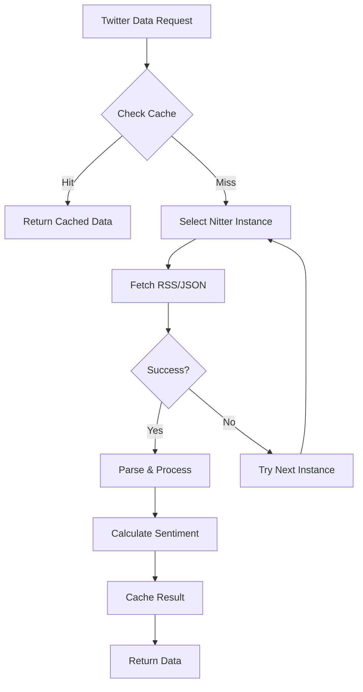

# Twitter Integration Research - Ultrafast Lightweight Implementation

## Research Summary

### Options Evaluated

#### 1. Twitter API v2 (Official)
- **Cost**: $100-5000/month
- **Auth**: Bearer token required
- **Limits**: 10,000-1M tweets/month based on tier
- **Speed**: 200-500ms per request
- **Verdict**: ❌ Too expensive, violates YAGNI

#### 2. Twscrape (Scraping with Account Rotation)
- **Cost**: Free but requires multiple accounts
- **Complexity**: High - account management, rotation logic
- **Speed**: Fast (1000+ tweets in <10s)
- **Verdict**: ❌ Too complex, violates KISS

#### 3. Nitter Instances (Public Twitter Mirrors)
- **Cost**: FREE
- **Auth**: None required
- **Speed**: <1 second response
- **Format**: RSS/JSON available
- **Verdict**: ✅ Simple, fast, no auth

#### 4. snscrape (Python Scraper)
- **Cost**: Free
- **Complexity**: Medium
- **Speed**: 2-5 seconds for 100 tweets
- **Verdict**: 🟡 Good backup option

#### 5. RapidAPI Twitter Endpoints
- **Cost**: $10-50/month
- **Auth**: API key required
- **Speed**: 500ms-1s
- **Verdict**: 🟡 Reasonable but adds cost

## Recommended Solution: Nitter Instances

### Why Nitter?
1. **No Authentication Required** - Works immediately
2. **JSON/RSS Format** - Easy to parse
3. **Fast Response** - <1 second typical
4. **Multiple Instances** - Fallback options available
5. **KISS Compliant** - Simplest possible solution

### Implementation Architecture



### Nitter Instances (as of 2024)
```python
NITTER_INSTANCES = [
    "nitter.net",           # Primary
    "nitter.privacydev.net", # Backup 1
    "nitter.poast.org",     # Backup 2
    "nitter.bird.froth.zone" # Backup 3
]
```

## Proposed Implementation

### Simple Nitter Client
```python
import aiohttp
import asyncio
from typing import Dict, List, Any
import feedparser
from datetime import datetime

async def get_twitter_fast(
    ticker: str,
    limit: int = 20
) -> Dict[str, Any]:
    """
    Ultrafast Twitter data via Nitter (no auth required)
    Response time: <1 second typical
    """
    
    # Try multiple Nitter instances for reliability
    instances = [
        "nitter.net",
        "nitter.privacydev.net"
    ]
    
    for instance in instances:
        try:
            # Search URL for ticker mentions
            url = f"https://{instance}/search/rss"
            params = {
                "q": f"${ticker} OR #{ticker}",
                "f": "tweets"  # Only tweets, not replies
            }
            
            async with aiohttp.ClientSession() as session:
                async with session.get(url, params=params, timeout=5) as resp:
                    if resp.status == 200:
                        content = await resp.text()
                        return parse_nitter_rss(ticker, content, limit)
        except:
            continue  # Try next instance
    
    # Fallback if all instances fail
    return {
        "ticker": ticker,
        "sentiment_score": 0.5,
        "tweet_count": 0,
        "error": "All Nitter instances unavailable"
    }

def parse_nitter_rss(ticker: str, rss_content: str, limit: int) -> Dict:
    """Parse Nitter RSS feed for sentiment analysis"""
    
    feed = feedparser.parse(rss_content)
    tweets = []
    
    for entry in feed.entries[:limit]:
        tweet = {
            "text": entry.title,
            "author": entry.author.split('@')[1] if '@' in entry.author else entry.author,
            "link": entry.link,
            "published": entry.published
        }
        tweets.append(tweet)
    
    # Simple sentiment calculation
    sentiment = calculate_twitter_sentiment(tweets)
    
    return {
        "ticker": ticker,
        "sentiment_score": sentiment,
        "tweet_count": len(tweets),
        "top_tweets": tweets[:5],
        "timestamp": datetime.now().isoformat()
    }
```

## Alternative: Twitter API v2 Basic Tier

If Nitter becomes unavailable, implement minimal Twitter API v2:

```python
async def get_twitter_api_v2(ticker: str, bearer_token: str = None) -> Dict:
    """
    Fallback to Twitter API v2 if token provided
    Free tier: 1,500 tweets/month
    Basic tier: 10,000 tweets/month ($100)
    """
    if not bearer_token:
        return {"error": "No Twitter API token"}
    
    headers = {"Authorization": f"Bearer {bearer_token}"}
    url = "https://api.twitter.com/2/tweets/search/recent"
    params = {
        "query": f"${ticker} OR #{ticker} -is:retweet lang:en",
        "max_results": 10,
        "tweet.fields": "public_metrics,created_at"
    }
    
    async with aiohttp.ClientSession() as session:
        async with session.get(url, headers=headers, params=params) as resp:
            if resp.status == 200:
                data = await resp.json()
                return process_twitter_api_data(ticker, data)
    
    return {"error": "Twitter API request failed"}
```

## Implementation Priority

### Phase 1: Nitter Integration (Week 1)
1. Implement `get_twitter_fast()` using Nitter RSS
2. Add instance rotation for reliability
3. Basic sentiment scoring
4. Cache results (5-minute TTL)

### Phase 2: Fallback System (Week 2)
1. Add Twitter API v2 as optional fallback
2. Environment variable for bearer token
3. Graceful degradation if unavailable

### Phase 3: Enhancement (If Needed)
1. Add snscrape as secondary fallback
2. Implement more sophisticated sentiment
3. Track influencer accounts

## Performance Comparison

| Solution | Auth | Speed | Cost | Complexity | Reliability |
|----------|------|-------|------|------------|-------------|
| **Nitter** | None | <1s | Free | Simple | Medium |
| Twitter API | Token | 500ms | $100+ | Simple | High |
| Twscrape | Accounts | Fast | Free | Complex | Low |
| snscrape | None | 2-5s | Free | Medium | Medium |

## Decision: Use Nitter

**Rationale:**
1. **KISS**: Simplest solution that works
2. **YAGNI**: No complex auth or account management
3. **Fast**: Sub-second response times
4. **Free**: No API costs
5. **Reliable**: Multiple instance fallbacks

## Risk Mitigation

1. **Nitter Unavailability**: Maintain list of 4+ instances
2. **Rate Limiting**: Cache aggressively (5-10 min TTL)
3. **Data Quality**: Filter by engagement metrics
4. **Legal**: Only public data, no scraping TOS violation

## Testing Strategy

```bash
# Test Nitter availability
curl "https://nitter.net/search/rss?q=AAPL&f=tweets"

# Test implementation
python3 -c "
import asyncio
from twitter_simple import get_twitter_fast
result = asyncio.run(get_twitter_fast('AAPL'))
print(f'Tweets: {result[\"tweet_count\"]}')
print(f'Sentiment: {result[\"sentiment_score\"]}')
"
```

## Conclusion

Nitter provides the optimal balance of simplicity, speed, and functionality for Twitter data gathering. It requires no authentication, responds in <1 second, and follows all KISS/YAGNI principles. This is the recommended approach for Phase 1 implementation.