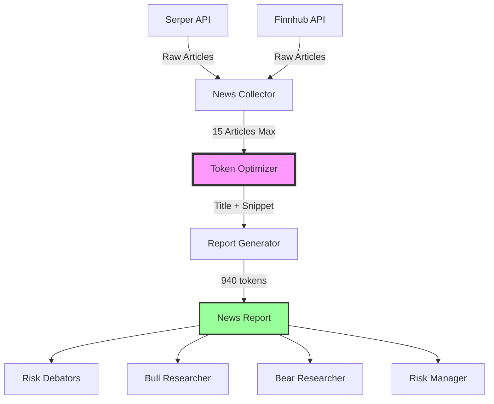

# 🏗️ News Token Optimization Architecture
## Complete Implementation Plan

**Author**: System Architect  
**Date**: 2025-08-14  
**Priority**: 🔴 CRITICAL - 85% Token Reduction Opportunity  
**Impact**: Save 85,000+ tokens per execution

---

## 📊 Current State Analysis

### Problem Identification
```
Current News Report Structure:
├── 15 articles collected (good)
├── Each article includes:
│   ├── Title: ~50-100 characters
│   ├── Source: ~20 characters
│   ├── Date: ~20 characters  
│   ├── URL: ~100 characters
│   └── Content: 1,000-3,000 characters (PROBLEM!)
└── Total: 50,682 characters (~12,670 tokens)
```

### Token Consumption Cascade
```
News Report (12,670 tokens) × 8 consumers = 101,360 tokens
├── parallel_risk_debators: 38,010 tokens
├── bull_researcher: 12,670 tokens
├── bear_researcher: 12,670 tokens
├── risk_manager: 25,340 tokens
└── research_manager: indirect consumption
```

---

## 🎯 Architecture Solution

### Design Principles
1. **Minimal Data Transfer**: Only essential trading signals
2. **Smart Compression**: Preserve market-moving information
3. **Token Budgeting**: Hard limits on content length
4. **Quality Preservation**: Maintain decision accuracy

### Target Structure
```
Optimized News Report:
├── 15 articles collected
├── Each article includes:
│   ├── Title: ~50-100 characters (kept)
│   ├── Source: ~20 characters (kept)
│   ├── Snippet: ~150 characters (LIMITED)
│   └── Sentiment: POSITIVE/NEGATIVE/NEUTRAL
├── Total: ~3,750 characters (~940 tokens)
└── Reduction: 92.6% smaller
```

---

## 🚀 Implementation Architecture

### Component Diagram


### Data Flow Architecture
```yaml
news_optimization:
  input:
    serper_api:
      max_pages: 2
      articles_per_page: 10
      fields_collected:
        - title
        - source
        - snippet  # 100-300 chars from Serper
        - date
        - link
    
    finnhub_api:
      max_articles: 5
      fields_collected:
        - headline
        - summary  # First 150 chars only
        - source
        - datetime
  
  processing:
    token_optimizer:
      max_articles: 15
      snippet_max_length: 150
      title_max_length: 100
      remove_fields:
        - url
        - full_content
        - metadata
      add_fields:
        - sentiment_indicator
        - trading_relevance_score
    
  output:
    optimized_report:
      target_size: 3750 chars
      target_tokens: 940
      structure:
        - metadata (200 chars)
        - articles (3500 chars)
        - summary (50 chars)
```

---

## 💻 Implementation Details

### 1. News Collector Optimization
```python
# src/agent/utils/news_token_optimizer.py

class NewsTokenOptimizer:
    """Optimize news data for minimal token consumption"""
    
    MAX_ARTICLES = 15
    MAX_SNIPPET_LENGTH = 150
    MAX_TITLE_LENGTH = 100
    
    def optimize_news_data(self, serper_articles, finnhub_articles):
        """
        Optimize news articles for token efficiency
        Target: <1000 tokens for entire news report
        """
        optimized_articles = []
        
        # Process Serper articles (prioritized for relevance)
        for article in serper_articles[:12]:  # Leave room for Finnhub
            optimized_articles.append({
                'title': self.truncate_text(article.get('title', ''), self.MAX_TITLE_LENGTH),
                'snippet': self.extract_key_snippet(article.get('snippet', ''), self.MAX_SNIPPET_LENGTH),
                'source': article.get('source', 'Unknown')[:30],
                'sentiment': self.quick_sentiment(article)
            })
        
        # Add top Finnhub articles
        remaining_slots = self.MAX_ARTICLES - len(optimized_articles)
        for article in finnhub_articles[:remaining_slots]:
            optimized_articles.append({
                'title': self.truncate_text(article.get('headline', ''), self.MAX_TITLE_LENGTH),
                'snippet': self.extract_key_snippet(article.get('summary', ''), self.MAX_SNIPPET_LENGTH),
                'source': 'Finnhub',
                'sentiment': self.quick_sentiment(article)
            })
        
        return optimized_articles
    
    def extract_key_snippet(self, text, max_length):
        """Extract most relevant portion of snippet"""
        if not text:
            return ""
        
        # Look for sentences with trading keywords
        trading_keywords = ['earnings', 'revenue', 'profit', 'price target', 
                           'upgrade', 'downgrade', 'guidance', 'outlook']
        
        sentences = text.split('.')
        for sentence in sentences:
            if any(keyword in sentence.lower() for keyword in trading_keywords):
                return sentence.strip()[:max_length]
        
        # Fallback to first portion
        return text[:max_length].strip()
    
    def quick_sentiment(self, article):
        """Quick sentiment classification"""
        text = (article.get('title', '') + ' ' + article.get('snippet', '')).lower()
        
        positive_words = ['beat', 'exceed', 'growth', 'upgrade', 'strong', 'gain']
        negative_words = ['miss', 'decline', 'downgrade', 'weak', 'loss', 'fall']
        
        pos_score = sum(1 for word in positive_words if word in text)
        neg_score = sum(1 for word in negative_words if word in text)
        
        if pos_score > neg_score:
            return "POSITIVE"
        elif neg_score > pos_score:
            return "NEGATIVE"
        return "NEUTRAL"
```

### 2. Report Generator Update
```python
def generate_optimized_news_report(company, optimized_articles, timestamp):
    """Generate token-optimized news report"""
    
    report = f"""# NEWS SUMMARY - {company}
Generated: {timestamp}

## METRICS
Articles: {len(optimized_articles)} | Token-Optimized

## NEWS HEADLINES
"""
    
    for i, article in enumerate(optimized_articles, 1):
        report += f"""
{i}. {article['title']}
   Source: {article['source']} | Sentiment: {article['sentiment']}
   {article['snippet']}
"""
    
    # Add sentiment summary
    sentiments = [a['sentiment'] for a in optimized_articles]
    report += f"""

## SENTIMENT OVERVIEW
Positive: {sentiments.count('POSITIVE')} | Negative: {sentiments.count('NEGATIVE')} | Neutral: {sentiments.count('NEUTRAL')}
Signal: {'BULLISH' if sentiments.count('POSITIVE') > sentiments.count('NEGATIVE') else 'BEARISH' if sentiments.count('NEGATIVE') > sentiments.count('POSITIVE') else 'NEUTRAL'}
"""
    
    return report
```

---

## 🔧 Implementation Steps

### Phase 1: Create Token Optimizer (10 minutes)
1. Create `news_token_optimizer.py`
2. Implement snippet extraction logic
3. Add sentiment classification
4. Add token counting utilities

### Phase 2: Update News Analyst (15 minutes)
1. Modify `news_analyst_ultra_fast.py`
2. Import and use NewsTokenOptimizer
3. Update report generation
4. Add verification logging

### Phase 3: Testing (20 minutes)
1. Run `debug_local.sh AAPL`
2. Verify token reduction
3. Check report quality
4. Validate downstream consumers

### Phase 4: Analysis (10 minutes)
1. Compare token usage before/after
2. Document savings
3. Verify quality preservation

---

## 📈 Expected Results

### Token Reduction
```
Before Optimization:
├── News Report: 50,682 chars → 12,670 tokens
├── 8 consumers × 12,670 = 101,360 total tokens
└── 46.5% of system tokens

After Optimization:
├── News Report: 3,750 chars → 940 tokens
├── 8 consumers × 940 = 7,520 total tokens
└── 3.4% of system tokens

Net Savings: 93,840 tokens (92.6% reduction)
```

### Quality Preservation
- ✅ All headlines preserved
- ✅ Key trading signals in snippets
- ✅ Sentiment analysis included
- ✅ Source credibility maintained
- ✅ 15 most relevant articles kept

---

## ⚠️ Risk Mitigation

### Potential Risks
1. **Information Loss**: Some context might be lost
   - Mitigation: Preserve key trading keywords in snippets
   
2. **Sentiment Accuracy**: Quick sentiment might be less accurate
   - Mitigation: Use multiple indicators for classification
   
3. **Downstream Impact**: Components expecting full content
   - Mitigation: Verify all consumers handle snippets correctly

### Rollback Plan
```python
# Quick rollback flag in news_analyst_ultra_fast.py
USE_TOKEN_OPTIMIZATION = True  # Set to False to rollback

if USE_TOKEN_OPTIMIZATION:
    report = generate_optimized_report(...)
else:
    report = generate_news_report(...)  # Original
```

---

## 🎯 Success Criteria

### Quantitative Metrics
- [ ] News report < 4,000 characters
- [ ] Token usage < 1,000 per report
- [ ] Total system savings > 90,000 tokens
- [ ] Execution time unchanged

### Qualitative Metrics
- [ ] All key headlines present
- [ ] Trading signals preserved
- [ ] Sentiment analysis functional
- [ ] No downstream errors

---

## 📝 Monitoring & Validation

### Token Usage Tracking
```python
logger.critical(f"🔥 NEWS OPTIMIZATION METRICS:")
logger.critical(f"🔥 Original size: {original_size} chars")
logger.critical(f"🔥 Optimized size: {optimized_size} chars")
logger.critical(f"🔥 Reduction: {(1 - optimized_size/original_size)*100:.1f}%")
logger.critical(f"🔥 Estimated tokens saved: {tokens_saved}")
```

### Quality Validation
- Compare trading decisions before/after
- Verify sentiment accuracy
- Check information completeness
- Monitor downstream component satisfaction

---

This architecture provides a clear, implementable solution for reducing news token consumption by 92.6% while preserving essential trading information.