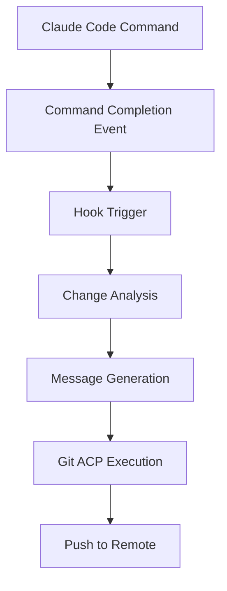
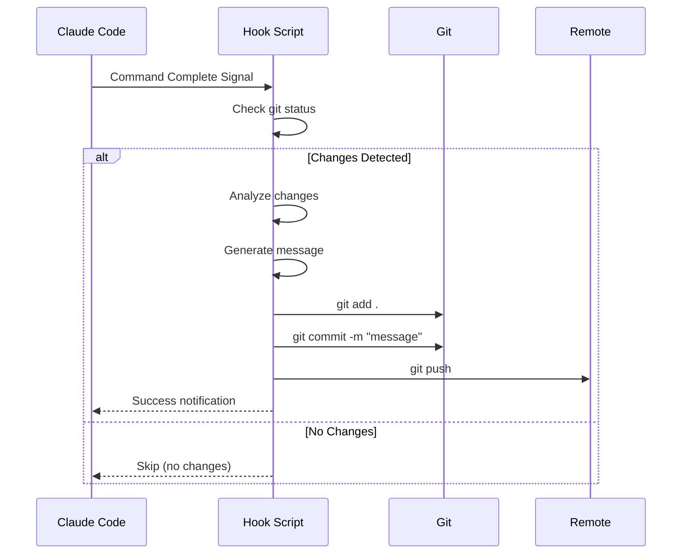

# Auto-Commit Hook Architecture

## System Components

### 1. Hook Configuration


### 2. Hook Integration Points

#### A. Settings Configuration (`~/.claude/settings.json`)
```json
{
  "hooks": {
    "post-command": "~/.claude/hooks/auto_commit.sh"
  }
}
```

#### B. Hook Script (`~/.claude/hooks/auto_commit.sh`)
- Monitors working directory changes
- Analyzes modified files
- Generates contextual commit messages
- Executes git acp command

### 3. Message Generation Strategy

#### Context Analysis
1. **File Type Detection**: Identify changed file types (.py, .md, .json, etc.)
2. **Change Scope**: Count modified/added/deleted files
3. **Directory Context**: Determine affected modules/components
4. **Operation Type**: Infer action (update, fix, add, refactor, etc.)

#### Message Format
```
[action] [scope]: [description]

Examples:
- "update config: switch to gpt-4o and o3 models"
- "fix trading: resolve async configuration issues"
- "add docs: create auto-commit hook architecture"
```

### 4. Implementation Flow



### 5. Safety Features

1. **Change Validation**: Only commit if changes exist
2. **Repository Check**: Verify we're in a git repository
3. **Branch Protection**: Check current branch before pushing
4. **Error Handling**: Graceful failure with notifications
5. **Exclusion Patterns**: Skip sensitive files (.env, secrets)

### 6. Configuration Options

```bash
# Environment variables for customization
CLAUDE_AUTO_COMMIT=true          # Enable/disable hook
CLAUDE_COMMIT_PREFIX=""           # Optional prefix for messages
CLAUDE_EXCLUDE_PATTERNS=".env"   # Files to exclude
CLAUDE_BRANCH_FILTER="main"      # Only auto-commit on specific branches
```

### 7. Message Intelligence

The hook will analyze:
- **Command Context**: What Claude Code command was executed
- **File Patterns**: Common patterns (config, docs, source, tests)
- **Change Magnitude**: Small fix vs. major refactor
- **Time Context**: Group related changes within time window

### 8. Testing Strategy

1. **Unit Tests**: Test message generation logic
2. **Integration Tests**: Test git operations
3. **Safety Tests**: Ensure no accidental commits
4. **Performance Tests**: Ensure minimal overhead