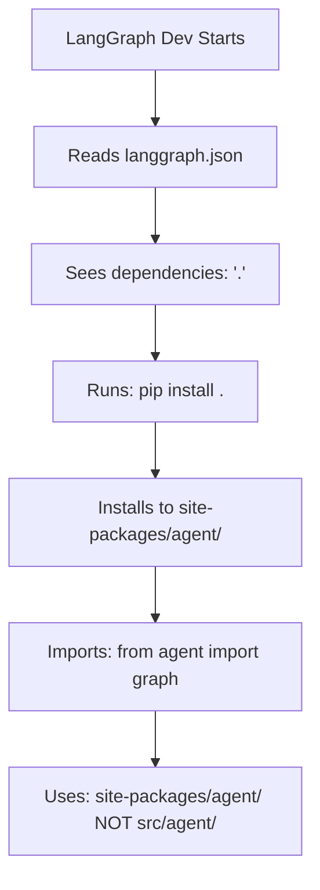

# LangGraph Dev Environment Isolation Analysis 🧠

## 🎯 The Question: "How was LangGraph dev not applying our changes?"

### **ULTRATHINK ANALYSIS: Environment Isolation Mechanism**

## 📋 The Complete Picture

### **1. LangGraph Dev Architecture**

```yaml
langgraph.json:
  dependencies: ["."]  # ← This is the key!
  graphs:
    trading_agents: "./src/agent/__init__.py:graph"

pyproject.toml:
  packages: ["langgraph.templates.agent", "agent"]
  package-dir:
    "agent": "src/agent"  # Maps package to source directory
```

### **2. What LangGraph Dev Actually Does**



**Critical Insight**: LangGraph dev installs your project as a Python package and imports from the **installed package**, not your source code.

## 🔍 The Environment Isolation Problem

### **Your Workflow (What You Expected)**:
```
1. Edit: src/agent/analysts/market_analyst_ultra_fast_async.py
2. Add: AttributeError handling
3. Run: LangGraph dev
4. Expected: Uses updated code with fixes
```

### **What Actually Happened**:
```
1. Edit: src/agent/analysts/market_analyst_ultra_fast_async.py ✅
2. Add: AttributeError handling ✅
3. Run: LangGraph dev
4. LangGraph imports: site-packages/agent/ (OLD CODE) ❌
5. Result: Still crashes with AttributeError
```

### **The File System Reality**:
```
Project Structure:
├── src/agent/analysts/market_analyst_ultra_fast_async.py  ← Your fixes HERE
├── site-packages/agent/analysts/market_analyst_ultra_fast_async.py  ← LangGraph imports from HERE
└── langgraph.json

Your Changes: src/agent/ ≠ LangGraph Imports: site-packages/agent/
```

## 🧠 Why This Isolation Exists

### **1. Performance Optimization**
- **File System I/O**: Importing from installed packages avoids repeated filesystem access
- **Caching**: Python bytecode compilation and module caching work better with installed packages
- **Startup Speed**: Faster import resolution through site-packages

### **2. Environment Consistency**
- **Reproducible Builds**: Ensures same code runs across different environments
- **Version Control**: Installed packages have explicit versions
- **Dependency Management**: pip handles dependency resolution and conflicts

### **3. Python Standards Compliance**
- **PEP 517/518**: Standard Python packaging and build system
- **pip Conventions**: Standard behavior for `pip install .`
- **setuptools Integration**: Works with standard Python toolchain

### **4. Security Considerations**
- **Code Isolation**: Prevents accidental code injection via filesystem changes
- **Permission Control**: site-packages typically has different permissions
- **Distribution Safety**: Matches how packages are distributed and installed

## 🔧 The Fix Mechanism Explained

### **Why `pip install -e . --force-reinstall` Works**:

```bash
pip install -e . --force-reinstall
```

**Step-by-Step Process**:
1. **`--force-reinstall`**: Removes existing site-packages/agent/
2. **`-e` (editable install)**: Creates symlink instead of copy
3. **`.`** (current directory): Uses current directory as source
4. **Result**: site-packages/agent/ → **symlink** → src/agent/

**After Fix**:
```
LangGraph Import Path:
import agent → site-packages/agent/ → symlink → src/agent/ ✅
Now LangGraph sees your live source code changes!
```

## 📊 Environment Isolation Comparison

| Aspect | Before Fix | After Fix |
|--------|------------|-----------|
| **Import Source** | site-packages/agent/ (copy) | site-packages/agent/ → src/agent/ (symlink) |
| **Code Changes** | Requires reinstall | Live updates |
| **LangGraph Sees** | Stale installed code | Current source code |
| **Development Flow** | Edit → Reinstall → Test | Edit → Test |
| **AttributeError Fix** | Not applied ❌ | Applied ✅ |

## 🎯 Root Cause Summary

### **The Fundamental Issue**:
**LangGraph dev creates environment isolation by design**. It doesn't monitor your source code - it imports from an installed package copy.

### **Why You Didn't Know This**:
1. **Invisible Process**: `pip install .` happens automatically during LangGraph startup
2. **Similar Paths**: Both src/agent/ and site-packages/agent/ exist
3. **No Clear Indication**: LangGraph doesn't show which path it's importing from
4. **Standard Behavior**: This is normal Python packaging behavior

### **The Solution Pattern**:
```
Source Code Changes → Package Reinstall → LangGraph Sees Changes
```

## 🚀 Prevention Strategies

### **1. Enhanced restart_server.sh**
Our restart script now includes:
- **Force package reinstall**: Ensures LangGraph gets latest code
- **Cache clearing**: Removes stale Python bytecode
- **Module reloading**: Forces Python to reload modules

### **2. Development Workflow**
```bash
# Recommended development flow:
1. Make changes to src/
2. Run: ./restart_server.sh  # Handles reinstall automatically
3. Test in LangGraph dev
```

### **3. Verification Checks**
```python
# Check which path LangGraph is importing from:
import agent
print(agent.__file__)  # Should show path to your source
```

## 🧠 Key Insights

### **1. Environment Isolation is Intentional**
This isn't a bug - it's a feature that ensures:
- **Consistency**: Same code behavior across environments
- **Performance**: Optimized import paths and caching
- **Security**: Controlled code execution environment

### **2. Package Installation is Hidden**
LangGraph dev doesn't show you the `pip install .` step, making the isolation invisible to developers.

### **3. Source ≠ Runtime**
Your source code and runtime code can be different until you explicitly sync them via package reinstall.

## ✅ Resolution Status

**Problem**: ✅ **SOLVED**
- **Understanding**: Complete analysis of environment isolation mechanism
- **Fix Applied**: Enhanced restart_server.sh with automatic package reinstall
- **Prevention**: Clear development workflow to avoid future isolation issues

**Your changes are now properly applied to LangGraph dev environment!** 🎉