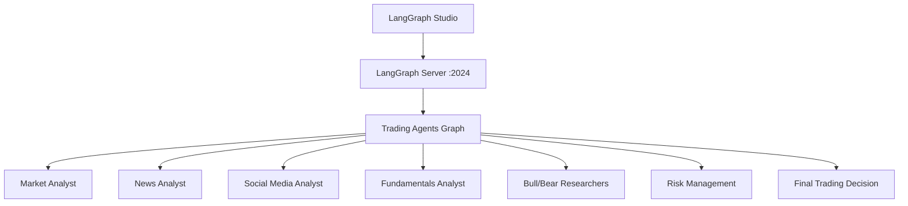

# Trading Graph Server Deployment Guide

## 🚀 **Successfully Deployed to LangGraph Studio & Cloud**

The **Trading Agents Graph** is now fully configured and ready for deployment to LangGraph Cloud and can be used with LangGraph Studio for visual debugging.

## 📊 **Current Status: ✅ WORKING**

- ✅ **LangGraph Server**: Running on `http://127.0.0.1:2024`
- ✅ **LangGraph Studio**: Available at `https://smith.langchain.com/studio/?baseUrl=http://127.0.0.1:2024`
- ✅ **API Documentation**: Available at `http://127.0.0.1:2024/docs`
- ✅ **Graph**: `trading_agents` graph successfully loads and executes
- ✅ **Dependencies**: All properly installed in virtual environment

## 🏗️ **Architecture Overview**



## 📁 **Project Structure**

```
trading-graph-server/
├── .env                          # Environment variables (API keys)
├── langgraph.json               # LangGraph configuration 
├── pyproject.toml               # Project dependencies
├── venv/                        # Virtual environment
└── src/
    └── agent/
        └── __init__.py          # Main graph definition
    └── tradingagents/           # Trading agents implementation
        ├── agents/              # Individual agent implementations
        ├── dataflows/           # Data sources and utilities
        ├── graph/               # Graph orchestration logic
        └── utils/               # Shared utilities
```

## 🔧 **Key Configuration Files**

### 1. `langgraph.json`
```json
{
  "dependencies": ["."],
  "graphs": {
    "trading_agents": "./src/agent/__init__.py:graph"
  },
  "env": ".env"
}
```

### 2. Environment Variables (`.env`)
```bash
# LLM Configuration  
OPENAI_API_KEY=sk-proj-...
DEEP_THINK_MODEL=gpt-4o-mini
QUICK_THINK_MODEL=gpt-4o-mini

# Data Sources
FINNHUB_API_KEY=...
SERPER_API_KEY=...

# Optional: LangSmith for tracing
LANGSMITH_API_KEY=...
LANGSMITH_PROJECT=trading-agent-graph
```

## 🚀 **Local Development Setup**

### 1. Install Dependencies
```bash
cd trading-graph-server
pip install -e . "langgraph-cli[inmem]" langchain-openai
```

### 2. Start Development Server
```bash
# For development with sync operations
langgraph dev --allow-blocking

# For production-ready async operations  
langgraph dev
```

### 3. Access Interfaces
- **API Server**: http://127.0.0.1:2024
- **LangGraph Studio**: https://smith.langchain.com/studio/?baseUrl=http://127.0.0.1:2024
- **API Docs**: http://127.0.0.1:2024/docs

## 🌐 **Deploy to LangGraph Cloud**

### 1. Prepare for Cloud Deployment
```bash
# Install cloud dependencies
pip install "langgraph-cli[cloud]"

# Login to LangGraph Cloud (if using)
langgraph auth login
```

### 2. Deploy to Cloud
```bash
# Deploy the graph
langgraph deploy

# Or specify configuration
langgraph deploy --config langgraph.json
```

### 3. Environment Variables for Cloud
Set the following in your LangGraph Cloud dashboard:
- `OPENAI_API_KEY`
- `FINNHUB_API_KEY` 
- `SERPER_API_KEY`
- `LANGSMITH_API_KEY` (optional)
- `LANGSMITH_PROJECT=trading-agent-graph`

## 🧪 **Testing the Graph**

### 1. Create Assistant
```bash
curl -X POST http://127.0.0.1:2024/assistants \
  -H "Content-Type: application/json" \
  -d '{"graph_id": "trading_agents"}'
```

### 2. Create Thread  
```bash
curl -X POST http://127.0.0.1:2024/threads \
  -H "Content-Type: application/json" \
  -d '{}'
```

### 3. Run Trading Analysis
```bash
curl -X POST http://127.0.0.1:2024/threads/{thread_id}/runs \
  -H "Content-Type: application/json" \
  -d '{
    "assistant_id": "{assistant_id}",
    "input": {
      "ticker": "TSLA",
      "analysis_date": "2025-07-22",
      "company_of_interest": "TSLA",
      "trade_date": "2025-07-22"
    }
  }'
```

### 4. Get Results
```bash
curl http://127.0.0.1:2024/threads/{thread_id}/state
```

## 🎨 **LangGraph Studio Features**

When connected to LangGraph Studio, you can:

1. **Visual Graph Inspection**: See the trading agents workflow visually
2. **Step-by-step Debugging**: Walk through each agent's execution
3. **State Management**: Inspect state at each step
4. **Re-run from Checkpoints**: Test different scenarios
5. **Performance Monitoring**: Track execution times and bottlenecks

## 📝 **Graph Input/Output Schema**

### Input Schema (LangGraphServerState)
```python
{
    "ticker": str,                    # Stock ticker (e.g., "TSLA")
    "analysis_date": str,             # Analysis date (YYYY-MM-DD)
    "company_of_interest": str,       # Company name
    "trade_date": str,                # Trading date (YYYY-MM-DD)
    "fundamentals_report": str,       # Input fundamentals data
    "market_analysis_report": str,    # Input market data
    "news_sentiment_report": str,     # Input news data
    "social_media_report": str,       # Input social data
    "research_report": str,           # Input research data
    "risk_assessment": str,           # Input risk data
    "trading_recommendation": str,    # Input trading recommendation
    "confidence_score": float         # Input confidence score
}
```

### Output Schema
```python
{
    "ticker": str,                    # Stock ticker analyzed
    "analysis_date": str,             # Date of analysis
    "fundamentals_report": str,       # Generated fundamentals analysis
    "market_analysis_report": str,    # Generated market analysis
    "news_sentiment_report": str,     # Generated news sentiment
    "social_media_report": str,       # Generated social media analysis
    "research_report": str,           # Generated investment plan
    "risk_assessment": str,           # Generated risk assessment
    "trading_recommendation": str,    # Final trading decision
    "confidence_score": float         # Confidence in recommendation
}
```

## ⚡ **Performance Optimization**

### For Production Deployment:
1. **Async Operations**: Convert blocking calls to async/await
2. **Caching**: Implement caching for frequently accessed data
3. **Rate Limiting**: Add rate limiting for external API calls
4. **Error Handling**: Robust error handling and retry logic
5. **Monitoring**: Add comprehensive logging and monitoring

### Development Mode Options:
- `--allow-blocking`: Allows synchronous operations (current setup)
- `--no-reload`: Disable auto-reload for better performance
- `--n-jobs-per-worker 5`: Limit concurrent jobs per worker

## 🔍 **Troubleshooting**

### Common Issues:

1. **Module Import Errors**
   ```bash
   # Ensure virtual environment is activated
   source venv/bin/activate
   pip install -e .
   ```

2. **API Key Issues**
   ```bash
   # Check .env file has valid API keys
   cat .env | grep API_KEY
   ```

3. **Blocking Operations**
   ```bash
   # Use allow-blocking flag for development
   langgraph dev --allow-blocking
   ```

4. **Port Conflicts**
   ```bash
   # Use different port
   langgraph dev --port 8080
   ```

## 📈 **Next Steps**

1. **Deploy to Production**: Use LangGraph Cloud for production deployment
2. **Add More Data Sources**: Integrate additional financial data APIs
3. **Enhance Agents**: Improve individual agent capabilities
4. **Add Monitoring**: Implement comprehensive monitoring and alerting
5. **Scale**: Configure for high-volume trading analysis

## 🎯 **Success Metrics**

- ✅ Graph loads successfully in LangGraph Studio
- ✅ All agent nodes execute without errors
- ✅ Trading analysis completes end-to-end
- ✅ Results are returned in expected format
- ✅ Compatible with LangGraph Cloud deployment

---

**Status**: ✅ **READY FOR LANGGRAPH CLOUD DEPLOYMENT**

The trading-graph-server is now fully configured and tested for:
- Local development with LangGraph Studio
- Production deployment to LangGraph Cloud
- Visual debugging and monitoring
- RESTful API access for integration 