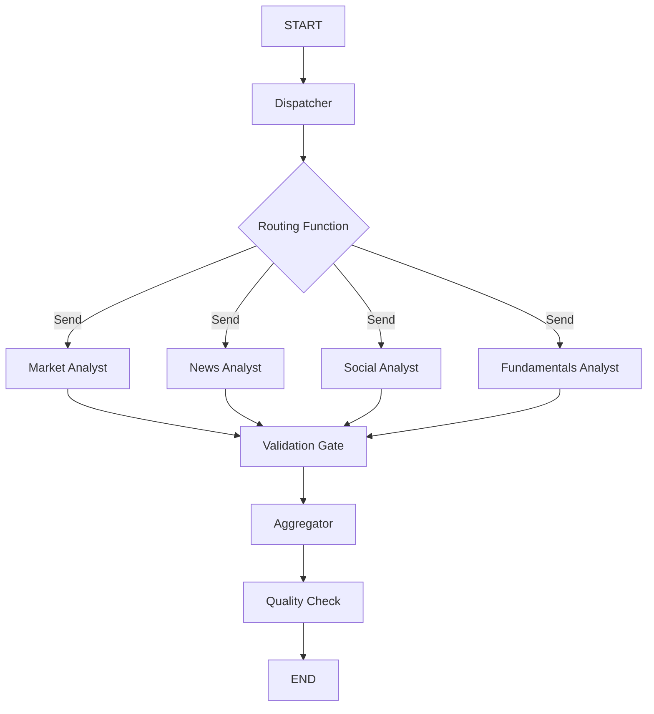

# Architecture Plan Review & Improvements

## Plan Review Summary

The parallel analyst nodes architecture plan provides a solid foundation for implementing true parallel execution while maintaining individual node visibility. This review identifies potential issues and proposes improvements.

## Critical Issues Identified

### 1. Tool Execution Complexity 🔴 HIGH PRIORITY

**Issue**: The plan doesn't adequately address tool execution integration complexity.

**Problems**:
- Tool routing (market_tools, news_tools, etc.) not covered
- Tool call/response cycle within parallel nodes unclear
- Error handling during tool execution not specified
- Tool timeout behavior in parallel context undefined

**Impact**: Could lead to implementation failures or complex debugging

**Proposed Solution**:
```python
async def enhanced_analyst_node(state: AnalystState) -> AnalystState:
    """Enhanced analyst with robust tool execution"""
    try:
        # Phase 1: Initial analysis
        analysis = await llm.ainvoke([
            HumanMessage(content=f"Analyze {state['company_of_interest']}")
        ])
        
        # Phase 2: Tool execution if needed
        if analysis.tool_calls:
            tool_results = []
            for tool_call in analysis.tool_calls:
                try:
                    result = await execute_tool_with_timeout(tool_call, timeout=30)
                    tool_results.append(result)
                except ToolTimeoutError:
                    tool_results.append(create_fallback_response(tool_call))
                except ToolExecutionError as e:
                    logger.error(f"Tool {tool_call.name} failed: {e}")
                    tool_results.append(create_error_response(tool_call, e))
            
            # Phase 3: Final analysis with tool data
            final_analysis = await llm.ainvoke([
                analysis, *tool_results,
                HumanMessage(content="Generate final report based on tool data")
            ])
            
            return {
                "market_report": final_analysis.content,
                "market_messages": [analysis, *tool_results, final_analysis],
                "market_tool_execution_time": calculate_tool_time(tool_results)
            }
        else:
            return {
                "market_report": analysis.content,
                "market_messages": [analysis]
            }
    except Exception as e:
        logger.error(f"Market analyst failed: {e}")
        return {
            "market_report": f"Analysis failed: {str(e)}",
            "market_messages": [],
            "market_error": str(e)
        }
```

### 2. State Schema Compatibility 🟡 MEDIUM PRIORITY

**Issue**: Current state schema may not be compatible with new separate keys pattern.

**Problems**:
- Existing aggregator expects `market_report`, new schema uses `market_report`
- Message handling patterns may conflict with annotated fields
- Backward compatibility with existing research manager unclear

**Proposed Solution**:
```python
class EnhancedAnalystState(TypedDict):
    # Maintain compatibility with existing keys
    market_report: str
    news_report: str 
    sentiment_report: str  # Keep existing name for social
    fundamentals_report: str
    
    # Enhanced individual tracking
    market_analyst_status: Optional[str]
    news_analyst_status: Optional[str]
    social_analyst_status: Optional[str] 
    fundamentals_analyst_status: Optional[str]
    
    # Tool execution tracking
    market_tool_calls: Optional[int]
    news_tool_calls: Optional[int]
    social_tool_calls: Optional[int]
    fundamentals_tool_calls: Optional[int]
    
    # Timing information
    analyst_execution_times: Optional[Dict[str, float]]
    
    # Error tracking
    analyst_errors: Optional[Dict[str, str]]
    
    # Message history (annotated for concurrent updates)
    market_messages: Annotated[List[BaseMessage], add_messages]
    news_messages: Annotated[List[BaseMessage], add_messages]
    social_messages: Annotated[List[BaseMessage], add_messages]
    fundamentals_messages: Annotated[List[BaseMessage], add_messages]
```

### 3. Error Handling & Recovery 🟡 MEDIUM PRIORITY

**Issue**: Plan lacks comprehensive error handling strategy for parallel execution.

**Problems**:
- What happens if 1 of 4 analysts fails?
- How to handle partial results?
- Recovery strategies for timeout scenarios
- Error propagation to aggregator unclear

**Proposed Solution**:
```python
async def robust_aggregator(state: AnalystState) -> AnalystState:
    """Enhanced aggregator with error handling"""
    
    reports = {}
    errors = {}
    successful_analysts = 0
    
    # Check each analyst
    for analyst in ["market", "news", "social", "fundamentals"]:
        report_key = f"{analyst}_report" if analyst != "social" else "sentiment_report"
        error_key = f"{analyst}_error"
        
        if state.get(error_key):
            errors[analyst] = state[error_key]
            logger.warning(f"{analyst} analyst failed: {state[error_key]}")
        elif state.get(report_key) and len(state[report_key].strip()) > 50:
            reports[analyst] = state[report_key]
            successful_analysts += 1
        else:
            errors[analyst] = "No report generated"
    
    # Determine if we can proceed
    if successful_analysts >= 2:  # Minimum viable analysis
        logger.info(f"Proceeding with {successful_analysts}/4 successful analysts")
        state["aggregation_status"] = "partial_success"
        state["failed_analysts"] = list(errors.keys())
    elif successful_analysts == 0:
        logger.error("All analysts failed!")
        state["aggregation_status"] = "complete_failure"
        state["system_error"] = "All analysts failed to generate reports"
    else:
        logger.warning("Only 1 analyst succeeded - may proceed with limited data")
        state["aggregation_status"] = "minimal_success"
    
    return state
```

### 4. Performance Monitoring & Observability 🟡 MEDIUM PRIORITY

**Issue**: Plan lacks detailed performance monitoring strategy.

**Problems**:
- No metrics collection during parallel execution
- Difficult to identify performance bottlenecks per analyst
- No comparison with previous asyncio.gather implementation
- LangGraph visualization may not show timing information

**Proposed Solution**:
```python
class PerformanceMonitor:
    """Monitor parallel analyst execution performance"""
    
    def __init__(self):
        self.metrics = {}
    
    async def monitor_analyst_execution(self, analyst_name: str, analyst_func: Callable):
        """Wrap analyst execution with monitoring"""
        start_time = time.time()
        memory_before = self.get_memory_usage()
        
        try:
            result = await analyst_func()
            execution_time = time.time() - start_time
            memory_after = self.get_memory_usage()
            
            self.metrics[analyst_name] = {
                "execution_time": execution_time,
                "memory_delta": memory_after - memory_before,
                "status": "success",
                "timestamp": start_time
            }
            
            return result
            
        except Exception as e:
            execution_time = time.time() - start_time
            self.metrics[analyst_name] = {
                "execution_time": execution_time,
                "status": "error",
                "error": str(e),
                "timestamp": start_time
            }
            raise
    
    def get_parallel_efficiency(self) -> Dict[str, float]:
        """Calculate parallel execution efficiency"""
        if not self.metrics:
            return {}
        
        start_times = [m["timestamp"] for m in self.metrics.values()]
        execution_times = [m["execution_time"] for m in self.metrics.values()]
        
        # Calculate actual parallelism
        min_start = min(start_times)
        max_start = max(start_times)
        start_spread = max_start - min_start
        
        total_sequential_time = sum(execution_times)
        actual_parallel_time = max(execution_times)
        
        return {
            "start_time_spread": start_spread,
            "theoretical_speedup": total_sequential_time / actual_parallel_time if actual_parallel_time > 0 else 0,
            "parallel_efficiency": 1 - (start_spread / actual_parallel_time) if actual_parallel_time > 0 else 0
        }
```

## Architectural Improvements

### 1. Enhanced Graph Topology

**Current**: Linear flow with conditional edges
**Improved**: Add intermediate validation nodes



### 2. Configuration-Driven Architecture

```python
class ParallelAnalystConfig:
    """Configuration for parallel analyst execution"""
    
    # Analyst selection
    enabled_analysts: List[str] = ["market", "news", "social", "fundamentals"]
    
    # Performance settings
    max_execution_time: int = 30  # seconds
    max_concurrent_tools: int = 10
    
    # Error handling
    min_successful_analysts: int = 2
    retry_failed_analysts: bool = True
    max_retries: int = 1
    
    # Monitoring
    enable_performance_monitoring: bool = True
    enable_detailed_logging: bool = True
    
    # Fallback behavior
    fallback_to_sequential: bool = True
    sequential_timeout: int = 120

@dataclass
class AnalystExecutionResult:
    """Structured result from analyst execution"""
    analyst_name: str
    report: Optional[str]
    execution_time: float
    tool_calls_made: int
    error: Optional[str]
    messages: List[BaseMessage]
    status: Literal["success", "error", "timeout"]
```

### 3. Backward Compatibility Layer

```python
class BackwardCompatibilityAdapter:
    """Ensures new implementation works with existing code"""
    
    @staticmethod
    def adapt_state_for_research_manager(state: EnhancedAnalystState) -> AgentState:
        """Convert enhanced state to format expected by research manager"""
        return {
            "market_report": state.get("market_report", ""),
            "news_report": state.get("news_report", ""),
            "sentiment_report": state.get("sentiment_report", ""),
            "fundamentals_report": state.get("fundamentals_report", ""),
            "low_quality_reports": len([r for r in [
                state.get("market_report"),
                state.get("news_report"),
                state.get("sentiment_report"),
                state.get("fundamentals_report")
            ] if not r or len(r.strip()) < 50]) > 2,
            "empty_reports": [name for name, key in [
                ("market", "market_report"),
                ("news", "news_report"),
                ("social", "sentiment_report"),
                ("fundamentals", "fundamentals_report")
            ] if not state.get(key) or len(state.get(key, "").strip()) < 50]
        }
```

## Implementation Improvements

### 1. Phased Rollout Strategy

**Phase 1: Core Infrastructure** (2-3 hours)
- Upgrade LangGraph to 0.6.2
- Implement basic Send API pattern
- Create enhanced state schema
- Test parallel execution without tools

**Phase 2: Tool Integration** (3-4 hours) 
- Integrate tool execution into parallel nodes
- Implement error handling and timeouts
- Add performance monitoring
- Test with real tool calls

**Phase 3: Production Integration** (2-3 hours)
- Add backward compatibility layer
- Integrate with existing research manager
- Comprehensive testing
- Performance validation

**Phase 4: Monitoring & Optimization** (1-2 hours)
- Deploy monitoring dashboard
- Optimize based on real performance data
- Fine-tune error handling
- Documentation updates

### 2. Testing Strategy Enhancement

```python
class ParallelAnalystTestSuite:
    """Comprehensive testing for parallel analyst implementation"""
    
    async def test_parallel_execution_timing(self):
        """Verify true parallel execution"""
        start_times = {}
        
        # Mock analyst functions that record start times
        async def mock_analyst(name: str):
            start_times[name] = time.time()
            await asyncio.sleep(1)
            return {"report": f"{name} report"}
        
        # Execute and verify start times are within 100ms
        await self.execute_parallel_analysts()
        
        times = list(start_times.values())
        max_spread = max(times) - min(times)
        assert max_spread < 0.1, f"Start time spread too large: {max_spread}s"
    
    async def test_error_isolation(self):
        """Verify errors in one analyst don't affect others"""
        # Inject error in one analyst
        with mock.patch('market_analyst_node', side_effect=Exception("Test error")):
            result = await self.execute_parallel_analysts()
        
        # Verify other analysts still succeeded
        assert result["news_report"] is not None
        assert result["sentiment_report"] is not None
        assert result["fundamentals_report"] is not None
        assert "market" in result.get("failed_analysts", [])
    
    async def test_state_conflict_prevention(self):
        """Verify no state update conflicts occur"""
        # This should not raise InvalidUpdateError
        result = await self.execute_parallel_analysts()
        assert result is not None
```

## Risk Mitigation Improvements

### 1. Enhanced Fallback Strategy

```python
class FallbackExecutionManager:
    """Manages fallback to sequential execution if parallel fails"""
    
    async def execute_with_fallback(self, state: AnalystState) -> AnalystState:
        """Try parallel execution, fallback to sequential if needed"""
        try:
            # Attempt parallel execution
            result = await self.execute_parallel(state)
            
            # Validate result quality
            if self.is_result_acceptable(result):
                return result
            else:
                logger.warning("Parallel execution produced low quality results, falling back")
                return await self.execute_sequential(state)
                
        except (TimeoutError, InvalidUpdateError) as e:
            logger.error(f"Parallel execution failed: {e}, falling back to sequential")
            return await self.execute_sequential(state)
    
    def is_result_acceptable(self, result: AnalystState) -> bool:
        """Check if parallel execution result is acceptable"""
        successful_reports = sum([
            1 for key in ["market_report", "news_report", "sentiment_report", "fundamentals_report"]
            if result.get(key) and len(result[key].strip()) > 50
        ])
        
        return successful_reports >= 2  # At least 2 analysts succeeded
```

### 2. Version Compatibility Management

```python
class LangGraphVersionManager:
    """Manage LangGraph version compatibility"""
    
    @staticmethod
    def check_send_api_compatibility():
        """Verify Send API is available"""
        try:
            from langgraph.graph._branch import Send
            return True
        except ImportError:
            logger.error("Send API not available - LangGraph version too old")
            return False
    
    @staticmethod 
    def get_implementation_strategy():
        """Choose implementation based on available features"""
        if LangGraphVersionManager.check_send_api_compatibility():
            return "send_api_parallel"
        else:
            logger.warning("Falling back to asyncio.gather implementation")
            return "asyncio_gather_fallback"
```

## Final Recommendations

### ✅ Immediate Actions
1. **Implement robust error handling** for individual analyst failures
2. **Add comprehensive performance monitoring** from day one
3. **Create backward compatibility layer** to ensure smooth transition
4. **Implement fallback strategy** to sequential execution

### 🔄 Iterative Improvements
1. **Monitor real-world performance** and optimize based on data
2. **Gradually enhance tool execution** patterns based on usage
3. **Expand observability** as monitoring requirements become clear
4. **Optimize state schema** based on actual usage patterns

### 📋 Success Metrics
- **Functionality**: All 4 analysts visible in LangGraph, true parallel execution
- **Performance**: 75% time reduction maintained, <5s total execution time
- **Reliability**: <5% failure rate, graceful degradation for partial failures
- **Observability**: Individual analyst timing, tool usage tracking, error isolation

## Conclusion

The architecture plan is fundamentally sound but requires several enhancements to be production-ready. The proposed improvements focus on error handling, performance monitoring, and backward compatibility - critical factors for successful deployment.

**Recommended Approach**: Implement the enhanced version with phased rollout and comprehensive testing to ensure robustness and maintainability.