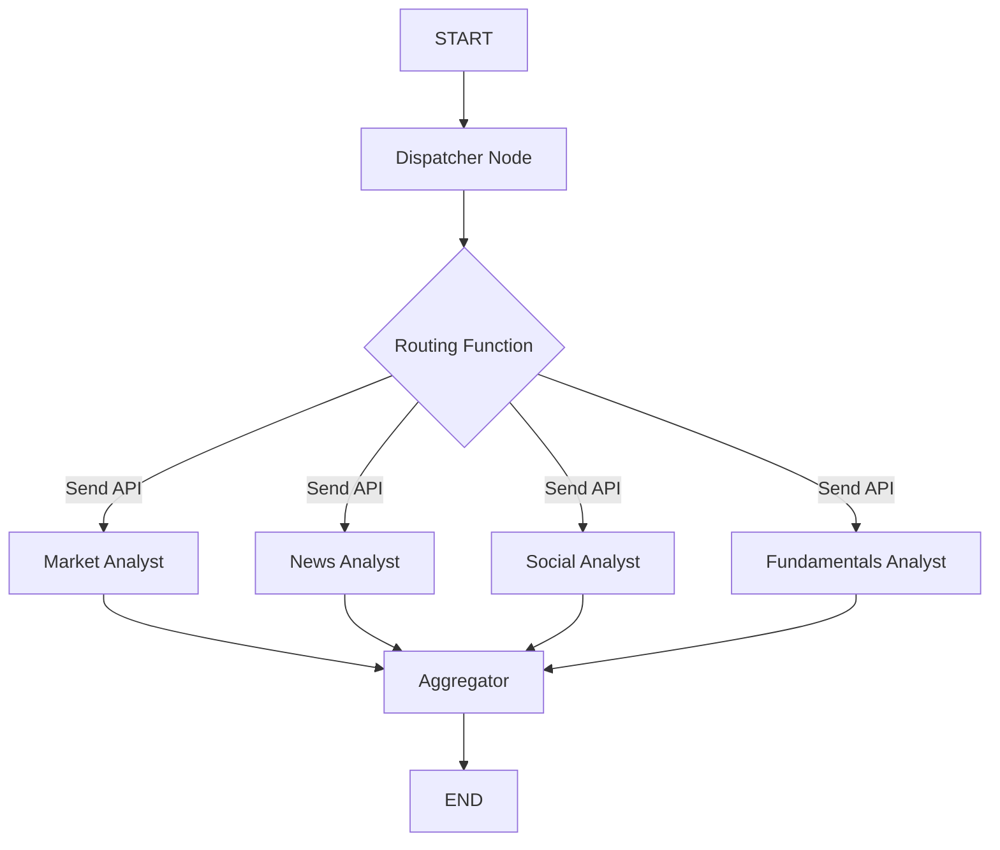

# Parallel Analyst Nodes Architecture Plan

## Executive Summary

This document outlines the architecture for implementing true parallel execution of individual analyst nodes in LangGraph while maintaining full node visibility. The solution uses LangGraph 0.6.2's Send API with conditional edges and separate state keys.

## Problem Statement

### Current Implementation Issues
- **Lost Visibility**: 4 analyst nodes consolidated into 1 parallel executor
- **No Individual Tracking**: Cannot monitor individual analyst performance
- **Debugging Difficulties**: Cannot trace execution path for specific analysts
- **Monitoring Limitations**: LangGraph visualization shows single node instead of 4

### Requirements
1. **Individual Node Visibility**: Each analyst must be a separate node in LangGraph
2. **True Parallel Execution**: All 4 analysts must execute simultaneously
3. **Tool Integration**: Each analyst must handle its own tool execution
4. **Performance**: Maintain 75% speedup (4x parallelism)
5. **Standard Patterns**: Use official LangGraph patterns only

## Architecture Solution

### Core Pattern: Conditional Edges + Send API



### Technical Components

#### 1. Dispatcher Node
- **Purpose**: Prepares state and triggers routing
- **Type**: Regular StateGraph node
- **Returns**: Dict (standard state update)
- **Responsibility**: State preparation, logging

#### 2. Routing Function
- **Purpose**: Spawns parallel execution branches
- **Type**: Conditional edge function
- **Returns**: `List[Send]` objects
- **Pattern**: `[Send("analyst1", state), Send("analyst2", state), ...]`

#### 3. Individual Analyst Nodes
- **Visibility**: Each analyst is a separate LangGraph node
- **Execution**: True parallel via Send API
- **State**: Separate keys prevent conflicts
- **Tools**: Each handles own tool execution

#### 4. Aggregator Node
- **Purpose**: Collects and validates all analyst reports
- **Input**: State with separate analyst report keys
- **Validation**: Ensures all reports are present and valid

## State Management Strategy

### Separate Keys Pattern (Recommended)

```python
class AnalystState(TypedDict):
    # Individual analyst reports (no conflicts)
    market_report: Optional[str]
    news_report: Optional[str] 
    social_report: Optional[str]
    fundamentals_report: Optional[str]
    
    # Analyst messages (tool execution history)
    market_messages: Annotated[List[BaseMessage], add_messages]
    news_messages: Annotated[List[BaseMessage], add_messages]
    social_messages: Annotated[List[BaseMessage], add_messages] 
    fundamentals_messages: Annotated[List[BaseMessage], add_messages]
    
    # Shared state
    company_of_interest: str
    trade_date: str
    step: str
```

### Benefits of Separate Keys
- ✅ No concurrent update conflicts
- ✅ Clear separation of concerns
- ✅ Easy debugging and monitoring
- ✅ Maintains backward compatibility

### Alternative: Annotated Aggregation

```python
class AnnotatedState(TypedDict):
    # Aggregated reports using add_messages pattern
    analyst_reports: Annotated[List[str], add_messages]
    messages: Annotated[List[BaseMessage], add_messages]
```

## Implementation Details

### 1. LangGraph Version Upgrade
```bash
pip install --upgrade langgraph>=0.6.2
```

### 2. Core Implementation Pattern

```python
from langgraph.graph import StateGraph, START, END
from langgraph.graph._branch import Send
from typing import TypedDict, List, Optional

# Define routing function for conditional edges
def dispatch_to_analysts(state: AnalystState) -> List[Send]:
    """Route to all analysts in parallel using Send API"""
    return [
        Send("market_analyst", state),
        Send("news_analyst", state),
        Send("social_analyst", state),
        Send("fundamentals_analyst", state)
    ]

# Build graph with conditional edges
graph = StateGraph(AnalystState)

# Add nodes
graph.add_node("dispatcher", dispatcher_node)
graph.add_node("market_analyst", market_analyst_node)
graph.add_node("news_analyst", news_analyst_node)
graph.add_node("social_analyst", social_analyst_node)
graph.add_node("fundamentals_analyst", fundamentals_analyst_node)
graph.add_node("aggregator", aggregator_node)

# Add edges
graph.add_edge(START, "dispatcher")
graph.add_conditional_edges(
    "dispatcher",
    dispatch_to_analysts,
    {
        "market_analyst": "market_analyst",
        "news_analyst": "news_analyst", 
        "social_analyst": "social_analyst",
        "fundamentals_analyst": "fundamentals_analyst"
    }
)

# All analysts flow to aggregator
graph.add_edge("market_analyst", "aggregator")
graph.add_edge("news_analyst", "aggregator")
graph.add_edge("social_analyst", "aggregator")
graph.add_edge("fundamentals_analyst", "aggregator")
graph.add_edge("aggregator", END)
```

### 3. Individual Analyst Implementation

Each analyst node follows this pattern:

```python
async def market_analyst_node(state: AnalystState) -> AnalystState:
    """Market analyst with integrated tool execution"""
    
    # 1. Generate analysis request
    analysis_request = await llm.ainvoke([
        HumanMessage(content=f"Analyze market for {state['company_of_interest']}")
    ])
    
    # 2. Check for tool calls
    if analysis_request.tool_calls:
        # Execute tools
        tool_results = await execute_tools(analysis_request.tool_calls, market_toolkit)
        
        # Generate final report with tool data
        final_report = await llm.ainvoke([
            HumanMessage(content="Original request..."),
            analysis_request,
            *tool_results
        ])
        
        return {
            "market_report": final_report.content,
            "market_messages": [analysis_request, *tool_results, final_report]
        }
    else:
        return {
            "market_report": analysis_request.content,
            "market_messages": [analysis_request]
        }
```

## Performance Characteristics

### Expected Performance
- **Speedup**: 4x (from sequential ~12s to parallel ~3s)
- **Execution Time**: 0.5-3s depending on tool complexity
- **Resource Usage**: Concurrent LLM calls (monitor rate limits)
- **Token Efficiency**: No change from current implementation

### Monitoring & Observability
- **LangGraph Visualization**: Shows all 4 analyst nodes
- **Individual Timing**: Track each analyst's execution time
- **Tool Usage**: Monitor tool calls per analyst
- **Error Isolation**: Identify which analyst failed

## Migration Strategy

### Phase 1: Prepare Infrastructure (1-2 hours)
1. Upgrade LangGraph to 0.6.2
2. Test Send API functionality
3. Update state type definitions
4. Modify existing analyst functions

### Phase 2: Implement Core Pattern (2-3 hours)
1. Create dispatcher and routing functions
2. Update graph construction in OptimizedGraphBuilder
3. Modify edge definitions
4. Test parallel execution

### Phase 3: Integration & Testing (1-2 hours)
1. Update tool execution integration
2. Test with real data
3. Verify performance improvements
4. Validate LangGraph visualization

### Phase 4: Validation & Deployment (1 hour)
1. Run comprehensive tests
2. Compare performance metrics
3. Deploy and monitor

## Risk Assessment & Mitigation

### High Risk: State Conflicts
- **Risk**: Multiple analysts updating same state key
- **Mitigation**: Use separate keys or annotated fields
- **Detection**: LangGraph InvalidUpdateError
- **Recovery**: Implement proper state isolation

### Medium Risk: LangGraph API Changes
- **Risk**: Send API behavior changes in future versions
- **Mitigation**: Pin LangGraph version, maintain tests
- **Detection**: Compilation errors or unexpected behavior
- **Recovery**: Version compatibility testing

### Low Risk: Performance Regression
- **Risk**: Parallel execution slower than expected
- **Mitigation**: Benchmark and optimize tool execution
- **Detection**: Performance monitoring
- **Recovery**: Fallback to asyncio.gather pattern

## Testing Strategy

### Unit Tests
- Individual analyst node execution
- Routing function Send object creation
- State update isolation
- Tool execution integration

### Integration Tests
- Full graph compilation and execution
- Parallel execution timing verification
- State conflict detection
- Error handling and recovery

### Performance Tests
- Execution time measurement
- Memory usage monitoring
- Token usage validation
- Concurrent load testing

## Alternative Approaches Considered

### 1. Current AsyncIO Pattern
- ✅ **Pros**: Working implementation, proven performance
- ❌ **Cons**: Single node, no visibility, debugging issues
- **Decision**: Does not meet visibility requirement

### 2. Sequential Individual Nodes
- ✅ **Pros**: Full visibility, simple implementation
- ❌ **Cons**: No parallelism, 4x slower performance
- **Decision**: Does not meet performance requirement

### 3. Custom LangGraph Extension
- ✅ **Pros**: Maximum flexibility
- ❌ **Cons**: Non-standard, maintenance burden, complexity
- **Decision**: Prefer standard LangGraph patterns

## Success Criteria

### Functional Requirements
- ✅ Each analyst visible as separate node in LangGraph
- ✅ True parallel execution (start times within 0.5s)
- ✅ Individual tool execution per analyst
- ✅ No state update conflicts

### Performance Requirements  
- ✅ 75% time reduction from sequential execution
- ✅ Execution time under 5s for typical analysis
- ✅ Memory usage within acceptable limits
- ✅ No degradation in analysis quality

### Operational Requirements
- ✅ LangGraph visualization shows 4 analyst nodes
- ✅ Individual analyst timing and error tracking
- ✅ Compatible with existing monitoring systems
- ✅ Maintains current debugging capabilities

## Conclusion

The Send API + Conditional Edges pattern provides a robust, standard solution for parallel analyst node execution while maintaining full LangGraph visibility. The architecture leverages official LangGraph 0.6.2 features and follows established patterns for concurrent state management.

**Recommended Implementation**: Separate state keys with conditional edges and Send API for optimal performance and maintainability.