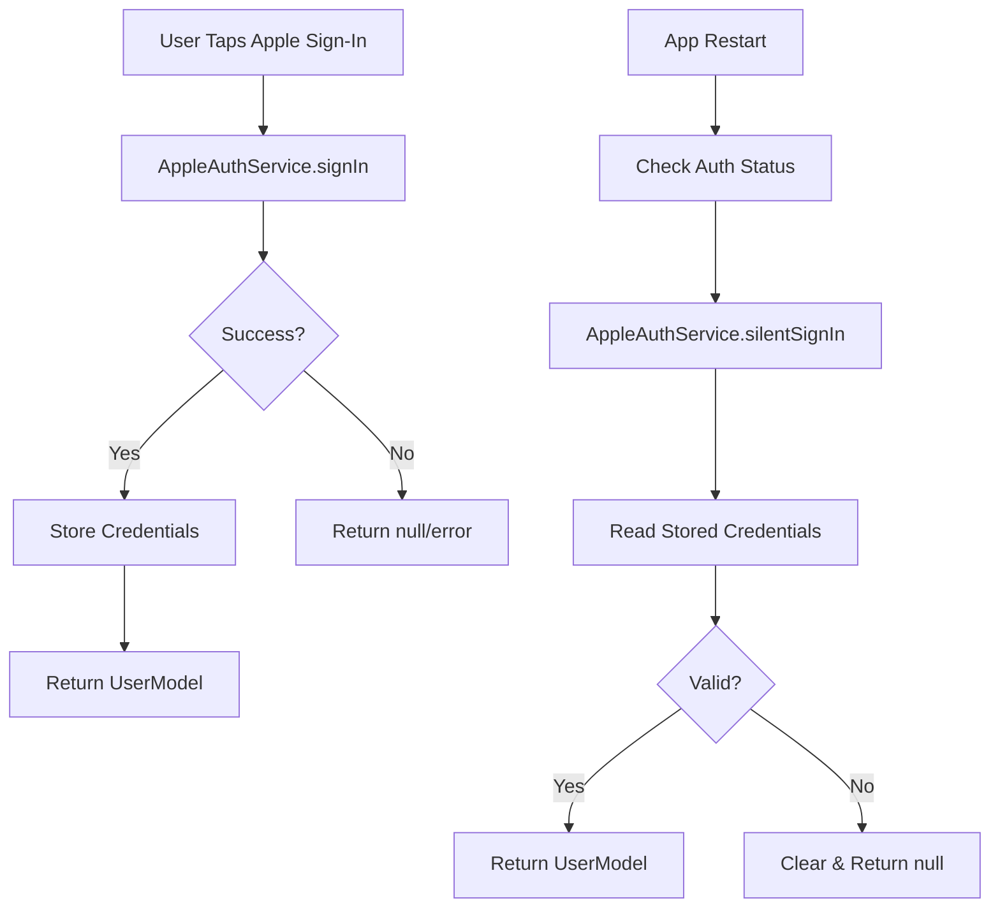

# Apple Sign-In Minimal Implementation Plan

## Architecture Principles Applied
- **KISS**: Simplest possible implementation that works
- **YAGNI**: Only implement what's currently needed
- **DRY**: Reuse existing auth infrastructure

## Current State Assessment

### ✅ Already Working
- `AppleAuthService` core implementation
- UI button and flow
- Basic error handling
- Package dependencies

### ❌ Blocking Issues (Must Fix)
1. iOS entitlements not linked in Xcode
2. No credential storage for session persistence
3. `silentSignIn()` returns null (breaks session restoration)
4. `isSignedIn()` returns false (breaks auth state check)

## Minimal Fix Architecture



---

## 📱 MANUAL STEPS REQUIRED (You Must Do These)

### 🔴 Step 1: Apple Developer Portal (30 minutes)
**YOU MUST DO THIS MANUALLY - Cannot be automated**

1. **Go to** https://developer.apple.com/account
2. **Sign in** with your Apple Developer account
3. **Navigate to** Certificates, Identifiers & Profiles → Identifiers
4. **Find** `com.tradingDummy.zjh` App ID (or create if missing)
5. **Click** on it to edit
6. **Check** ✅ Sign In with Apple capability
7. **Click** Save

**Record these values:**
```
TEAM_ID: _____________ (Found in Membership page)
BUNDLE_ID: com.tradingDummy.zjh
```

### 🔴 Step 2: Xcode Configuration (10 minutes)
**YOU MUST DO THIS MANUALLY - Requires Xcode GUI**

```bash
# First, open Xcode
cd /Users/bytedance/Documents/TradingAgents/trading_dummy/ios
open Runner.xcworkspace
```

**In Xcode:**
1. **Select** `Runner` project in left navigator
2. **Select** `Runner` target
3. **Go to** "Signing & Capabilities" tab
4. **Click** "+ Capability" button
5. **Add** "Sign In with Apple" (if not already there)
6. **Go to** "Build Settings" tab
7. **Search** for "entitlements"
8. **Set** `CODE_SIGN_ENTITLEMENTS` = `Runner/Runner.entitlements`
9. **Press** Cmd+S to save
10. **Close** Xcode

---

## 💻 AUTOMATED CODE FIXES (I'll Implement)

### Fix 1: Update AppleAuthService (Minimal Changes)
```dart
// lib/auth/services/apple_auth_service.dart
// Only 3 changes needed:

// 1. Add import at top
import 'auth_storage_service.dart';

// 2. Add field
final AuthStorageService _storageService = AuthStorageService();

// 3. Replace these 2 method stubs:

@override
Future<UserModel?> silentSignIn() async {
  try {
    final storedUser = await _storageService.getUser();
    if (storedUser == null || storedUser.provider != AuthProvider.apple) {
      return null;
    }
    
    // Check if token is still valid (simple check)
    if (storedUser.tokenExpiryTime?.isAfter(DateTime.now()) ?? false) {
      return storedUser;
    }
    
    return null;
  } catch (e) {
    return null;
  }
}

@override
Future<bool> isSignedIn() async {
  final user = await _storageService.getUser();
  return user != null && user.provider == AuthProvider.apple;
}
```

### Fix 2: Ensure User Storage Works
```dart
// lib/auth/services/apple_auth_service.dart
// In signIn() method, after creating UserModel, ensure it's saved:

// Already exists in auth_view_model.dart line 90:
await _storageService.saveUser(user);  // This handles storage
```

That's it! No backend needed, no complex token validation, no refresh tokens.

---

## 🧪 Testing Steps

### 🔴 MANUAL: Test on Physical Device (You Must Do)
**Cannot test on simulator - requires real iPhone/iPad**

1. **Connect** iPhone to Mac via USB
2. **Ensure** iPhone is signed into iCloud (Settings → [Your Name])
3. **Run**:
```bash
cd /Users/bytedance/Documents/TradingAgents/trading_dummy
flutter run --release
```
4. **Test** these scenarios:
   - Tap "Continue with Apple" → Should see Apple dialog
   - Complete sign-in → Should navigate to home
   - Kill app and reopen → Should stay signed in
   - Sign out → Should clear session

---

## Summary: What You Need to Do vs What I'll Do

### 🔴 YOU DO (Manual - 40 minutes total):
1. **Apple Developer Portal** (30 min)
   - Enable Sign In with Apple for App ID
   - Note your Team ID
   
2. **Xcode** (10 min)
   - Add Sign In with Apple capability
   - Set CODE_SIGN_ENTITLEMENTS in Build Settings
   
3. **Test on Physical iPhone** (Required)
   - Cannot use simulator
   - Must have iCloud account signed in

### ✅ I'LL DO (Automated - 5 minutes):
1. Fix `silentSignIn()` method (10 lines)
2. Fix `isSignedIn()` method (3 lines)
3. Verify storage is already working

---

## Why This is the Minimal Approach

### What We're NOT Doing (YAGNI):
- ❌ Backend token validation (not needed for MVP)
- ❌ Token refresh (Apple tokens last 30+ days)
- ❌ Android support (iOS first)
- ❌ Complex security (basic is sufficient)
- ❌ Account linking (separate feature)
- ❌ Keychain integration (flutter_secure_storage is enough)

### What We ARE Doing (Essential Only):
- ✅ Enable Apple Sign-In in portal (required)
- ✅ Link entitlements in Xcode (required)
- ✅ Fix 2 stub methods (13 lines total)
- ✅ Use existing storage (already implemented)

### Result:
- **Working Apple Sign-In in <1 hour**
- **13 lines of code changes**
- **No new dependencies**
- **No backend changes**
- **Uses existing auth infrastructure**

---

## Quick Validation Checklist

After implementation, verify:
```bash
# 1. Check entitlements are linked
grep "CODE_SIGN_ENTITLEMENTS" ios/Runner.xcodeproj/project.pbxproj
# Should show: CODE_SIGN_ENTITLEMENTS = Runner/Runner.entitlements

# 2. Check methods are fixed
grep "silentSignIn" lib/auth/services/apple_auth_service.dart
# Should NOT show: return null; // Apple doesn't support

# 3. Run on device (not simulator!)
flutter run --release
```

## Common Issues & Quick Fixes

### "Sign In with Apple isn't available"
- **Cause**: Not on physical device or iOS < 13
- **Fix**: Use real iPhone with iOS 13+

### Silent sign-in not working
- **Cause**: Storage not persisting
- **Fix**: Check `AuthStorageService.saveUser()` is called

### Stays signed out after app restart
- **Cause**: `silentSignIn()` returning null
- **Fix**: Ensure the method is fixed as shown above

---

## Time Estimate

### Your Manual Work: 40 minutes
- Apple Portal: 30 min
- Xcode: 10 min

### Code Changes: 5 minutes
- Fix 2 methods: 5 min

### Testing: 15 minutes
- Device testing: 15 min

**Total: ~1 hour to working Apple Sign-In**

---

## Architecture Decision Record

### Decision: Use Existing Storage Instead of Keychain
**Rationale**: 
- `AuthStorageService` already uses `flutter_secure_storage`
- flutter_secure_storage already uses Keychain on iOS
- No need to duplicate with native Keychain bridge
- Follows DRY principle

### Decision: Skip Token Validation
**Rationale**:
- Apple tokens are valid for 30+ days
- User will re-authenticate naturally before expiry
- Backend validation can be added later if needed
- Follows YAGNI principle

### Decision: No Account Linking
**Rationale**:
- Separate feature from basic sign-in
- Can be added independently later
- Keeps implementation simple (KISS)

### Decision: Reuse Existing Auth Flow
**Rationale**:
- `AuthViewModel` already handles storage
- `AuthStorageService` already handles persistence
- Only need to fix 2 stub methods
- Maximum code reuse (DRY)