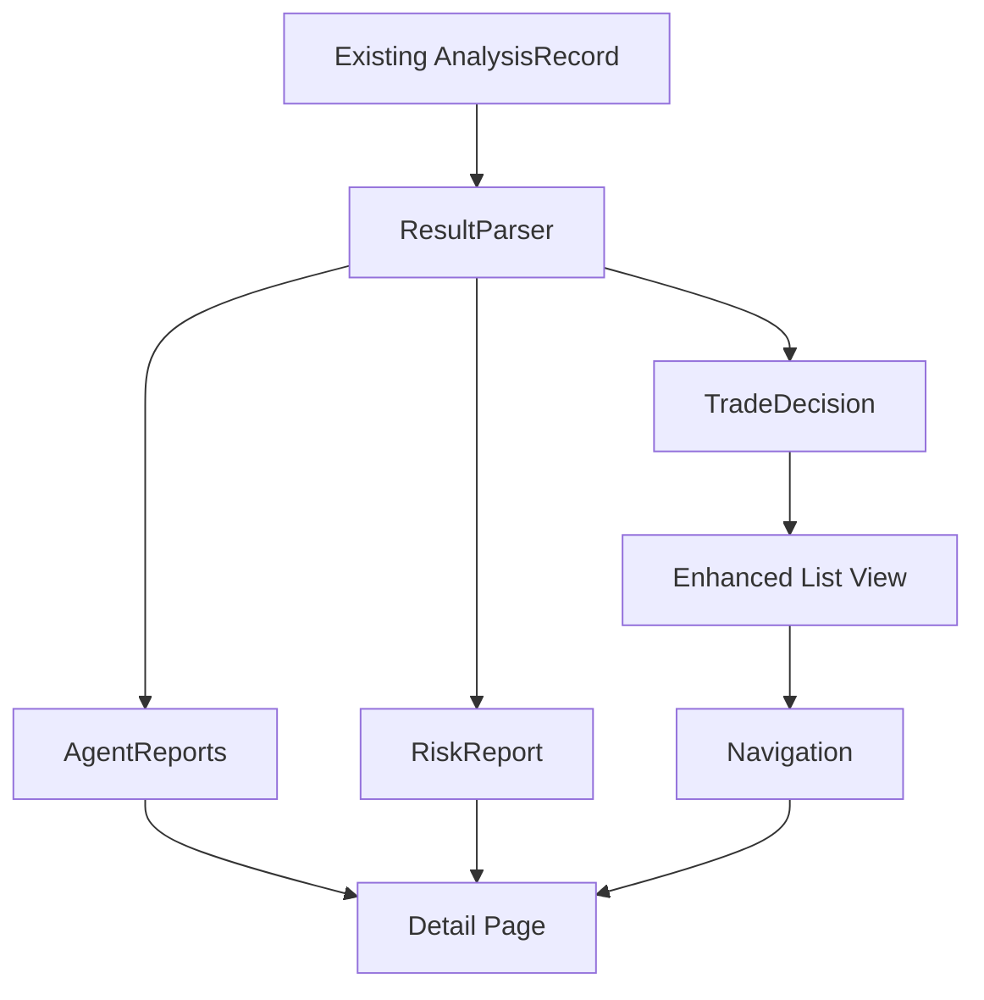

# Refined Implementation Guide - Analyst Result UI Display

## Architecture Principles Applied

### KISS (Keep It Simple, Stupid)
- **Reuse existing `AnalysisRecord` model** - No new database tables or models
- **Parse existing JSON result field** - Extract agent reports from already-stored data
- **Extend current UI patterns** - Build on existing navigation and widget patterns

### YAGNI (You Aren't Gonna Need It)
- **No speculative features** - Only implement specified requirements
- **No custom state management** - Use existing Provider pattern from app
- **No new APIs** - Work with existing data flow

### SOLID Principles
- **Single Responsibility**: Each widget handles one UI concern
- **Open/Closed**: Extend existing models without modification
- **Dependency Inversion**: Depend on existing abstractions

### DRY (Don't Repeat Yourself)
- **Reuse existing utilities**: Date formatting, color mapping, icon helpers
- **Share constants**: Use existing AppLogger, Theme patterns
- **Extract common patterns**: Decision display logic shared across views

## Integration Architecture



## Refined File Structure

```
lib/
├── features/
│   └── analyst_details/              # NEW FEATURE MODULE
│       ├── models/
│       │   ├── parsed_analysis.dart  # Parse existing JSON
│       │   └── report_sections.dart  # Report data structures
│       ├── pages/
│       │   └── analysis_detail_page.dart
│       ├── widgets/
│       │   ├── decision_header.dart
│       │   ├── risk_report_view.dart
│       │   ├── agent_report_button.dart
│       │   └── report_modal.dart
│       └── utils/
│           └── result_parser.dart    # JSON parsing utilities
├── pages/
│   └── simple_analysis_page.dart     # ENHANCED with navigation
└── (existing structure unchanged)
```

## Core Integration Points

### 1. Extending AnalysisRecord (Non-Breaking)

```dart
// lib/features/analyst_details/models/parsed_analysis.dart
import '../../jobs/infrastructure/persistence/analysis_record.dart';

class ParsedAnalysis {
  final AnalysisRecord record;
  final TradeDecision? decision;
  final double? confidence;
  final Map<String, dynamic>? riskReport;
  final List<AgentReport> agentReports;
  final Map<String, dynamic>? debateReport;
  
  ParsedAnalysis({
    required this.record,
    this.decision,
    this.confidence,
    this.riskReport,
    this.agentReports = const [],
    this.debateReport,
  });
  
  factory ParsedAnalysis.fromRecord(AnalysisRecord record) {
    if (record.result == null) {
      return ParsedAnalysis(record: record);
    }
    
    try {
      final json = jsonDecode(record.result!);
      return ParsedAnalysis(
        record: record,
        decision: _parseDecision(json),
        confidence: _parseConfidence(json),
        riskReport: json['risk_manager_report'],
        agentReports: _parseAgentReports(json),
        debateReport: json['debate_manager_report'],
      );
    } catch (e) {
      return ParsedAnalysis(record: record);
    }
  }
  
  static TradeDecision? _parseDecision(Map<String, dynamic> json) {
    final decision = json['final_decision'] ?? 
                    json['trade_decision'] ?? 
                    json['result']?['final_decision'];
    
    if (decision == null) return null;
    
    switch (decision.toString().toUpperCase()) {
      case 'BUY':
        return TradeDecision.buy;
      case 'SELL':
        return TradeDecision.sell;
      case 'HOLD':
        return TradeDecision.hold;
      default:
        return null;
    }
  }
  
  static double? _parseConfidence(Map<String, dynamic> json) {
    final confidence = json['confidence'] ?? 
                      json['confidence_level'] ?? 
                      json['result']?['confidence'];
    return confidence?.toDouble();
  }
  
  static List<AgentReport> _parseAgentReports(Map<String, dynamic> json) {
    final reports = <AgentReport>[];
    
    // Try to extract from expected structure
    if (json['market_report'] != null) {
      reports.add(AgentReport(
        type: 'market',
        title: 'Market Analysis',
        content: json['market_report'].toString(),
      ));
    }
    
    if (json['fundamentals_report'] != null) {
      reports.add(AgentReport(
        type: 'fundamentals',
        title: 'Fundamentals Analysis',
        content: json['fundamentals_report'].toString(),
      ));
    }
    
    if (json['sentiment_report'] != null) {
      reports.add(AgentReport(
        type: 'sentiment',
        title: 'Sentiment Analysis',
        content: json['sentiment_report'].toString(),
      ));
    }
    
    if (json['news_report'] != null) {
      reports.add(AgentReport(
        type: 'news',
        title: 'News Analysis',
        content: json['news_report'].toString(),
      ));
    }
    
    return reports;
  }
}

enum TradeDecision { buy, sell, hold }

class AgentReport {
  final String type;
  final String title;
  final String content;
  
  AgentReport({
    required this.type,
    required this.title,
    required this.content,
  });
}
```

### 2. Enhanced List Item (Minimal Change)

```dart
// Modify existing simple_analysis_page.dart - _buildAnalysisCard method
Widget _buildAnalysisCard(AnalysisRecord analysis) {
  final parsed = ParsedAnalysis.fromRecord(analysis);
  final isComplete = analysis.status.toLowerCase() == 'success';
  
  return Dismissible(
    // ... existing dismissible code ...
    child: Card(
      margin: const EdgeInsets.only(bottom: 8),
      child: ListTile(
        leading: _buildStatusIcon(analysis, parsed.decision),
        title: // ... existing title ...
        subtitle: // ... existing subtitle ...
        trailing: // ... existing trailing ...
        onTap: isComplete 
          ? () => _navigateToDetail(context, analysis)  // NEW
          : null,
      ),
    ),
  );
}

Widget _buildStatusIcon(AnalysisRecord analysis, TradeDecision? decision) {
  if (analysis.isPending || analysis.isRunning) {
    return CircleAvatar(
      backgroundColor: Colors.grey.withOpacity(0.2),
      child: analysis.isPending
        ? Icon(Icons.schedule, color: Colors.orange)
        : SizedBox(
            width: 20,
            height: 20,
            child: CircularProgressIndicator(strokeWidth: 2),
          ),
    );
  }
  
  if (analysis.hasError) {
    return CircleAvatar(
      backgroundColor: Colors.red.withOpacity(0.2),
      child: Icon(Icons.error, color: Colors.red),
    );
  }
  
  // Show trade decision icon for completed
  final icon = _getDecisionIcon(decision);
  final color = _getDecisionColor(decision);
  
  return CircleAvatar(
    backgroundColor: color.withOpacity(0.2),
    child: Icon(icon, color: color, size: 20),
  );
}

void _navigateToDetail(BuildContext context, AnalysisRecord analysis) {
  Navigator.push(
    context,
    MaterialPageRoute(
      builder: (context) => AnalysisDetailPage(record: analysis),
    ),
  );
}
```

### 3. Detail Page Implementation

```dart
// lib/features/analyst_details/pages/analysis_detail_page.dart
import 'package:flutter/material.dart';
import '../../../jobs/infrastructure/persistence/analysis_record.dart';
import '../models/parsed_analysis.dart';
import '../widgets/decision_header.dart';
import '../widgets/risk_report_view.dart';
import '../widgets/agent_report_button.dart';
import '../widgets/report_modal.dart';

class AnalysisDetailPage extends StatelessWidget {
  final AnalysisRecord record;
  
  const AnalysisDetailPage({
    Key? key,
    required this.record,
  }) : super(key: key);
  
  @override
  Widget build(BuildContext context) {
    final parsed = ParsedAnalysis.fromRecord(record);
    
    return Scaffold(
      appBar: AppBar(
        title: Text('${record.ticker} Analysis'),
        backgroundColor: Theme.of(context).colorScheme.surface,
        elevation: 1,
      ),
      body: Column(
        children: [
          // Header Section (25%)
          Expanded(
            flex: 1,
            child: DecisionHeader(
              ticker: record.ticker,
              analyzeTime: record.completedAt ?? record.createdAt,
              decision: parsed.decision,
              confidence: parsed.confidence,
            ),
          ),
          
          // Risk Report Section (50%)
          Expanded(
            flex: 2,
            child: RiskReportView(
              report: parsed.riskReport,
            ),
          ),
          
          // Agent Reports Section (25%)
          Expanded(
            flex: 1,
            child: _buildAgentReportsSection(context, parsed),
          ),
        ],
      ),
    );
  }
  
  Widget _buildAgentReportsSection(BuildContext context, ParsedAnalysis parsed) {
    final reports = [
      ('📊 Market Analysis', parsed.agentReports.firstWhere(
        (r) => r.type == 'market',
        orElse: () => AgentReport(type: 'market', title: 'Market Analysis', content: ''),
      )),
      ('📈 Fundamentals Report', parsed.agentReports.firstWhere(
        (r) => r.type == 'fundamentals',
        orElse: () => AgentReport(type: 'fundamentals', title: 'Fundamentals', content: ''),
      )),
      ('🎭 Sentiment Analysis', parsed.agentReports.firstWhere(
        (r) => r.type == 'sentiment',
        orElse: () => AgentReport(type: 'sentiment', title: 'Sentiment', content: ''),
      )),
      ('📰 News Analysis', parsed.agentReports.firstWhere(
        (r) => r.type == 'news',
        orElse: () => AgentReport(type: 'news', title: 'News', content: ''),
      )),
      ('⚖️ Debate Summary', AgentReport(
        type: 'debate',
        title: 'Debate Manager',
        content: parsed.debateReport?.toString() ?? '',
      )),
    ];
    
    return Padding(
      padding: const EdgeInsets.all(16.0),
      child: Column(
        children: reports.map((report) => Expanded(
          child: AgentReportButton(
            title: report.$1,
            hasContent: report.$2.content.isNotEmpty,
            onTap: () => _showReportModal(context, report.$1, report.$2.content),
          ),
        )).toList(),
      ),
    );
  }
  
  void _showReportModal(BuildContext context, String title, String content) {
    if (content.isEmpty) {
      ScaffoldMessenger.of(context).showSnackBar(
        SnackBar(content: Text('$title not available')),
      );
      return;
    }
    
    ReportModal.show(
      context: context,
      title: title,
      content: content,
    );
  }
}
```

## Atomic Implementation Tasks

### Phase 1: Data Layer (3 tasks)
1. **Task 1.1**: Create `ParsedAnalysis` model
   - Input: AnalysisRecord with JSON result
   - Output: Parsed trade decision, confidence, reports
   - Test: Unit test JSON parsing with sample data

2. **Task 1.2**: Create `TradeDecision` enum and helpers
   - Input: String decision from JSON
   - Output: Enum with color/icon getters
   - Test: Unit test enum conversions

3. **Task 1.3**: Create `AgentReport` model
   - Input: JSON report sections
   - Output: Structured report objects
   - Test: Unit test report extraction

### Phase 2: Widgets Layer (5 tasks)
4. **Task 2.1**: Create `DecisionHeader` widget
   - Input: Ticker, time, decision, confidence
   - Output: Formatted header UI
   - Test: Widget test with different states

5. **Task 2.2**: Create `RiskReportView` widget
   - Input: Risk report JSON/text
   - Output: Scrollable formatted text
   - Test: Widget test with long content

6. **Task 2.3**: Create `AgentReportButton` widget
   - Input: Title, hasContent flag
   - Output: Styled button with disabled state
   - Test: Widget test tap handling

7. **Task 2.4**: Create `ReportModal` widget
   - Input: Title, content
   - Output: Full-screen modal with close
   - Test: Widget test modal lifecycle

8. **Task 2.5**: Create status icon helper
   - Input: AnalysisRecord, ParsedAnalysis
   - Output: Appropriate icon widget
   - Test: Unit test icon selection logic

### Phase 3: Integration Layer (3 tasks)
9. **Task 3.1**: Create `AnalysisDetailPage`
   - Input: AnalysisRecord
   - Output: Complete detail page
   - Test: Widget test page layout

10. **Task 3.2**: Enhance list item in `simple_analysis_page`
    - Input: Existing list item
    - Output: Updated with new icon and navigation
    - Test: Integration test navigation

11. **Task 3.3**: Add navigation handler
    - Input: Tap on completed analysis
    - Output: Navigate to detail page
    - Test: Integration test navigation flow

### Phase 4: Polish & Testing (2 tasks)
12. **Task 4.1**: Add animations
    - Input: Page transitions, modal animations
    - Output: Smooth animations
    - Test: Visual regression test

13. **Task 4.2**: Comprehensive testing
    - Input: All components
    - Output: Full test coverage
    - Test: Integration test complete flow

## Success Metrics

### Technical Metrics
- **Zero breaking changes** to existing code
- **100% compatibility** with existing AnalysisRecord
- **<200ms** page load time
- **>80%** test coverage

### User Experience Metrics
- **Single tap** to view details
- **Clear visual distinction** between BUY/SELL/HOLD
- **Instant recognition** of analysis status
- **Smooth navigation** between list and detail

## Implementation Checklist

- [ ] All tasks use existing data structures
- [ ] No new database tables or migrations
- [ ] Reuse existing color/icon mappings
- [ ] Follow existing navigation patterns
- [ ] Use existing theme and styling
- [ ] Maintain existing error handling
- [ ] Preserve dismissible functionality
- [ ] Keep existing refresh logic

This refined implementation guide ensures full compatibility with the existing codebase while adding the new analyst detail UI feature through extension rather than rebuilding.