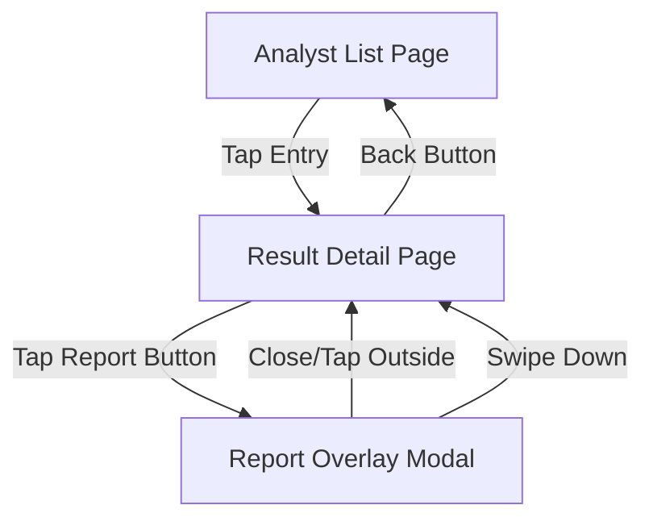

# UI Wireframes and Visual Design Specifications

## Overview
This document provides detailed wireframes, component specifications, and visual design guidelines for the Analyst Result UI Display system.

## Screen Flow Diagram



## Detailed Wireframes

### 1. Analyst List Page - Mobile Layout

```
┌─────────────────────────────────────────┐
│  📱 Trading Analysis Results            │ ← Navigation Bar (56dp)
├─────────────────────────────────────────┤
│                                         │
│  ┌─────────────────────────────────────┐ │
│  │ [🔄] AAPL      Aug 7, 2:30 PM      │ │ ← 72dp height
│  │      Running analysis...            │ │
│  └─────────────────────────────────────┘ │
│                                         │
│  ┌─────────────────────────────────────┐ │
│  │ [📈] GOOGL     Aug 7, 1:45 PM      │ │ ← 72dp height
│  │      Analysis complete • 85% conf   │ │
│  └─────────────────────────────────────┘ │
│                                         │
│  ┌─────────────────────────────────────┐ │
│  │ [⏸️] MSFT      Aug 7, 12:30 PM     │ │ ← 72dp height
│  │      Analysis complete • 72% conf   │ │
│  └─────────────────────────────────────┘ │
│                                         │
│  ┌─────────────────────────────────────┐ │
│  │ [📉] TSLA      Aug 7, 11:15 AM     │ │ ← 72dp height
│  │      Analysis complete • 68% conf   │ │
│  └─────────────────────────────────────┘ │
│                                         │
└─────────────────────────────────────────┘
```

### 2. Result Detail Page - Mobile Layout

```
┌─────────────────────────────────────────┐
│  ← GOOGL Analysis Result                │ ← Navigation Bar (56dp)
├─────────────────────────────────────────┤
│                                         │ ← Header Section (25%)
│         GOOGL                           │   ~180dp
│    Analyzed: Aug 7, 1:45 PM            │
│                                         │
│      [📈 BUY] 85% Confidence           │
│                                         │
├─────────────────────────────────────────┤
│   Risk Manager Final Decision          │ ← Report Section (50%)
│  ┌─────────────────────────────────────┐ │   ~360dp
│  │ Recommendation: STRONG BUY          │ │
│  │                                     │ │
│  │ Based on comprehensive analysis of  │ │
│  │ market conditions, technical        │ │
│  │ indicators, and fundamental data,   │ │
│  │ we recommend a STRONG BUY position  │ │
│  │ in GOOGL.                          │ │
│  │                                     │ │
│  │ Key factors supporting decision:    │ │
│  │ • Strong Q3 earnings beat          │ │
│  │ • AI/Cloud growth acceleration     │ │
│  │ • Favorable technical setup        │ │
│  │ • Institutional buying pressure    │ │ ← Scrollable
│  │                                     │ │   Content
│  │ Risk Assessment:                    │ │
│  │ • Low-Medium risk profile          │ │
│  │ • 15% upside potential             │ │
│  │ • Stop loss recommended: $142      │ │
│  │                                     │ │
│  └─────────────────────────────────────┘ │
├─────────────────────────────────────────┤
│  [ 📊 Market Analysis Report      ] │ ← Report Buttons (25%)
│                                         │   ~180dp
│  [ 📈 Fundamentals Report         ] │
│                                         │
│  [ 🎭 Sentiment Analysis Report   ] │
│                                         │
│  [ 📰 News Analysis Report        ] │
│                                         │
│  [ ⚖️ Debate Manager Summary      ] │
│                                         │
└─────────────────────────────────────────┘
```

### 3. Report Overlay Modal - Mobile Layout

```
┌─────────────────────────────────────────┐
│  Market Analysis Report            ✕    │ ← Modal Header (48dp)
├─────────────────────────────────────────┤
│  ┌─────────────────────────────────────┐ │
│  │                                     │ │
│  │  Technical Analysis Summary         │ │
│  │  ═══════════════════════════════    │ │
│  │                                     │ │
│  │  Current Price: $149.23            │ │
│  │  Day Change: +$2.41 (+1.64%)       │ │
│  │                                     │ │
│  │  Key Technical Indicators:          │ │
│  │  • RSI (14): 67.2 - Slightly       │ │
│  │    overbought but still bullish    │ │
│  │  • MACD: Bullish crossover         │ │
│  │  • Moving Averages: Price above    │ │
│  │    20, 50, and 200-day SMA         │ │
│  │                                     │ │
│  │  Support Levels:                    │ │ ← Scrollable
│  │  • Immediate: $145.50              │ │   Content
│  │  • Strong: $142.00                 │ │
│  │                                     │ │
│  │  Resistance Levels:                 │ │
│  │  • Immediate: $152.00              │ │
│  │  • Strong: $157.50                 │ │
│  │                                     │ │
│  │  Volume Analysis:                   │ │
│  │  • Today's volume: 28.5M           │ │
│  │  • 10-day avg: 24.1M (+18%)        │ │
│  │                                     │ │
│  │  Pattern Recognition:               │ │
│  │  • Ascending triangle formation    │ │
│  │  • Breakout target: $155-158       │ │
│  │                                     │ │
│  └─────────────────────────────────────┘ │
└─────────────────────────────────────────┘
```

## Component Specifications

### StatusIcon Component
```
Size: 24x24dp
Variants:
  PENDING: Material Icons - hourglass_empty (animated rotation)
  BUY: Material Icons - trending_up (green)
  HOLD: Material Icons - pause_circle_outline (orange)  
  SELL: Material Icons - trending_down (red)
  ERROR: Material Icons - error_outline (red)

Colors:
  Green: #10B981
  Orange: #F59E0B  
  Red: #EF4444
  Gray: #6B7280
```

### TradeDecisionBadge Component
```
Size: Height 36dp, Min-width 80dp
Typography: 14sp, Bold
Border: 2dp solid
Border Radius: 18dp (fully rounded)
Padding: 8dp horizontal, 6dp vertical

BUY Badge:
  Background: #F0FDF4 (light green)
  Text: #166534 (dark green)
  Border: #22C55E (medium green)

HOLD Badge:
  Background: #FFFBEB (light amber)
  Text: #92400E (dark amber)  
  Border: #F59E0B (medium amber)

SELL Badge:
  Background: #FEF2F2 (light red)
  Text: #991B1B (dark red)
  Border: #EF4444 (medium red)
```

### ReportButton Component
```
Size: Height 48dp, Full width with 16dp margins
Typography: 16sp, Medium weight
Background: #F9FAFB (light gray)
Border: 1dp solid #E5E7EB
Border Radius: 8dp
Padding: 12dp horizontal

Hover/Press State:
  Background: #F3F4F6
  Border: #D1D5DB
  
Icon: 20x20dp, positioned left with 12dp margin
Text: Ellipsis overflow for long titles
```

### ConfidenceIndicator Component
```
Display: "XX% Confidence"
Typography: 14sp, Medium weight
Colors based on confidence level:
  90-100%: #059669 (high confidence green)
  75-89%: #0891B2 (medium-high confidence blue)
  60-74%: #D97706 (medium confidence amber)  
  <60%: #DC2626 (low confidence red)
```

## Responsive Design Specifications

### Tablet Layout Adaptations (768dp+)
- Two-column layout for Result Detail Page
- Left column: Header + Report Buttons (40% width)
- Right column: Risk Manager Report (60% width)  
- Modal overlays expand to max 600dp width, centered

### Desktop Layout Adaptations (1024dp+)
- Three-column layout for Result Detail Page
- Left: Header + Navigation (25% width)
- Center: Risk Manager Report (50% width)
- Right: Report Buttons + Mini previews (25% width)
- Modal overlays as side panels instead of overlays

## Accessibility Specifications

### Screen Reader Support
- Semantic labels for all interactive elements
- Status announcements for loading states
- Proper heading hierarchy (h1, h2, h3)
- Alternative text for status icons

### Keyboard Navigation
- Tab order: Top to bottom, left to right
- Enter key activates buttons and list items
- Escape key closes modals
- Focus indicators with 2dp outline

### Color Contrast Compliance
- All text meets WCAG 2.1 AA standards (4.5:1 ratio)
- Status icons include text labels, not just color coding
- Focus indicators visible with 3:1 contrast ratio

## Animation Specifications

### Page Transitions
```
Duration: 300ms
Curve: Material ease-in-out
Effect: Slide transition with slight fade
```

### Modal Animations  
```
Entry:
  Duration: 250ms
  Curve: Material ease-out
  Effect: Fade + scale from 0.8 to 1.0

Exit:
  Duration: 200ms  
  Curve: Material ease-in
  Effect: Fade + scale from 1.0 to 0.9
```

### Loading States
```
Pending Icon:
  Duration: 1000ms (1 second full rotation)
  Curve: Linear
  Effect: Continuous rotation

List Item Updates:
  Duration: 200ms
  Curve: Material ease-in-out  
  Effect: Color transition for status changes
```

## Implementation Notes

### Development Priorities
1. **Core functionality**: List view and navigation
2. **Status system**: Icon display and decision badges  
3. **Detail page**: Header and scrollable report section
4. **Modal system**: Overlay reports with proper animations
5. **Polish**: Animations, responsive design, accessibility

### Technical Considerations
- Use Flutter's built-in Material Design components where possible
- Implement custom components for specific design requirements
- Ensure smooth scrolling performance with large report content
- Test on multiple screen sizes and orientations
- Validate accessibility with screen reader testing

This wireframe specification provides the detailed visual and interaction guidance needed for implementing the Analyst Result UI Display system with professional quality and user-friendly design.