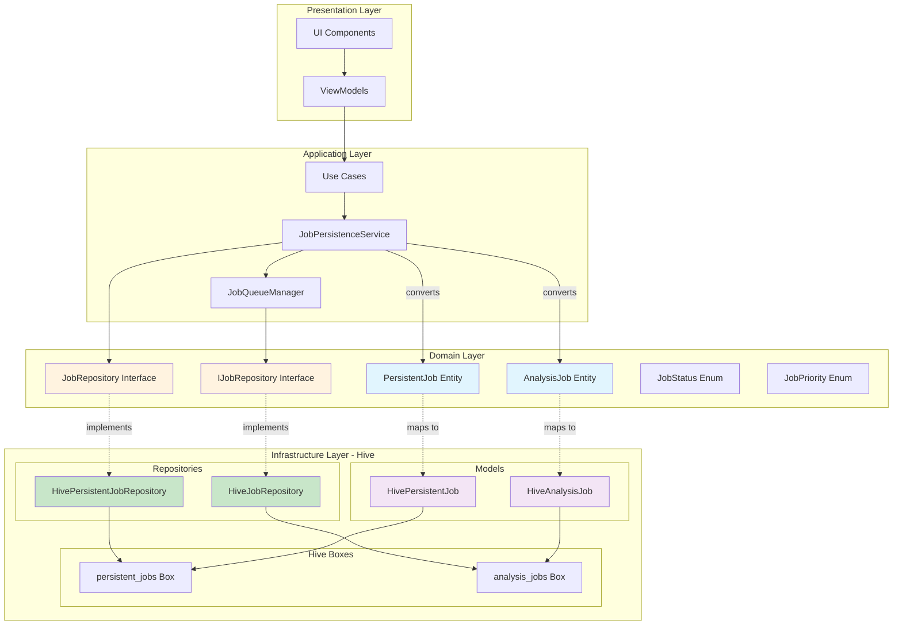
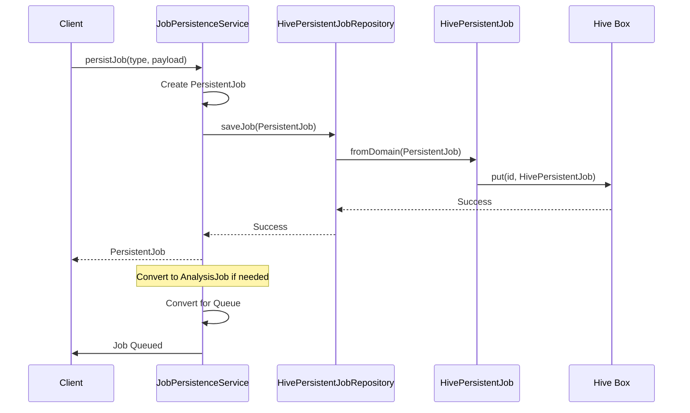
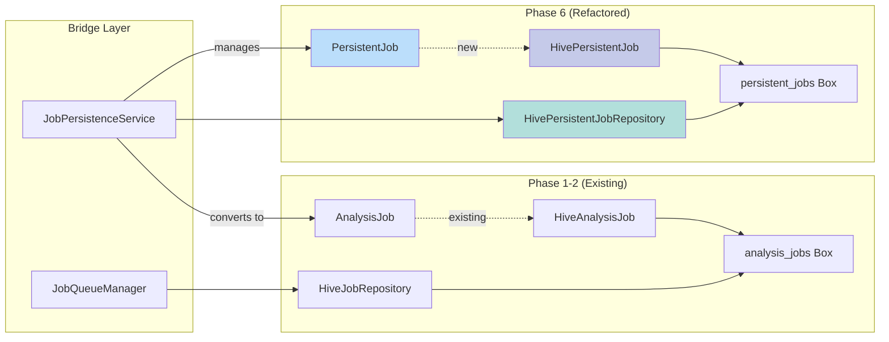
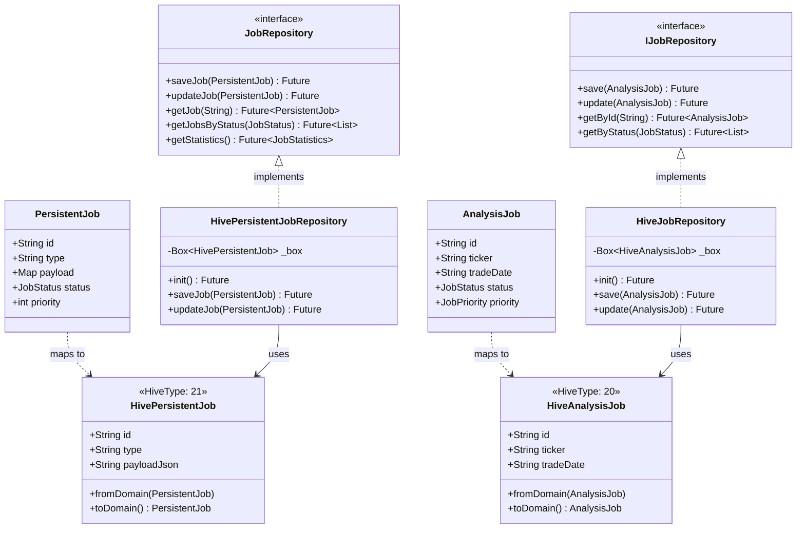
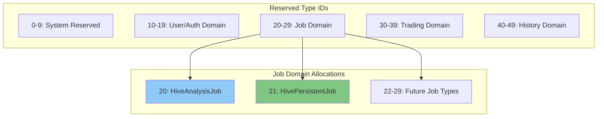
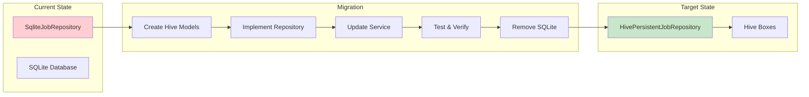

# Phase 6 Hive Architecture

## System Architecture Diagram

## Data Flow Diagram

## Component Integration

## Class Relationships (SOLID Compliance)

## Hive Type ID Allocation

## Migration Path

## Key Design Decisions

1. **Separate Hive Boxes**: `persistent_jobs` vs `analysis_jobs` for clear separation
2. **Type ID 21**: Next available ID after HiveAnalysisJob (20)
3. **JSON Serialization**: Complex fields (payload, result, metadata) stored as JSON strings
4. **Bridge Pattern**: JobPersistenceService bridges PersistentJob and AnalysisJob systems
5. **SOLID Compliance**: Clean interfaces, single responsibilities, dependency inversion

## Benefits of Hive Architecture

- **Consistency**: Single persistence technology across all phases
- **Performance**: Fast NoSQL operations, no SQL query overhead
- **Offline Support**: Works without network connectivity
- **Type Safety**: Generated adapters ensure type safety
- **Simplicity**: No SQL schema migrations needed
- **Flutter Integration**: Native Flutter support via hive_flutter