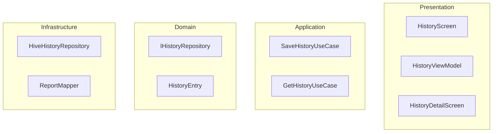

# History Feature - Complete Implementation Plan

## 🎯 Overview

Implement a History feature for the `trading_dummy` app that stores LangGraph analysis requests and responses using Hive v4 with SOLID principles and parallel execution capability.

## 📊 LangGraph Report Structure

**Request Data:**
- `ticker`: String (e.g., "AAPL")
- `tradeDate`: String (format: "YYYY-MM-DD")

**Response Data Priority:**
1. `final_trade_decision` - Trading recommendation
2. `trader_investment_plan` - Investment strategy
3. `market_report`, `fundamentals_report`, `sentiment_report`, `news_report`
4. `rawOutput` - Complete LangGraph response

## 🏗️ Architecture Overview



## 📁 Directory Structure

```
lib/history/
├── domain/
│   ├── entities/history_entry.dart
│   ├── repositories/i_history_repository.dart
│   └── value_objects/analysis_details.dart
├── application/
│   └── use_cases/
│       ├── save_history_use_case.dart
│       ├── get_history_use_case.dart
│       └── delete_history_use_case.dart
├── infrastructure/
│   ├── repositories/
│   │   ├── hive_history_repository.dart
│   │   └── mock_history_repository.dart
│   └── mappers/report_mapper.dart
└── presentation/
    ├── view_models/history_view_model.dart
    ├── screens/
    │   ├── history_screen.dart
    │   └── history_detail_screen.dart
    └── widgets/
        ├── history_list_item.dart
        └── history_empty_state.dart
```

## 🚀 Parallel Implementation Plan

### Wave 1: Foundation (Parallel)
| Task | Agent | Files | Lines | Verification |
|------|-------|-------|-------|--------------|
| 1.1 Dependencies | Solo | pubspec.yaml | 10 | `flutter pub get` |
| 1.2 Domain Interfaces | Agent 1 | i_history_repository.dart | 30 | `dart analyze` |
| 1.3 Basic Models | Agent 1 | history_entry.dart, analysis_details.dart | 150 | `dart analyze` |

### Wave 2: Hive Integration (Parallel after Wave 1)
| Task | Agent | Files | Lines | Verification |
|------|-------|-------|-------|--------------|
| 2.1 Hive Annotations | Agent 1 | Update models | 50 | `flutter pub run build_runner build` |
| 2.2 Report Mapper | Agent 2 | report_mapper.dart | 200 | Unit test |
| 2.3 Mock Repository | Agent 2 | mock_history_repository.dart | 100 | Unit test |

### Wave 3: Use Cases (Parallel after Wave 2)
| Task | Agent | Files | Lines | Verification |
|------|-------|-------|-------|--------------|
| 3.1 Save Use Case | Agent 3 | save_history_use_case.dart | 50 | Unit test |
| 3.2 Get Use Case | Agent 3 | get_history_use_case.dart | 50 | Unit test |
| 3.3 Delete Use Case | Agent 3 | delete_history_use_case.dart | 40 | Unit test |

### Wave 4: UI Components (Parallel after Wave 1)
| Task | Agent | Files | Lines | Verification |
|------|-------|-------|-------|--------------|
| 4.1 List Item Widget | Agent 4 | history_list_item.dart | 150 | Widget test |
| 4.2 Empty State | Agent 4 | history_empty_state.dart | 80 | Widget test |
| 4.3 View Model | Agent 5 | history_view_model.dart | 200 | Unit test |

### Wave 5: Hive Implementation (After Wave 2)
| Task | Agent | Files | Lines | Verification |
|------|-------|-------|-------|--------------|
| 5.1 Hive Repository | Agent 2 | hive_history_repository.dart | 150 | Integration test |
| 5.2 Hive Init | Solo | main.dart | 30 | `flutter run` |

### Wave 6: Screens (After Wave 4)
| Task | Agent | Files | Lines | Verification |
|------|-------|-------|-------|--------------|
| 6.1 History Screen | Agent 5 | history_screen.dart | 250 | `flutter run` |
| 6.2 Detail Screen | Agent 4 | history_detail_screen.dart | 200 | `flutter run` |

### Wave 7: Integration (Sequential)
| Task | Agent | Files | Lines | Verification |
|------|-------|-------|-------|--------------|
| 7.1 Service Provider | Solo | service_provider.dart | 20 | Test DI |
| 7.2 Analysis Integration | Agent 5 | analysis_page_wrapper.dart | 50 | Full flow test |
| 7.3 Navigation | Agent 5 | home_screen.dart | 30 | UI test |

## 👥 Agent Assignments

**Agent 1 - Domain Specialist (3 tasks)**
- 1.2 Domain Interfaces
- 1.3 Basic Models  
- 2.1 Hive Annotations

**Agent 2 - Infrastructure (3 tasks)**
- 2.2 Report Mapper
- 2.3 Mock Repository
- 5.1 Hive Repository

**Agent 3 - Business Logic (3 tasks)**
- 3.1 Save Use Case
- 3.2 Get Use Case
- 3.3 Delete Use Case

**Agent 4 - UI Components (3 tasks)**
- 4.1 List Item Widget
- 4.2 Empty State
- 6.2 Detail Screen

**Agent 5 - Integration (4 tasks)**
- 4.3 View Model
- 6.1 History Screen
- 7.2 Analysis Integration
- 7.3 Navigation

**Solo Tasks (4 tasks)**
- 1.1 Dependencies
- 5.2 Hive Init
- 7.1 Service Provider

## 📋 Key Code Templates

### HistoryEntry Model
```dart
@HiveType(typeId: 0)
class HistoryEntry extends HiveObject {
  @HiveField(0) final String id;
  @HiveField(1) final String ticker;
  @HiveField(2) final String tradeDate;
  @HiveField(3) final DateTime timestamp;
  @HiveField(4) final String finalDecision;
  @HiveField(5) final double? confidence;
  @HiveField(6) final String summary;
  @HiveField(7) final AnalysisDetails details;
}
```

### Repository Interface
```dart
abstract class IHistoryRepository {
  Future<void> save(HistoryEntry entry);
  Future<List<HistoryEntry>> getAll();
  Future<HistoryEntry?> getById(String id);
  Future<void> delete(String id);
}
```

### Report Mapper Core
```dart
class ReportMapper {
  HistoryEntry map(FinalReport report) {
    final decision = _extractDecision(report.content);
    final confidence = _extractConfidence(report.content);
    final summary = _generateSummary(report.content, decision);
    
    return HistoryEntry(
      ticker: report.ticker,
      tradeDate: report.tradeDate,
      timestamp: report.timestamp,
      finalDecision: decision,
      confidence: confidence,
      summary: summary,
      details: _extractDetails(report),
    );
  }
}
```

## ✅ Verification Checklist

### Dependencies & Setup
```bash
# Add to pubspec.yaml
dependencies:
  hive: ^2.2.3
  hive_flutter: ^1.1.0
  uuid: ^4.5.1
dev_dependencies:
  hive_generator: ^2.0.1
  build_runner: ^2.4.13

# Run
flutter pub get
flutter pub run build_runner build --delete-conflicting-outputs
```

### Hive Initialization (main.dart)
```dart
await Hive.initFlutter();
Hive.registerAdapter(HistoryEntryAdapter());
Hive.registerAdapter(AnalysisDetailsAdapter());
await Hive.openBox<HistoryEntry>('history');
```

### Integration Points
1. **ServiceProvider**: Add `IHistoryRepository historyRepository`
2. **AnalysisPageWrapper**: Call `SaveHistoryUseCase` after analysis
3. **HomeScreen**: Add navigation to HistoryScreen

### Final Testing Flow
```
1. flutter run
2. Login → Analyze AAPL → Check History
3. Tap entry → View details
4. Swipe to delete
5. Filter by ticker
6. Restart app → Verify persistence
```

## 🎯 Success Metrics
- All 20 tasks complete
- Zero analyzer errors
- Tests passing
- 2-3 hour completion with parallel execution
- Full user flow working end-to-end