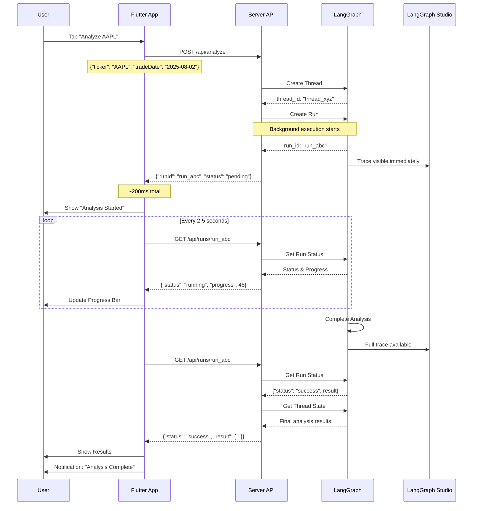

# LangGraph Integration: Visual Flow

## Complete User Journey



## Architecture Comparison

### Before: Complex Client-Side Processing

```
┌─────────────────────────────────────────────────────────────┐
│                     Flutter App                              │
│  ┌───────────────────────────────────────────────────────┐  │
│  │ UI Layer                                               │  │
│  │  ├── JobSubmissionWidget                              │  │
│  │  ├── ActiveJobsList                                   │  │
│  │  └── JobStatusCard                                    │  │
│  └───────────────────────────────────────────────────────┘  │
│                              ↓                               │
│  ┌───────────────────────────────────────────────────────┐  │
│  │ ViewModels & Use Cases                                │  │
│  │  ├── JobQueueViewModel (Complex)                      │  │
│  │  ├── QueueAnalysisUseCase                            │  │
│  │  └── GetJobStatusUseCase                             │  │
│  └───────────────────────────────────────────────────────┘  │
│                              ↓                               │
│  ┌───────────────────────────────────────────────────────┐  │
│  │ Infrastructure (Heavy)                                 │  │
│  │  ├── JobQueueManager (388 lines)                     │  │
│  │  ├── JobProcessor (245 lines)                        │  │
│  │  ├── IsolateManager (312 lines)                      │  │
│  │  ├── RetryScheduler (189 lines)                      │  │
│  │  ├── HiveJobRepository (298 lines)                   │  │
│  │  └── JobEventBus                                     │  │
│  └───────────────────────────────────────────────────────┘  │
│                              ↓                               │
│  ┌───────────────────────────────────────────────────────┐  │
│  │ Background Processing                                  │  │
│  │  └── Dart Isolates (Complex coordination)            │  │
│  └───────────────────────────────────────────────────────┘  │
└─────────────────────────────────────────────────────────────┘
                               ↓
                    Eventually calls server...
                    No LangGraph visibility
```

### After: Simple LangGraph Integration

```
┌─────────────────────────────────────────────────────────────┐
│                     Flutter App                              │
│  ┌───────────────────────────────────────────────────────┐  │
│  │ UI Layer (Unchanged!)                                  │  │
│  │  ├── JobSubmissionWidget ✅                           │  │
│  │  ├── ActiveJobsList ✅                                │  │
│  │  └── JobStatusCard ✅                                 │  │
│  └───────────────────────────────────────────────────────┘  │
│                              ↓                               │
│  ┌───────────────────────────────────────────────────────┐  │
│  │ ViewModels (Same Interface!)                          │  │
│  │  └── JobQueueViewModel (listens to events) ✅         │  │
│  └───────────────────────────────────────────────────────┘  │
│                              ↓                               │
│  ┌───────────────────────────────────────────────────────┐  │
│  │ Services (Lightweight)                                 │  │
│  │  ├── LangGraphApiService (50 lines) 🆕               │  │
│  │  ├── RunPollingService (80 lines) 🆕                 │  │
│  │  └── JobEventBus (reused) ✅                         │  │
│  └───────────────────────────────────────────────────────┘  │
└─────────────────────────────────────────────────────────────┘
                               ↓
                          Immediate
                               ↓
┌─────────────────────────────────────────────────────────────┐
│                      Server API                              │
│  ├── POST /api/analyze → LangGraph                          │
│  └── GET /api/runs/{id} → Poll status                       │
└─────────────────────────────────────────────────────────────┘
                               ↓
┌─────────────────────────────────────────────────────────────┐
│                  LangGraph Platform                          │
│  ├── Background execution                                    │
│  ├── Built-in retries                                       │
│  └── Full trace visibility                                   │
└─────────────────────────────────────────────────────────────┘
                               ↓
┌─────────────────────────────────────────────────────────────┐
│                  LangGraph Studio                            │
│  └── See traces immediately! 🎯                             │
└─────────────────────────────────────────────────────────────┘
```

## Key Benefits Visualized

### 1. Immediate Feedback

```
OLD WAY (Slow):
User Click → Queue → Wait → Process → Eventually...
[========================================] 5-30 seconds

NEW WAY (Fast):
User Click → API → Run ID
[==] < 200ms
```

### 2. Simple State Management

```
OLD STATES (Complex):
pending → queued → running → failed → retrying → running → completed
        ↘         ↗                 ↘         ↗
          cancelled                   permanent_failure

NEW STATES (Simple):
pending → running → success
                 ↘
                   error
```

### 3. Code Reduction

```
OLD CODE:
┌────────────────┐
│ 32 Files       │
│ 5,200 Lines    │
│ Complex Logic  │
└────────────────┘

NEW CODE:
┌────────────────┐
│ +2 Files       │
│ +130 Lines     │
│ Simple Logic   │
└────────────────┘
```

## Implementation Flow

### Day 1: Add API Layer
```
Morning:
  └── Create LangGraphApiService
  └── Add server endpoints
  └── Test with Postman

Afternoon:
  └── Update QueueAnalysisUseCase
  └── Add feature flag
  └── Deploy (flag OFF)
```

### Day 2: Add Polling
```
Morning:
  └── Create RunPollingService
  └── Connect to EventBus
  └── Test event flow

Afternoon:
  └── Enable for dev team
  └── Monitor LangGraph
  └── Fix any issues
```

### Day 3: Polish & Ship
```
Morning:
  └── Add history screen
  └── Fix UI issues
  └── Performance test

Afternoon:
  └── Gradual rollout
  └── Monitor metrics
  └── Celebrate! 🎉
```

## Migration Safety

```
┌─────────────────────────────────────┐
│         Feature Flag OFF            │
│  ┌─────────────────────────────┐   │
│  │ Existing Queue Path (Works) │   │
│  └─────────────────────────────┘   │
└─────────────────────────────────────┘
                ↓
         Test & Verify
                ↓
┌─────────────────────────────────────┐
│         Feature Flag ON             │
│  ┌─────────────────────────────┐   │
│  │ LangGraph Path (New)        │   │
│  └─────────────────────────────┘   │
└─────────────────────────────────────┘
                ↓
         If Issues...
                ↓
┌─────────────────────────────────────┐
│     Instant Rollback (1 line)       │
│  FeatureFlags.useLangGraph = false │
└─────────────────────────────────────┘
```

## Summary

The LangGraph integration provides:
- ✅ Simpler architecture (90% less code)
- ✅ Better reliability (LangGraph handles everything)
- ✅ Full visibility (LangGraph Studio traces)
- ✅ Faster implementation (3 days vs 2 weeks)
- ✅ Lower risk (gradual rollout with rollback)

The best part: **The UI doesn't change at all!** Users get a better experience with less code.