# Phase 6 Hive Refactoring Plan

## 🎯 Executive Summary

This document outlines the comprehensive plan to refactor Phase 6 from SQLite to Hive, aligning with the documented architecture in ASYNC_ANALYSIS_ARCHITECTURE.md and following SOLID principles.

## 🏗️ Architecture Overview

### Current State (Incorrect)
- Phase 6 implemented with SQLite via `SqliteJobRepository`
- Creates unnecessary complexity bridging two persistence systems
- Violates documented architecture decisions

### Target State (Aligned with Architecture)
- Phase 6 uses Hive exclusively via `HivePersistentJobRepository`
- Consistent with Phases 1-2 implementation patterns
- Follows established Hive patterns and conventions

## 📐 SOLID Principles Application

### Single Responsibility (S)
- **Domain Layer**: `PersistentJob` entity focuses solely on business logic
- **Infrastructure Layer**: `HivePersistentJob` handles only persistence concerns
- **Repository**: `HivePersistentJobRepository` manages only Hive operations
- **Service**: `JobPersistenceService` orchestrates job lifecycle, not storage

### Open/Closed (O)
- Extend existing patterns without modifying core implementations
- Add new Hive models alongside existing ones
- Preserve existing interfaces and contracts

### Liskov Substitution (L)
- `HivePersistentJobRepository` fully implements `JobRepository` interface
- Can replace `SqliteJobRepository` without changing service layer
- Maintains behavioral compatibility

### Interface Segregation (I)
- Use existing `JobRepository` interface without modification
- No unnecessary methods or dependencies
- Clean separation of concerns

### Dependency Inversion (D)
- Service depends on `JobRepository` abstraction, not concrete implementation
- Domain layer remains independent of infrastructure
- Easy to swap implementations

## 🗂️ File Structure

```
lib/jobs/
├── domain/
│   ├── entities/
│   │   ├── persistent_job.dart (existing, no changes)
│   │   └── analysis_job.dart (existing, no changes)
│   └── repositories/
│       └── job_repository.dart (existing, no changes)
├── infrastructure/
│   ├── models/
│   │   ├── hive_analysis_job.dart (existing)
│   │   ├── hive_analysis_job.g.dart (generated)
│   │   ├── hive_persistent_job.dart (NEW)
│   │   └── hive_persistent_job.g.dart (generated)
│   ├── repositories/
│   │   ├── hive_job_repository.dart (existing)
│   │   ├── hive_persistent_job_repository.dart (NEW)
│   │   └── sqlite_job_repository.dart (TO DELETE)
│   └── services/
│       └── job_persistence_service.dart (update imports)
└── application/
    └── [use cases remain unchanged]
```

## 🔄 Refactoring Steps

### Phase 1: Create Hive Models (Parallel Tasks)

#### Task 1.1: Create HivePersistentJob Model
**File**: `lib/jobs/infrastructure/models/hive_persistent_job.dart`
**Lines**: ~200
```dart
import 'package:hive/hive.dart';
import '../../domain/entities/persistent_job.dart' as domain;

part 'hive_persistent_job.g.dart';

@HiveType(typeId: 21) // Next available after HiveAnalysisJob (20)
class HivePersistentJob extends HiveObject {
  @HiveField(0)
  final String id;
  
  @HiveField(1)
  final String type;
  
  @HiveField(2)
  final String payloadJson; // Store as JSON string
  
  @HiveField(3)
  final int statusIndex;
  
  @HiveField(4)
  final int priority;
  
  @HiveField(5)
  final DateTime createdAt;
  
  @HiveField(6)
  final DateTime? startedAt;
  
  @HiveField(7)
  final DateTime? completedAt;
  
  @HiveField(8)
  final DateTime? scheduledFor;
  
  @HiveField(9)
  final int retryCount;
  
  @HiveField(10)
  final int maxRetries;
  
  @HiveField(11)
  final String? errorMessage;
  
  @HiveField(12)
  final String? resultJson; // Store as JSON string
  
  @HiveField(13)
  final String metadataJson; // Store as JSON string
  
  @HiveField(14)
  final List<String> tags;
  
  // Constructor and conversion methods
  factory HivePersistentJob.fromDomain(domain.PersistentJob job);
  domain.PersistentJob toDomain();
}
```

#### Task 1.2: Update pubspec.yaml Dependencies
**Action**: Ensure Hive dependencies are up to date
```yaml
dependencies:
  hive: ^2.2.3
  hive_flutter: ^1.1.0

dev_dependencies:
  hive_generator: ^2.0.0
  build_runner: ^2.4.0
```

### Phase 2: Implement Hive Repository

#### Task 2.1: Create HivePersistentJobRepository
**File**: `lib/jobs/infrastructure/repositories/hive_persistent_job_repository.dart`
**Lines**: ~400
```dart
import 'package:hive/hive.dart';
import '../../domain/entities/persistent_job.dart';
import '../../domain/repositories/job_repository.dart';
import '../models/hive_persistent_job.dart';

class HivePersistentJobRepository implements JobRepository {
  static const String _boxName = 'persistent_jobs';
  late Box<HivePersistentJob> _box;
  
  Future<void> init() async {
    _box = await Hive.openBox<HivePersistentJob>(_boxName);
  }
  
  // Implement all JobRepository methods following HiveJobRepository patterns
  // - Use _ensureBoxOpen pattern
  // - Convert between domain and Hive models
  // - Implement efficient querying
  // - Handle sorting and filtering
}
```

### Phase 3: Update Service Layer

#### Task 3.1: Update JobPersistenceService
**File**: `lib/jobs/infrastructure/services/job_persistence_service.dart`
**Changes**:
1. Remove SQLite import
2. Import HivePersistentJobRepository
3. Update initialization to use Hive
4. Remove SQLite-specific cleanup in dispose

### Phase 4: Generate Code & Tests

#### Task 4.1: Generate Hive Adapters
```bash
flutter pub run build_runner build --delete-conflicting-outputs
```

#### Task 4.2: Create Comprehensive Tests
**Files**: 
- `test/jobs/infrastructure/models/hive_persistent_job_test.dart`
- `test/jobs/infrastructure/repositories/hive_persistent_job_repository_test.dart`

### Phase 5: Migration & Cleanup

#### Task 5.1: Delete SQLite Implementation
- Remove `lib/jobs/infrastructure/repositories/sqlite_job_repository.dart`
- Remove SQLite dependencies from pubspec.yaml

#### Task 5.2: Update Documentation
- Update progress tracker in ASYNC_ANALYSIS_ARCHITECTURE.md
- Document Hive box naming conventions

## 📊 Implementation Timeline

```mermaid
gantt
    title Phase 6 Hive Refactoring Timeline
    dateFormat  HH:mm
    section Models
    Create HivePersistentJob     :a1, 00:00, 30min
    Generate Adapters            :a2, after a1, 10min
    
    section Repository
    Implement HivePersistentJobRepository :b1, 00:00, 60min
    
    section Tests
    Unit Tests - Models          :c1, after a2, 30min
    Integration Tests - Repo     :c2, after b1, 45min
    
    section Integration
    Update Service Layer         :d1, after b1, 20min
    Run All Tests               :d2, after c2 d1, 15min
    
    section Cleanup
    Remove SQLite               :e1, after d2, 10min
    Update Documentation        :e2, after e1, 15min
```



## 🧪 Test Plans and Verification

### Unit Test Verification

#### 1. HivePersistentJob Model Tests
**Test File**: `test/jobs/infrastructure/models/hive_persistent_job_test.dart`
**How to Run**: `flutter test test/jobs/infrastructure/models/hive_persistent_job_test.dart`
**What to Verify**:
- ✅ Domain to Hive conversion preserves all fields
- ✅ Hive to domain conversion handles nullables correctly
- ✅ JSON serialization for complex fields (payload, result, metadata)
- ✅ Equality and hashCode implementations
- ✅ All JobStatus enum values map correctly

#### 2. HivePersistentJobRepository Tests
**Test File**: `test/jobs/infrastructure/repositories/hive_persistent_job_repository_test.dart`
**How to Run**: `flutter test test/jobs/infrastructure/repositories/hive_persistent_job_repository_test.dart`
**What to Verify**:
- ✅ All CRUD operations (Create, Read, Update, Delete)
- ✅ Query methods (by status, type, date range)
- ✅ Statistics calculation accuracy
- ✅ Cleanup operations
- ✅ Concurrent access handling
- ✅ Box initialization and lifecycle

#### 3. JobPersistenceService Integration Tests
**Test File**: `test/jobs/infrastructure/services/job_persistence_service_test.dart`
**How to Run**: `flutter test test/jobs/infrastructure/services/job_persistence_service_test.dart`
**What to Verify**:
- ✅ Service works with Hive repository
- ✅ Job lifecycle management
- ✅ Retry logic with exponential backoff
- ✅ Dead letter queue handling
- ✅ Scheduled job processing
- ✅ All 25 existing tests pass

### Integration Test Suite
```bash
# Run all job system tests
flutter test test/jobs/

# Expected output:
# ✅ 100+ tests passed
# ✅ No analyzer warnings
# ✅ No runtime exceptions
```

### Performance Benchmarks
- Repository operations < 10ms
- Batch operations < 50ms for 100 jobs
- Memory usage stable under load
- No memory leaks in long-running tests

### Manual Testing Checklist
```dart
// Test script for manual verification
void main() async {
  // Initialize Hive
  await Hive.initFlutter();
  
  // Register adapters
  Hive.registerAdapter(HivePersistentJobAdapter());
  
  // Create repository
  final repo = HivePersistentJobRepository();
  await repo.init();
  
  // Test job creation
  final job = PersistentJob.create(
    type: 'test_job',
    payload: {'test': 'data'},
  );
  
  await repo.saveJob(job);
  
  // Verify retrieval
  final retrieved = await repo.getJob(job.id);
  assert(retrieved != null);
  assert(retrieved.type == 'test_job');
  
  print('✅ Manual test passed');
}
```

### Checklist for Phase 6 Hive Refactoring
- [ ] HivePersistentJob model created with correct type ID (21)
- [ ] All fields properly annotated with @HiveField
- [ ] JSON serialization for complex types implemented
- [ ] HivePersistentJobRepository implements all JobRepository methods
- [ ] Code generation successful (no conflicts)
- [ ] All unit tests pass (models, repository)
- [ ] Integration tests with JobPersistenceService pass
- [ ] SQLite implementation removed
- [ ] Documentation updated
- [ ] No analyzer warnings
- [ ] Performance targets met
- [ ] Memory usage stable
- [ ] Hive boxes properly initialized and closed

## 🔍 Risk Mitigation

### Data Migration
- No existing production data (Phase 6 is new)
- Clean switch from SQLite to Hive
- No backward compatibility needed

### Type ID Conflicts
- Use typeId 21 for HivePersistentJob
- Document all typeIds in central location
- Reserve range 20-29 for job system

### Performance Considerations
- Index frequently queried fields
- Use efficient query patterns from HiveJobRepository
- Batch operations where possible

## 📝 Migration Commands

```bash
# Step 1: Clean build
flutter clean
flutter pub get

# Step 2: Generate Hive adapters
flutter pub run build_runner build --delete-conflicting-outputs

# Step 3: Run tests
flutter test test/jobs/

# Step 4: Verify no SQLite references
grep -r "sqlite" lib/jobs/
grep -r "SqliteJobRepository" lib/

# Step 5: Final verification
flutter analyze
```

## ✅ Success Criteria

1. **All tests pass**: 100% of existing Phase 6 tests work with Hive
2. **No SQLite references**: Complete removal of SQLite implementation
3. **Performance maintained**: Same or better performance metrics
4. **Architecture aligned**: Consistent with documented decisions
5. **SOLID compliance**: Clean separation of concerns maintained

## 🎯 Next Steps

1. Create HivePersistentJob model
2. Implement HivePersistentJobRepository
3. Update JobPersistenceService imports
4. Run comprehensive tests
5. Remove SQLite implementation
6. Update documentation

This refactoring will ensure Phase 6 aligns with the established architecture and maintains consistency across the job processing system.