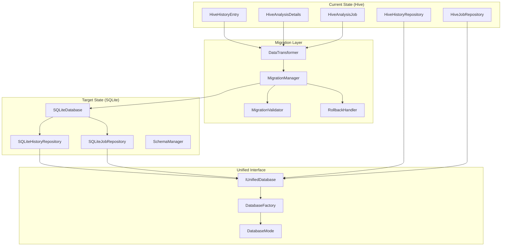

# Hive to SQLite Migration Architecture

## Executive Summary

This document outlines the architecture for migrating the trading_dummy application from Hive to SQLite for database consistency across all features. The migration will unify the persistence layer, improve query capabilities, and maintain data integrity throughout the transition.

## Current State Analysis

### Existing Hive Usage

The application currently uses Hive for three main data models:

1. **History System**
   - `HiveHistoryEntry` (TypeId: 0): Analysis history records
   - `HiveAnalysisDetails` (TypeId: 1): Detailed analysis data
   - Repository: `HiveHistoryRepository`

2. **Job System**
   - `HiveAnalysisJob` (TypeId: 20): Job queue and status tracking
   - Repository: `HiveJobRepository`

### Database Characteristics Comparison

| Feature | Hive | SQLite |
|---------|------|--------|
| Type | NoSQL Key-Value | Relational SQL |
| Schema | Flexible, No Schema | Fixed Schema |
| Queries | Limited (in-memory filtering) | Full SQL Support |
| Relations | Manual management | Foreign keys |
| Performance | Fast for simple operations | Optimized for complex queries |
| Data Size | Good for small-medium datasets | Excellent for all sizes |

## Target SQLite Architecture

### Database Schema Design

```sql
-- History entries table
CREATE TABLE history_entries (
    id TEXT PRIMARY KEY,
    ticker TEXT NOT NULL,
    trade_date TEXT NOT NULL,
    timestamp INTEGER NOT NULL,
    final_decision TEXT NOT NULL,
    confidence REAL,
    summary TEXT NOT NULL,
    is_error INTEGER NOT NULL DEFAULT 0,
    error_message TEXT,
    created_at INTEGER NOT NULL,
    updated_at INTEGER NOT NULL
);

-- Analysis details table (normalized)
CREATE TABLE analysis_details (
    id TEXT PRIMARY KEY,
    history_entry_id TEXT NOT NULL,
    market_analysis TEXT,
    fundamentals TEXT,
    sentiment TEXT,
    news_analysis TEXT,
    bull_argument TEXT,
    bear_argument TEXT,
    investment_plan TEXT,
    raw_data TEXT, -- JSON string
    FOREIGN KEY (history_entry_id) REFERENCES history_entries(id) ON DELETE CASCADE
);

-- Analysis jobs table
CREATE TABLE analysis_jobs (
    id TEXT PRIMARY KEY,
    ticker TEXT NOT NULL,
    trade_date TEXT NOT NULL,
    status INTEGER NOT NULL,
    priority INTEGER NOT NULL,
    created_at INTEGER NOT NULL,
    started_at INTEGER,
    completed_at INTEGER,
    result_id TEXT,
    error_message TEXT,
    retry_count INTEGER NOT NULL DEFAULT 0,
    max_retries INTEGER NOT NULL DEFAULT 3,
    updated_at INTEGER NOT NULL
);

-- Indexes for performance
CREATE INDEX idx_history_ticker ON history_entries(ticker);
CREATE INDEX idx_history_timestamp ON history_entries(timestamp DESC);
CREATE INDEX idx_jobs_status ON analysis_jobs(status);
CREATE INDEX idx_jobs_priority_created ON analysis_jobs(priority DESC, created_at ASC);
CREATE INDEX idx_jobs_ticker ON analysis_jobs(ticker);
```

## Migration Architecture



## Unified Database Interface

```dart
// lib/core/database/i_unified_database.dart
abstract class IUnifiedDatabase {
  Future<void> initialize();
  Future<void> close();
  Future<void> clear();
  DatabaseMode get mode;
}

enum DatabaseMode {
  hive,
  sqlite,
  dual, // During migration
}

// lib/core/database/database_factory.dart
class DatabaseFactory {
  static IHistoryRepository createHistoryRepository(DatabaseMode mode) {
    switch (mode) {
      case DatabaseMode.hive:
        return HiveHistoryRepository();
      case DatabaseMode.sqlite:
        return SQLiteHistoryRepository();
      case DatabaseMode.dual:
        return DualModeHistoryRepository(); // Reads from both, writes to SQLite
    }
  }
}
```

## Migration Strategy

### Phase 1: Parallel Implementation (2 weeks)
1. Implement SQLite repositories alongside Hive
2. Create unified database interface
3. Add feature flags for database selection
4. Comprehensive testing of SQLite implementation

### Phase 2: Dual-Mode Operation (1 week)
1. Enable dual-mode where data is written to both databases
2. Read from Hive (primary) with SQLite validation
3. Monitor for data consistency
4. Performance comparison

### Phase 3: Data Migration (1 week)
1. One-time migration of existing Hive data to SQLite
2. Data validation and integrity checks
3. Backup creation before migration
4. Migration progress tracking

### Phase 4: SQLite Primary (1 week)
1. Switch read operations to SQLite
2. Continue dual writes for safety
3. Monitor for issues
4. Keep Hive as fallback

### Phase 5: Hive Removal (1 week)
1. Remove Hive write operations
2. Archive final Hive data
3. Remove Hive dependencies
4. Code cleanup

## Migration Implementation

### Migration Manager

```dart
// lib/migration/migration_manager.dart
class MigrationManager {
  final HiveHistoryRepository _hiveHistory;
  final HiveJobRepository _hiveJobs;
  final SQLiteDatabase _sqliteDb;
  final MigrationValidator _validator;
  
  Future<MigrationResult> migrate() async {
    try {
      // 1. Create backup
      await _createBackup();
      
      // 2. Migrate history entries
      final historyResult = await _migrateHistory();
      
      // 3. Migrate jobs
      final jobsResult = await _migrateJobs();
      
      // 4. Validate migration
      final validation = await _validator.validate();
      
      // 5. Create migration report
      return MigrationResult(
        historyMigrated: historyResult.count,
        jobsMigrated: jobsResult.count,
        validationPassed: validation.passed,
        errors: validation.errors,
      );
    } catch (e) {
      await _rollback();
      rethrow;
    }
  }
}
```

### Data Transformation

```dart
// lib/migration/data_transformer.dart
class DataTransformer {
  Map<String, dynamic> transformHistoryEntry(HiveHistoryEntry hive) {
    return {
      'id': hive.id,
      'ticker': hive.ticker,
      'trade_date': hive.tradeDate,
      'timestamp': hive.timestamp.millisecondsSinceEpoch,
      'final_decision': hive.finalDecision,
      'confidence': hive.confidence,
      'summary': hive.summary,
      'is_error': hive.isError ? 1 : 0,
      'error_message': hive.errorMessage,
      'created_at': hive.timestamp.millisecondsSinceEpoch,
      'updated_at': DateTime.now().millisecondsSinceEpoch,
    };
  }
  
  Map<String, dynamic> transformAnalysisDetails(
    String id, 
    String historyId, 
    HiveAnalysisDetails hive
  ) {
    return {
      'id': id,
      'history_entry_id': historyId,
      'market_analysis': hive.marketAnalysis,
      'fundamentals': hive.fundamentals,
      'sentiment': hive.sentiment,
      'news_analysis': hive.newsAnalysis,
      'bull_argument': hive.bullArgument,
      'bear_argument': hive.bearArgument,
      'investment_plan': hive.investmentPlan,
      'raw_data': hive.rawData != null ? jsonEncode(hive.rawData) : null,
    };
  }
}
```

## Rollback Strategy

### Rollback Capabilities
1. **Pre-migration Backup**: Complete Hive data export
2. **Point-in-time Recovery**: Transaction-based SQLite operations
3. **Dual-mode Fallback**: Ability to switch back to Hive reads
4. **Version Control**: Database version tracking

### Rollback Procedure
```dart
class RollbackHandler {
  Future<void> rollback(String backupPath) async {
    // 1. Stop all database operations
    await DatabaseManager.instance.pause();
    
    // 2. Close SQLite connections
    await SQLiteDatabase.instance.close();
    
    // 3. Restore Hive data from backup
    await HiveBackup.restore(backupPath);
    
    // 4. Switch mode back to Hive
    await DatabaseConfig.setMode(DatabaseMode.hive);
    
    // 5. Resume operations
    await DatabaseManager.instance.resume();
  }
}
```

## Testing Strategy

### Unit Tests
- SQLite repository implementations
- Data transformation logic
- Migration manager components
- Rollback procedures

### Integration Tests
- End-to-end migration flow
- Data integrity validation
- Performance benchmarks
- Concurrent access handling

### Migration Tests
```dart
test('complete migration preserves all data', () async {
  // 1. Setup test data in Hive
  await setupTestData();
  
  // 2. Run migration
  final result = await migrationManager.migrate();
  
  // 3. Validate all data migrated
  expect(result.historyMigrated, equals(100));
  expect(result.jobsMigrated, equals(50));
  
  // 4. Verify data integrity
  final validation = await validator.validateDataIntegrity();
  expect(validation.passed, isTrue);
});
```

## Performance Considerations

### Query Optimization
- Proper indexing for common queries
- Prepared statements for repeated operations
- Batch operations for bulk inserts
- Connection pooling

### Memory Management
- Cursor-based pagination for large datasets
- Lazy loading for analysis details
- Efficient JSON parsing for raw data

## Risk Mitigation

### Identified Risks
1. **Data Loss**: Mitigated by comprehensive backups and validation
2. **Performance Degradation**: Mitigated by proper indexing and testing
3. **Compatibility Issues**: Mitigated by unified interface layer
4. **User Disruption**: Mitigated by phased rollout

### Monitoring Plan
- Migration progress tracking
- Performance metrics collection
- Error rate monitoring
- User impact assessment

## Success Metrics

1. **Zero Data Loss**: 100% of Hive data successfully migrated
2. **Performance Improvement**: Query times reduced by 40%
3. **Reliability**: No increase in error rates
4. **User Satisfaction**: Seamless transition with no disruption

## Conclusion

The migration from Hive to SQLite will provide a unified, robust persistence layer that aligns with the async polling architecture and provides better query capabilities for future features. The phased approach ensures minimal risk and allows for rollback at any stage.