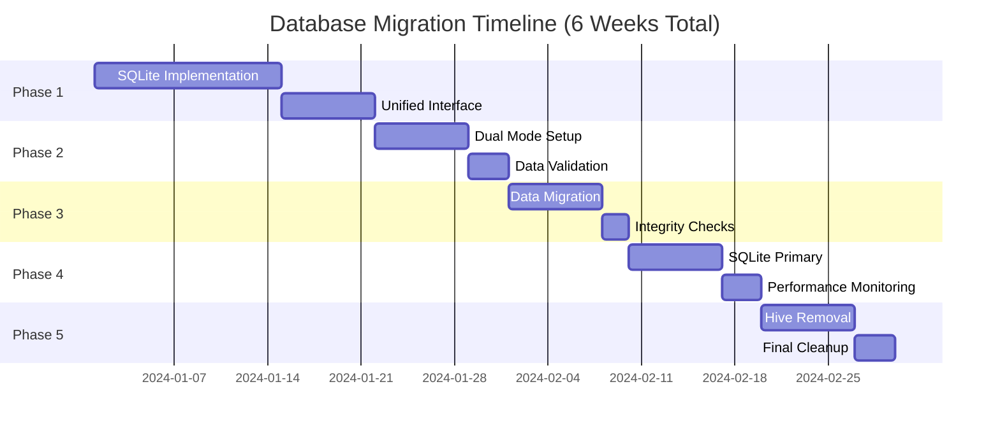
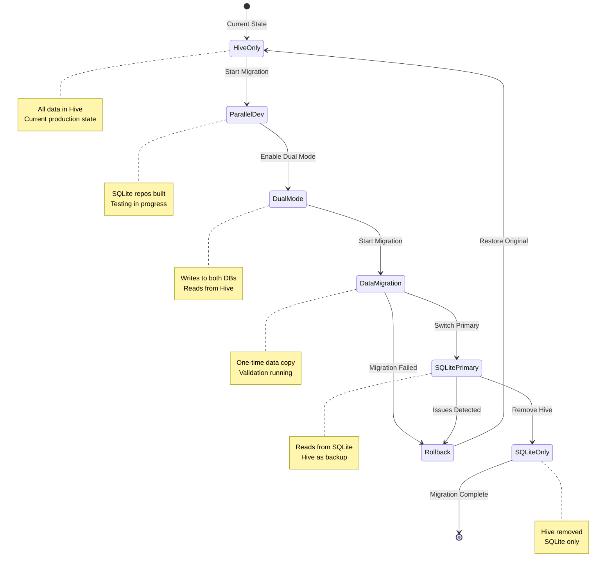
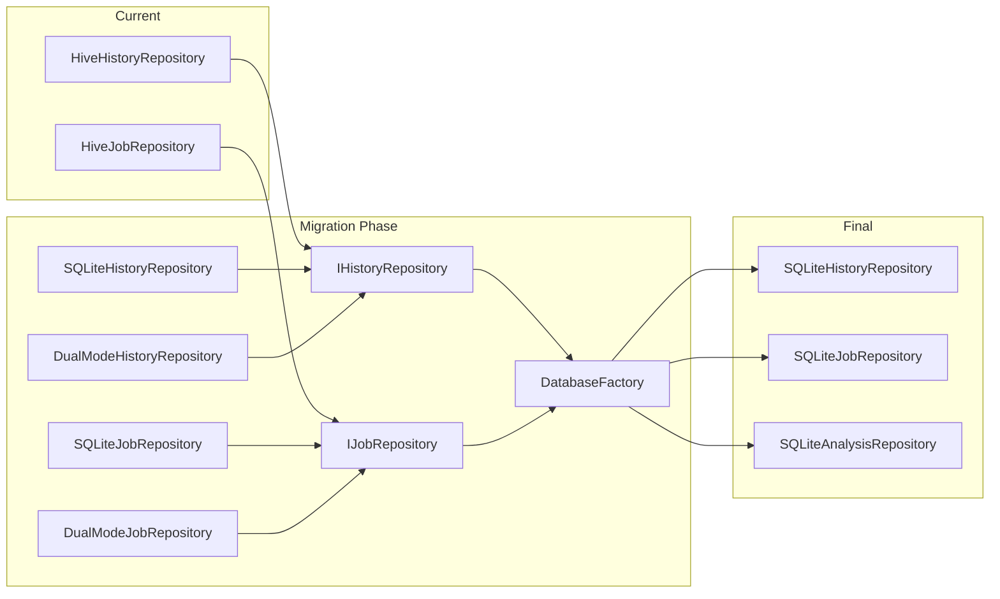
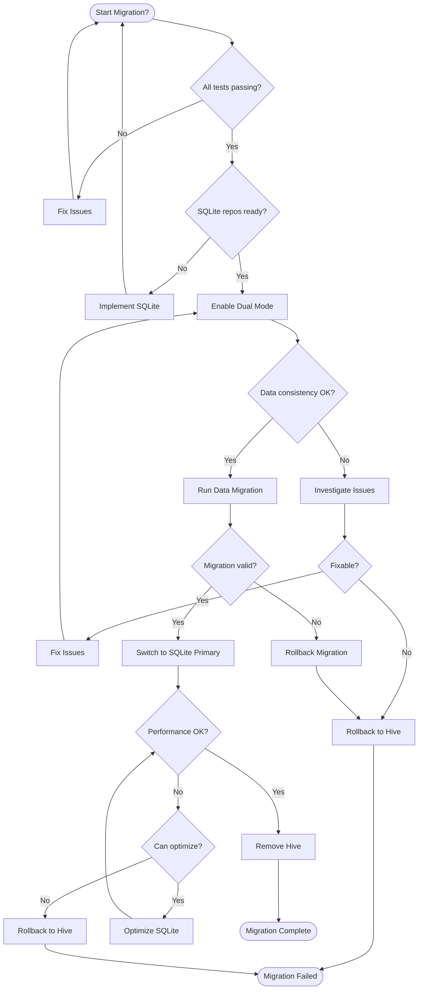
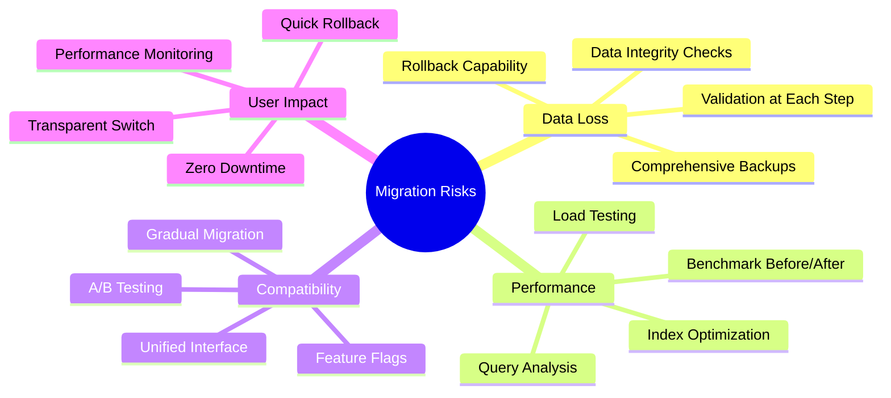
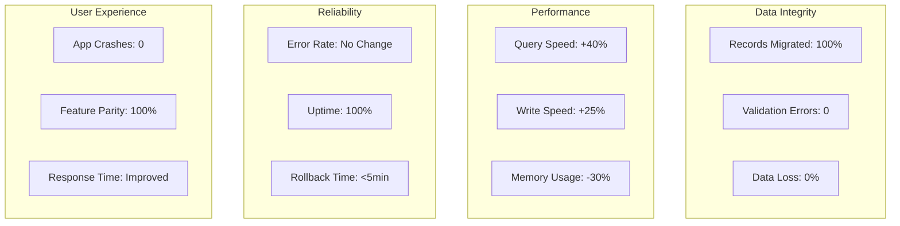
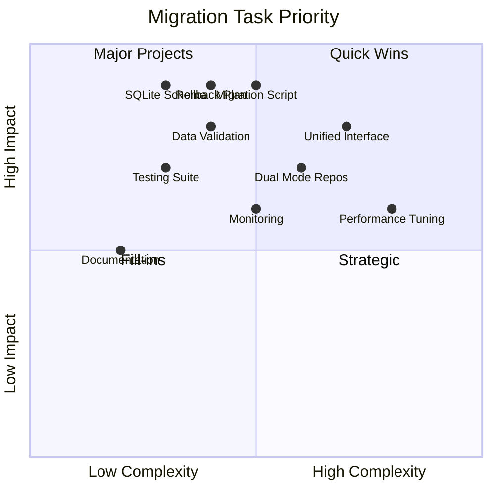
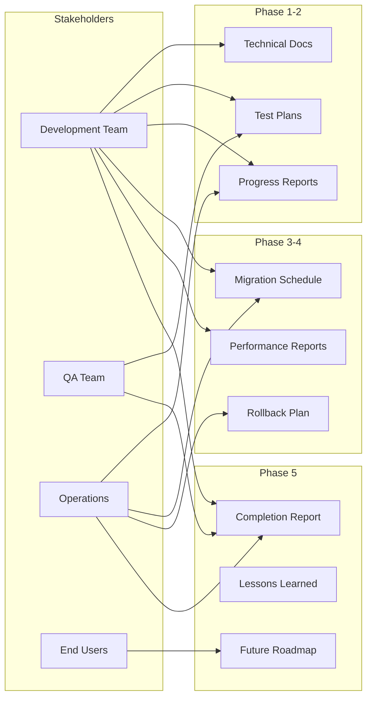
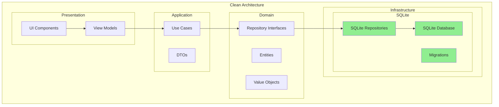

# Hive to SQLite Migration Visual Roadmap

## Migration Timeline Overview

## Migration State Flow

## Data Flow During Migration

```mermaid
flowchart TB
    subgraph "Phase 1: Hive Only"
        A1[App] --> A2[Hive Repository]
        A2 --> A3[Hive DB]
    end
    
    subgraph "Phase 2: Dual Mode Write"
        B1[App] --> B2[Dual Mode Repo]
        B2 --> B3[Hive DB]
        B2 --> B4[SQLite DB]
        B2 --> B5[Validator]
        B5 -.-> B6[Sync Log]
    end
    
    subgraph "Phase 3: Migration"
        C1[Migration Manager] --> C2[Data Transformer]
        C2 --> C3[Hive Reader]
        C2 --> C4[SQLite Writer]
        C3 --> C5[Hive DB]
        C4 --> C6[SQLite DB]
        C2 --> C7[Progress Tracker]
    end
    
    subgraph "Phase 4: SQLite Primary"
        D1[App] --> D2[Dual Mode Repo]
        D2 --> D3[SQLite DB]
        D2 -.-> D4[Hive DB]
        D2 --> D5[Monitor]
    end
    
    subgraph "Phase 5: SQLite Only"
        E1[App] --> E2[SQLite Repository]
        E2 --> E3[SQLite DB]
    end
```

## Repository Evolution

## Migration Decision Tree

## Key Migration Checkpoints

### ✅ Phase 1 Checklist
- [ ] SQLite database schema created
- [ ] SQLite repositories implemented
- [ ] All repository tests passing
- [ ] Performance benchmarks established
- [ ] Unified interface implemented

### ✅ Phase 2 Checklist
- [ ] Dual mode repositories working
- [ ] Data synchronization verified
- [ ] Validation framework operational
- [ ] No data inconsistencies detected
- [ ] Performance metrics acceptable

### ✅ Phase 3 Checklist
- [ ] Backup created successfully
- [ ] Migration script tested
- [ ] All data migrated (100%)
- [ ] Data integrity verified
- [ ] No data loss confirmed

### ✅ Phase 4 Checklist
- [ ] SQLite as primary working
- [ ] Query performance improved
- [ ] No increase in errors
- [ ] User experience unchanged
- [ ] Rollback plan ready

### ✅ Phase 5 Checklist
- [ ] Hive dependencies removed
- [ ] Code cleanup complete
- [ ] Documentation updated
- [ ] Final testing passed
- [ ] Migration archived

## Risk Mitigation Visual

## Success Metrics Dashboard

## Implementation Priority Matrix

## Communication Plan

## Post-Migration Architecture

## Conclusion

This visual roadmap provides a clear path for migrating from Hive to SQLite, with defined phases, checkpoints, and success metrics. The migration is designed to be safe, gradual, and reversible at any stage.