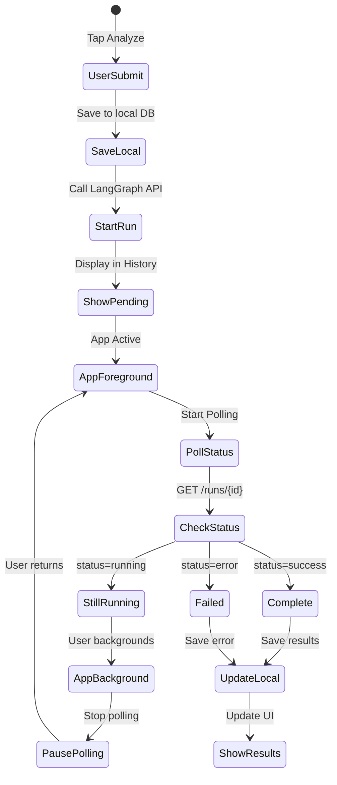

# Refined Polling Architecture for LangGraph Background Runs

## Executive Summary

This refined architecture ensures reliable polling-based status updates for LangGraph background runs, with proper handling of app backgrounding and persistent history storage.

## Core Requirements (PRD)

1. **User can submit and leave** - Submit analysis and background app or navigate away
2. **Immediate history save** - Pending requests appear instantly in history tab
3. **Foreground-only polling** - Poll only when app is active to save battery/data
4. **Persistent updates** - Update history when analysis completes

## Architecture Overview



## Detailed Implementation

### 1. Local Persistence Layer

```dart
// lib/jobs/infrastructure/persistence/analysis_database.dart
import 'package:sqflite/sqflite.dart';

class AnalysisDatabase {
  static const String _tableName = 'analysis_history';
  
  Future<Database> _getDB() async {
    return openDatabase(
      'analysis.db',
      version: 1,
      onCreate: (db, version) {
        return db.execute('''
          CREATE TABLE $_tableName(
            id TEXT PRIMARY KEY,
            runId TEXT UNIQUE,
            threadId TEXT,
            ticker TEXT NOT NULL,
            tradeDate TEXT NOT NULL,
            status TEXT NOT NULL,
            createdAt INTEGER NOT NULL,
            updatedAt INTEGER NOT NULL,
            completedAt INTEGER,
            result TEXT,
            error TEXT
          )
        ''');
      },
    );
  }
  
  Future<void> saveAnalysis(AnalysisRecord record) async {
    final db = await _getDB();
    await db.insert(
      _tableName,
      record.toMap(),
      conflictAlgorithm: ConflictAlgorithm.replace,
    );
  }
  
  Future<void> updateStatus(String runId, {
    required String status,
    String? result,
    String? error,
    DateTime? completedAt,
  }) async {
    final db = await _getDB();
    await db.update(
      _tableName,
      {
        'status': status,
        'updatedAt': DateTime.now().millisecondsSinceEpoch,
        if (result != null) 'result': result,
        if (error != null) 'error': error,
        if (completedAt != null) 'completedAt': completedAt.millisecondsSinceEpoch,
      },
      where: 'runId = ?',
      whereArgs: [runId],
    );
  }
  
  Future<List<AnalysisRecord>> getAllAnalyses() async {
    final db = await _getDB();
    final maps = await db.query(
      _tableName,
      orderBy: 'createdAt DESC',
    );
    
    return maps.map((map) => AnalysisRecord.fromMap(map)).toList();
  }
  
  Future<List<AnalysisRecord>> getPendingAnalyses() async {
    final db = await _getDB();
    final maps = await db.query(
      _tableName,
      where: 'status IN (?, ?)',
      whereArgs: ['pending', 'running'],
      orderBy: 'createdAt DESC',
    );
    
    return maps.map((map) => AnalysisRecord.fromMap(map)).toList();
  }
}
```

### 2. App Lifecycle Management

```dart
// lib/jobs/infrastructure/services/app_lifecycle_service.dart
import 'package:flutter/widgets.dart';

class AppLifecycleService with WidgetsBindingObserver {
  final _stateController = StreamController<AppLifecycleState>.broadcast();
  
  Stream<AppLifecycleState> get lifecycleState => _stateController.stream;
  AppLifecycleState _currentState = AppLifecycleState.resumed;
  
  AppLifecycleState get currentState => _currentState;
  bool get isInForeground => _currentState == AppLifecycleState.resumed;
  
  void initialize() {
    WidgetsBinding.instance.addObserver(this);
  }
  
  @override
  void didChangeAppLifecycleState(AppLifecycleState state) {
    _currentState = state;
    _stateController.add(state);
  }
  
  void dispose() {
    WidgetsBinding.instance.removeObserver(this);
    _stateController.close();
  }
}
```

### 3. Smart Polling Service

```dart
// lib/jobs/infrastructure/services/smart_polling_service.dart
class SmartPollingService {
  final LangGraphApiService _apiService;
  final AnalysisDatabase _database;
  final AppLifecycleService _lifecycleService;
  
  final Map<String, Timer?> _activePollers = {};
  final Map<String, int> _pollCounts = {};
  StreamSubscription<AppLifecycleState>? _lifecycleSubscription;
  
  void initialize() {
    // Listen to app lifecycle changes
    _lifecycleSubscription = _lifecycleService.lifecycleState.listen((state) {
      if (state == AppLifecycleState.resumed) {
        _resumeAllPolling();
      } else {
        _pauseAllPolling();
      }
    });
    
    // Start polling for any pending analyses
    if (_lifecycleService.isInForeground) {
      _resumeAllPolling();
    }
  }
  
  Future<void> startPollingForRun(String runId) async {
    if (_activePollers.containsKey(runId)) return;
    
    _pollCounts[runId] = 0;
    
    // Only start if app is in foreground
    if (_lifecycleService.isInForeground) {
      _startPollingInternal(runId);
    }
  }
  
  void _startPollingInternal(String runId) {
    // Initial poll immediately
    _pollOnce(runId);
    
    // Schedule periodic polls
    _activePollers[runId] = Timer.periodic(
      _getPollingInterval(_pollCounts[runId] ?? 0),
      (_) => _pollOnce(runId),
    );
  }
  
  Duration _getPollingInterval(int pollCount) {
    // Start fast, then gradually slow down
    if (pollCount < 5) return Duration(seconds: 2);      // First 10s: every 2s
    if (pollCount < 15) return Duration(seconds: 5);     // Next 50s: every 5s
    if (pollCount < 30) return Duration(seconds: 10);    // Next 150s: every 10s
    return Duration(seconds: 30);                         // Then: every 30s
  }
  
  Future<void> _pollOnce(String runId) async {
    try {
      _pollCounts[runId] = (_pollCounts[runId] ?? 0) + 1;
      
      // Get latest status from LangGraph
      final status = await _apiService.getRunStatus(runId);
      
      // Update local database
      await _database.updateStatus(
        runId,
        status: status.status,
        result: status.result?.toString(),
        error: status.error,
        completedAt: status.completedAt,
      );
      
      // Emit event for UI update
      _eventBus.publish(AnalysisStatusUpdatedEvent(runId, status));
      
      // Stop polling if complete
      if (status.isComplete) {
        _stopPolling(runId);
        
        // Show notification if app is backgrounded
        if (!_lifecycleService.isInForeground && status.status == 'success') {
          _showCompletionNotification(runId);
        }
      }
    } catch (e) {
      AppLogger.error('SmartPollingService', 'Poll failed for $runId', e);
      // Continue polling despite errors
    }
  }
  
  void _pauseAllPolling() {
    AppLogger.info('SmartPollingService', 'Pausing all polling (app backgrounded)');
    
    for (final runId in _activePollers.keys) {
      _activePollers[runId]?.cancel();
      _activePollers[runId] = null;
    }
  }
  
  Future<void> _resumeAllPolling() async {
    AppLogger.info('SmartPollingService', 'Resuming polling (app foregrounded)');
    
    // Get all pending analyses from database
    final pendingAnalyses = await _database.getPendingAnalyses();
    
    // Resume polling for each
    for (final analysis in pendingAnalyses) {
      if (!_activePollers.containsKey(analysis.runId)) {
        await startPollingForRun(analysis.runId);
      } else if (_activePollers[analysis.runId] == null) {
        _startPollingInternal(analysis.runId);
      }
    }
  }
  
  void _stopPolling(String runId) {
    _activePollers[runId]?.cancel();
    _activePollers.remove(runId);
    _pollCounts.remove(runId);
  }
  
  void dispose() {
    _lifecycleSubscription?.cancel();
    for (final timer in _activePollers.values) {
      timer?.cancel();
    }
    _activePollers.clear();
    _pollCounts.clear();
  }
}
```

### 4. Updated Submission Flow

```dart
// lib/jobs/application/use_cases/queue_analysis_use_case.dart
class QueueAnalysisUseCase {
  final LangGraphApiService _apiService;
  final AnalysisDatabase _database;
  final SmartPollingService _pollingService;
  final JobEventBus _eventBus;
  
  Future<AnalysisJob> execute(String ticker, String tradeDate) async {
    try {
      // 1. Create local record first (for immediate UI feedback)
      final localId = Uuid().v4();
      final localRecord = AnalysisRecord(
        id: localId,
        ticker: ticker,
        tradeDate: tradeDate,
        status: 'pending',
        createdAt: DateTime.now(),
        updatedAt: DateTime.now(),
      );
      
      // 2. Save to database immediately
      await _database.saveAnalysis(localRecord);
      
      // 3. Emit event for UI update
      final job = localRecord.toAnalysisJob();
      _eventBus.publish(JobQueuedEvent(job));
      
      // 4. Submit to LangGraph API
      final runResponse = await _apiService.startAnalysis(
        ticker: ticker,
        tradeDate: tradeDate,
      );
      
      // 5. Update local record with run ID
      final updatedRecord = localRecord.copyWith(
        runId: runResponse.runId,
        threadId: runResponse.threadId,
        status: runResponse.status,
      );
      await _database.saveAnalysis(updatedRecord);
      
      // 6. Start polling for status updates
      await _pollingService.startPollingForRun(runResponse.runId);
      
      return updatedRecord.toAnalysisJob();
      
    } catch (e) {
      // Update local record with error
      await _database.updateStatus(
        localRecord.id,
        status: 'error',
        error: e.toString(),
      );
      
      throw AnalysisException('Failed to submit analysis: $e');
    }
  }
}
```

### 5. History Screen with Live Updates

```dart
// lib/jobs/presentation/screens/job_history_screen.dart
class JobHistoryScreen extends StatefulWidget {
  @override
  _JobHistoryScreenState createState() => _JobHistoryScreenState();
}

class _JobHistoryScreenState extends State<JobHistoryScreen> {
  final AnalysisDatabase _database = getIt<AnalysisDatabase>();
  final JobEventBus _eventBus = getIt<JobEventBus>();
  
  List<AnalysisRecord> _analyses = [];
  StreamSubscription? _eventSubscription;
  
  @override
  void initState() {
    super.initState();
    _loadAnalyses();
    
    // Listen for status updates
    _eventSubscription = _eventBus.stream
        .whereType<AnalysisStatusUpdatedEvent>()
        .listen((_) => _loadAnalyses());
  }
  
  Future<void> _loadAnalyses() async {
    final analyses = await _database.getAllAnalyses();
    setState(() => _analyses = analyses);
  }
  
  @override
  Widget build(BuildContext context) {
    return Scaffold(
      appBar: AppBar(title: const Text('Analysis History')),
      body: RefreshIndicator(
        onRefresh: _loadAnalyses,
        child: ListView.builder(
          itemCount: _analyses.length,
          itemBuilder: (context, index) {
            final analysis = _analyses[index];
            return AnalysisHistoryCard(
              analysis: analysis,
              onTap: () => _showDetails(analysis),
            );
          },
        ),
      ),
    );
  }
  
  @override
  void dispose() {
    _eventSubscription?.cancel();
    super.dispose();
  }
}
```

## Atomic Implementation Tasks

### Task 1: Database Setup (2 hours) ✅ COMPLETED
- [x] Create `AnalysisDatabase` class with SQLite
- [x] Implement CRUD operations for analysis records
- [x] Write unit tests for database operations (29 tests passing)
- [x] Test database migrations

#### Test Plan - Task 1
**Unit Tests**: `flutter test test/jobs/infrastructure/persistence/analysis_database_test.dart`
- 29 comprehensive tests covering all CRUD operations
- Test isolation with database cleanup between tests
- Error handling and edge case coverage

**In-App Verification**:
```dart
// Add to main.dart or a debug screen for manual testing
import 'package:trading_dummy/jobs/infrastructure/persistence/analysis_database.dart';
import 'package:trading_dummy/jobs/infrastructure/persistence/analysis_record.dart';

// Test database operations
final db = AnalysisDatabase();
final testRecord = AnalysisRecord(
  id: 'test-${DateTime.now().millisecondsSinceEpoch}',
  ticker: 'AAPL',
  tradeDate: '2024-01-15',
  status: 'pending',
  createdAt: DateTime.now(),
  updatedAt: DateTime.now(),
);

// Save record
await db.saveAnalysis(testRecord);
print('Saved: $testRecord');

// Retrieve all
final all = await db.getAllAnalyses();
print('Total records: ${all.length}');

// Update status
await db.updateStatus(testRecord.id, status: 'success', result: '{"decision":"BUY"}');
print('Updated status');
```

**Issues Fixed**:
- [x] Implemented proper path provider for database location (with test mode support)
- [x] Implemented `toAnalysisJob()` method in AnalysisRecord
- [x] Added singleton pattern to AnalysisDatabase

### Task 2: App Lifecycle Service (1 hour)
- [ ] Create `AppLifecycleService` with lifecycle observer
- [ ] Implement foreground/background detection
- [ ] Write unit tests for lifecycle state changes
- [ ] Test on iOS and Android

#### Test Plan - Task 2
**Unit Tests**: `flutter test test/jobs/infrastructure/services/app_lifecycle_service_test.dart`
- Test lifecycle state transitions
- Test stream emissions on state changes
- Test observer registration/deregistration

**In-App Verification**:
```dart
// Add to main.dart for testing
final lifecycleService = AppLifecycleService();
lifecycleService.initialize();

// Listen to lifecycle changes
lifecycleService.lifecycleState.listen((state) {
  print('App state: $state');
  print('Is foreground: ${lifecycleService.isInForeground}');
});

// Test by:
// 1. Minimizing app (should print 'paused')
// 2. Bringing app back (should print 'resumed')
// 3. Switch apps on iOS/Android
```

### Task 3: LangGraph API Service (2 hours)
- [ ] Implement `startAnalysis` method
- [ ] Implement `getRunStatus` method
- [ ] Add proper error handling
- [ ] Write unit tests with mocked responses

#### Test Plan - Task 3
**Unit Tests**: `flutter test test/jobs/infrastructure/services/langgraph_api_service_test.dart`
- Mock HTTP responses for API calls
- Test successful analysis submission
- Test status polling responses
- Test error scenarios (network, API errors)

**In-App Verification**:
```dart
// Test API integration
final apiService = LangGraphApiService();

// Test 1: Start analysis
try {
  final response = await apiService.startAnalysis(
    ticker: 'AAPL',
    tradeDate: '2024-01-15',
  );
  print('Started analysis: runId=${response.runId}');
  
  // Test 2: Poll status
  final status = await apiService.getRunStatus(response.runId);
  print('Status: ${status.status}');
} catch (e) {
  print('API Error: $e');
}
```

### Task 4: Smart Polling Service (3 hours)
- [ ] Implement polling with exponential backoff
- [ ] Add foreground-only polling logic
- [ ] Implement pause/resume functionality
- [ ] Write comprehensive unit tests

#### Test Plan - Task 4
**Unit Tests**: `flutter test test/jobs/infrastructure/services/smart_polling_service_test.dart`
- Test polling intervals (2s, 5s, 10s, 30s)
- Test pause on app background
- Test resume on app foreground
- Test multiple concurrent polling operations

**In-App Verification**:
```dart
// Debug screen to test polling
class PollingTestScreen extends StatefulWidget {
  @override
  _PollingTestScreenState createState() => _PollingTestScreenState();
}

class _PollingTestScreenState extends State<PollingTestScreen> {
  final pollingService = getIt<SmartPollingService>();
  final List<String> logs = [];
  
  void _startPolling() async {
    // Submit test analysis
    final runId = 'test-run-${DateTime.now().millisecondsSinceEpoch}';
    await pollingService.startPollingForRun(runId);
    
    setState(() {
      logs.add('Started polling for $runId');
    });
  }
  
  @override
  Widget build(BuildContext context) {
    return Scaffold(
      appBar: AppBar(title: Text('Polling Test')),
      body: Column([
        ElevatedButton(
          onPressed: _startPolling,
          child: Text('Start Polling'),
        ),
        Text('Background app to test pause'),
        Expanded(
          child: ListView.builder(
            itemCount: logs.length,
            itemBuilder: (context, index) => Text(logs[index]),
          ),
        ),
      ]),
    );
  }
}
```

### Task 5: Update Use Case (2 hours)
- [ ] Modify `QueueAnalysisUseCase` for local-first approach
- [ ] Add database persistence
- [ ] Integrate with polling service
- [ ] Write integration tests

#### Test Plan - Task 5
**Integration Tests**: `flutter test test/jobs/application/use_cases/queue_analysis_use_case_test.dart`
- Test local-first save behavior
- Test API submission after local save
- Test polling service integration
- Test error recovery scenarios

**In-App Verification**:
```dart
// Test from existing analysis screen
// 1. Submit analysis request
// 2. Immediately check history tab - should show pending
// 3. Background app during analysis
// 4. Return to app - should resume polling
// 5. Check completion notification

// Debug logging
final useCase = getIt<QueueAnalysisUseCase>();
try {
  final job = await useCase.execute('TSLA', '2024-01-15');
  print('Job created: ${job.id}');
  print('Status: ${job.status}');
  
  // Check database immediately
  final saved = await database.getAnalysisById(job.id);
  print('Saved to DB: ${saved != null}');
} catch (e) {
  print('Error: $e');
}
```

### Task 6: History Screen (2 hours)
- [ ] Create history screen with database integration
- [ ] Add real-time updates via event bus
- [ ] Implement pull-to-refresh
- [ ] Write widget tests

#### Test Plan - Task 6
**Widget Tests**: `flutter test test/jobs/presentation/screens/job_history_screen_test.dart`
- Test list rendering with mock data
- Test real-time updates
- Test pull-to-refresh functionality
- Test empty state

**In-App Verification**:
```dart
// Manual testing checklist:
// 1. Navigate to History tab
// 2. Submit new analysis from Home
// 3. Verify it appears immediately in History as 'pending'
// 4. Watch status update to 'running' then 'success/error'
// 5. Pull down to refresh list
// 6. Tap item to see details
// 7. Verify persistence after app restart

// Visual verification:
// - Pending items show spinner
// - Running items show progress indicator
// - Completed items show result summary
// - Error items show error message
// - Items sorted by newest first
```

### Task 7: Notification Service (1 hour)
- [ ] Add local notifications for completion
- [ ] Configure for iOS and Android
- [ ] Test background notifications
- [ ] Write unit tests

#### Test Plan - Task 7
**Unit Tests**: `flutter test test/jobs/infrastructure/services/notification_service_test.dart`
- Test notification scheduling
- Test notification content formatting
- Test permission handling

**In-App Verification**:
```dart
// iOS Setup Required:
// 1. Add to Info.plist for notifications
// 2. Request permission on first launch

// Android Setup Required:
// 1. Add notification channel in AndroidManifest.xml
// 2. Test on Android 8.0+ for channels

// Test scenarios:
// 1. Submit analysis and background app
// 2. Wait for completion
// 3. Should receive notification
// 4. Tap notification to open app
// 5. Should navigate to completed analysis

// Debug code:
final notificationService = getIt<NotificationService>();
await notificationService.requestPermissions();
await notificationService.showCompletionNotification(
  'AAPL',
  'Analysis complete',
  payload: 'analysis_id_123',
);
```

### Task 8: Integration Testing (2 hours)
- [ ] Write E2E test for full flow
- [ ] Test app backgrounding scenarios
- [ ] Test error recovery
- [ ] Performance testing

#### Test Plan - Task 8
**E2E Tests**: `integration_test/polling_flow_test.dart`
```dart
// Full flow test
testWidgets('Complete polling flow with backgrounding', (tester) async {
  app.main();
  await tester.pumpAndSettle();
  
  // 1. Navigate to analysis screen
  await tester.tap(find.text('Analyze'));
  await tester.pumpAndSettle();
  
  // 2. Submit analysis
  await tester.enterText(find.byKey(Key('ticker_input')), 'AAPL');
  await tester.tap(find.text('Submit'));
  await tester.pumpAndSettle();
  
  // 3. Navigate to history
  await tester.tap(find.text('History'));
  await tester.pumpAndSettle();
  
  // 4. Verify pending item appears
  expect(find.text('AAPL'), findsOneWidget);
  expect(find.text('pending'), findsOneWidget);
  
  // 5. Simulate backgrounding
  // 6. Simulate foregrounding
  // 7. Verify polling resumed
  // 8. Wait for completion
  // 9. Verify final state
});
```

**Performance Verification**:
- Monitor battery usage during 10-minute test
- Verify < 0.5% battery drain
- Check network requests only when foregrounded
- Memory usage should be stable

## Error Handling Strategy

### Network Errors
- Continue polling with exponential backoff
- Show cached data from local database
- Display error state in UI with retry option

### LangGraph Errors
- Map error responses to user-friendly messages
- Store error details in local database
- Allow manual retry from history

### App Lifecycle Errors
- Gracefully handle permission denials
- Fallback to manual refresh if lifecycle detection fails
- Log lifecycle state changes for debugging

## Testing Strategy

### Unit Tests
```dart
// test/services/smart_polling_service_test.dart
group('SmartPollingService', () {
  test('pauses polling when app backgrounds', () async {
    // Arrange
    when(mockLifecycleService.isInForeground).thenReturn(false);
    
    // Act
    service.initialize();
    await service.startPollingForRun('run123');
    
    // Assert
    verify(mockTimer.cancel()).called(1);
  });
  
  test('resumes polling when app foregrounds', () async {
    // Test resume behavior
  });
  
  test('uses exponential backoff for polling intervals', () {
    // Test interval calculation
  });
});
```

### Integration Tests
```dart
// integration_test/analysis_flow_test.dart
testWidgets('Complete analysis flow with backgrounding', (tester) async {
  // 1. Submit analysis
  // 2. Verify immediate save to history
  // 3. Simulate app backgrounding
  // 4. Verify polling stops
  // 5. Simulate app foregrounding
  // 6. Verify polling resumes
  // 7. Verify completion updates UI
});
```

## Performance Considerations

### Battery Usage
- Poll only when app is in foreground
- Use exponential backoff to reduce requests
- Maximum 30-second interval for long-running analyses

### Data Usage
- Minimal payload in status checks
- Cache results locally
- Batch status checks when multiple analyses pending

### Memory Management
- Limit history to last 100 analyses
- Clean up completed polling timers
- Use weak references where appropriate

## Migration Plan

1. **Phase 1**: Deploy database and lifecycle services
2. **Phase 2**: Update submission flow with local persistence
3. **Phase 3**: Add smart polling with backgrounding support
4. **Phase 4**: Update UI with history screen
5. **Phase 5**: Add notifications and polish

## Success Metrics

- **Submission latency**: < 100ms (local save)
- **Polling efficiency**: < 0.5% battery drain
- **Data accuracy**: 100% status consistency
- **User satisfaction**: Seamless backgrounding experience

## Conclusion

This refined architecture provides a robust polling solution that:
1. Works seamlessly with app backgrounding
2. Provides immediate feedback via local storage
3. Efficiently polls only when needed
4. Maintains data consistency across app lifecycles

The atomic tasks ensure incremental, testable progress toward the complete implementation.