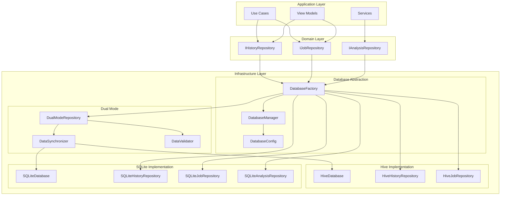

# Unified Database Interface Design

## Overview

This document details the unified database interface that will enable seamless transition from Hive to SQLite while maintaining backward compatibility and supporting dual-mode operation during migration.

## Architecture Overview



## Core Components

### 1. Database Manager

```dart
// lib/core/database/database_manager.dart
import 'package:flutter/foundation.dart';

enum DatabaseMode {
  hive,      // Use only Hive
  sqlite,    // Use only SQLite
  dual,      // Write to both, read from primary
  migration, // Special mode for data migration
}

class DatabaseManager {
  static final DatabaseManager _instance = DatabaseManager._internal();
  static DatabaseManager get instance => _instance;
  
  DatabaseManager._internal();
  
  DatabaseMode _mode = DatabaseMode.hive; // Default for backward compatibility
  DatabaseMode _primaryRead = DatabaseMode.hive;
  
  final Map<Type, dynamic> _repositories = {};
  bool _isInitialized = false;
  
  DatabaseMode get mode => _mode;
  DatabaseMode get primaryRead => _primaryRead;
  
  Future<void> initialize({
    required DatabaseMode mode,
    DatabaseMode? primaryRead,
  }) async {
    if (_isInitialized) {
      throw StateError('DatabaseManager already initialized');
    }
    
    _mode = mode;
    _primaryRead = primaryRead ?? mode;
    
    // Initialize databases based on mode
    switch (_mode) {
      case DatabaseMode.hive:
        await _initializeHive();
        break;
      case DatabaseMode.sqlite:
        await _initializeSQLite();
        break;
      case DatabaseMode.dual:
      case DatabaseMode.migration:
        await _initializeHive();
        await _initializeSQLite();
        break;
    }
    
    _isInitialized = true;
  }
  
  Future<void> switchMode(DatabaseMode newMode) async {
    if (!_isInitialized) {
      throw StateError('DatabaseManager not initialized');
    }
    
    // Validate mode transition
    _validateModeTransition(_mode, newMode);
    
    _mode = newMode;
    
    // Reinitialize repositories with new mode
    await _reinitializeRepositories();
  }
  
  T getRepository<T>() {
    if (!_repositories.containsKey(T)) {
      _repositories[T] = DatabaseFactory.createRepository<T>(_mode);
    }
    return _repositories[T] as T;
  }
  
  Future<void> close() async {
    for (final repo in _repositories.values) {
      if (repo is IDisposable) {
        await repo.dispose();
      }
    }
    _repositories.clear();
    _isInitialized = false;
  }
}
```

### 2. Database Factory

```dart
// lib/core/database/database_factory.dart
class DatabaseFactory {
  static T createRepository<T>(DatabaseMode mode) {
    switch (T) {
      case IHistoryRepository:
        return _createHistoryRepository(mode) as T;
      case IJobRepository:
        return _createJobRepository(mode) as T;
      case IAnalysisRepository:
        return _createAnalysisRepository(mode) as T;
      default:
        throw UnimplementedError('Repository type $T not implemented');
    }
  }
  
  static IHistoryRepository _createHistoryRepository(DatabaseMode mode) {
    switch (mode) {
      case DatabaseMode.hive:
        return HiveHistoryRepository();
      case DatabaseMode.sqlite:
        return SQLiteHistoryRepository();
      case DatabaseMode.dual:
        return DualModeHistoryRepository(
          primary: SQLiteHistoryRepository(),
          secondary: HiveHistoryRepository(),
          synchronizer: DataSynchronizer(),
        );
      case DatabaseMode.migration:
        return MigrationHistoryRepository(
          source: HiveHistoryRepository(),
          target: SQLiteHistoryRepository(),
        );
    }
  }
  
  static IJobRepository _createJobRepository(DatabaseMode mode) {
    switch (mode) {
      case DatabaseMode.hive:
        return HiveJobRepository();
      case DatabaseMode.sqlite:
        return SQLiteJobRepository();
      case DatabaseMode.dual:
        return DualModeJobRepository(
          primary: SQLiteJobRepository(),
          secondary: HiveJobRepository(),
          synchronizer: DataSynchronizer(),
        );
      case DatabaseMode.migration:
        return MigrationJobRepository(
          source: HiveJobRepository(),
          target: SQLiteJobRepository(),
        );
    }
  }
}
```

### 3. Dual Mode Repository

```dart
// lib/core/database/dual_mode_repository.dart
abstract class DualModeRepository<T> {
  final dynamic primary;
  final dynamic secondary;
  final DataSynchronizer synchronizer;
  final DataValidator validator = DataValidator();
  
  DualModeRepository({
    required this.primary,
    required this.secondary,
    required this.synchronizer,
  });
  
  // Write operations go to both databases
  Future<void> performWrite(Future<void> Function(dynamic repo) operation) async {
    // Write to primary first
    await operation(primary);
    
    // Write to secondary with error handling
    try {
      await operation(secondary);
    } catch (e) {
      // Log error but don't fail the operation
      AppLogger.error('DualMode', 'Secondary write failed', e);
      await synchronizer.recordSyncError(e);
    }
  }
  
  // Read operations use primary with validation
  Future<R> performRead<R>(Future<R> Function(dynamic repo) operation) async {
    final primaryResult = await operation(primary);
    
    // Validate with secondary in background
    _validateInBackground(operation, primaryResult);
    
    return primaryResult;
  }
  
  void _validateInBackground<R>(
    Future<R> Function(dynamic repo) operation,
    R primaryResult,
  ) {
    Future.microtask(() async {
      try {
        final secondaryResult = await operation(secondary);
        final isValid = await validator.compareResults(primaryResult, secondaryResult);
        
        if (!isValid) {
          await synchronizer.recordValidationError(
            primary: primaryResult,
            secondary: secondaryResult,
          );
        }
      } catch (e) {
        AppLogger.error('DualMode', 'Validation failed', e);
      }
    });
  }
}

// Example implementation for History Repository
class DualModeHistoryRepository extends DualModeRepository<HistoryEntry> 
    implements IHistoryRepository {
  DualModeHistoryRepository({
    required IHistoryRepository primary,
    required IHistoryRepository secondary,
    required DataSynchronizer synchronizer,
  }) : super(primary: primary, secondary: secondary, synchronizer: synchronizer);
  
  @override
  Future<void> save(HistoryEntry entry) async {
    await performWrite((repo) => repo.save(entry));
  }
  
  @override
  Future<List<HistoryEntry>> getAll() async {
    return performRead((repo) => repo.getAll());
  }
  
  @override
  Future<HistoryEntry?> getById(String id) async {
    return performRead((repo) => repo.getById(id));
  }
  
  @override
  Future<List<HistoryEntry>> getByTicker(String ticker) async {
    return performRead((repo) => repo.getByTicker(ticker));
  }
  
  @override
  Future<void> delete(String id) async {
    await performWrite((repo) => repo.delete(id));
  }
  
  @override
  Future<void> clear() async {
    await performWrite((repo) => repo.clear());
  }
}
```

### 4. SQLite Database Implementation

```dart
// lib/core/database/sqlite/sqlite_database.dart
import 'package:sqflite/sqflite.dart';
import 'package:path/path.dart';

class SQLiteDatabase {
  static final SQLiteDatabase _instance = SQLiteDatabase._internal();
  static SQLiteDatabase get instance => _instance;
  
  SQLiteDatabase._internal();
  
  Database? _database;
  
  Future<Database> get database async {
    if (_database != null) return _database!;
    _database = await _initDatabase();
    return _database!;
  }
  
  Future<Database> _initDatabase() async {
    final dbPath = await getDatabasesPath();
    final path = join(dbPath, 'trading_dummy.db');
    
    return await openDatabase(
      path,
      version: 1,
      onCreate: _onCreate,
      onUpgrade: _onUpgrade,
      onConfigure: _onConfigure,
    );
  }
  
  Future<void> _onConfigure(Database db) async {
    // Enable foreign keys
    await db.execute('PRAGMA foreign_keys = ON');
  }
  
  Future<void> _onCreate(Database db, int version) async {
    // Create history tables
    await db.execute('''
      CREATE TABLE history_entries (
        id TEXT PRIMARY KEY,
        ticker TEXT NOT NULL,
        trade_date TEXT NOT NULL,
        timestamp INTEGER NOT NULL,
        final_decision TEXT NOT NULL,
        confidence REAL,
        summary TEXT NOT NULL,
        is_error INTEGER NOT NULL DEFAULT 0,
        error_message TEXT,
        created_at INTEGER NOT NULL,
        updated_at INTEGER NOT NULL
      )
    ''');
    
    await db.execute('''
      CREATE TABLE analysis_details (
        id TEXT PRIMARY KEY,
        history_entry_id TEXT NOT NULL,
        market_analysis TEXT,
        fundamentals TEXT,
        sentiment TEXT,
        news_analysis TEXT,
        bull_argument TEXT,
        bear_argument TEXT,
        investment_plan TEXT,
        raw_data TEXT,
        FOREIGN KEY (history_entry_id) REFERENCES history_entries(id) ON DELETE CASCADE
      )
    ''');
    
    // Create jobs table
    await db.execute('''
      CREATE TABLE analysis_jobs (
        id TEXT PRIMARY KEY,
        ticker TEXT NOT NULL,
        trade_date TEXT NOT NULL,
        status INTEGER NOT NULL,
        priority INTEGER NOT NULL,
        created_at INTEGER NOT NULL,
        started_at INTEGER,
        completed_at INTEGER,
        result_id TEXT,
        error_message TEXT,
        retry_count INTEGER NOT NULL DEFAULT 0,
        max_retries INTEGER NOT NULL DEFAULT 3,
        updated_at INTEGER NOT NULL
      )
    ''');
    
    // Create indexes
    await _createIndexes(db);
  }
  
  Future<void> _createIndexes(Database db) async {
    await db.execute('CREATE INDEX idx_history_ticker ON history_entries(ticker)');
    await db.execute('CREATE INDEX idx_history_timestamp ON history_entries(timestamp DESC)');
    await db.execute('CREATE INDEX idx_jobs_status ON analysis_jobs(status)');
    await db.execute('CREATE INDEX idx_jobs_priority_created ON analysis_jobs(priority DESC, created_at ASC)');
    await db.execute('CREATE INDEX idx_jobs_ticker ON analysis_jobs(ticker)');
  }
  
  Future<void> _onUpgrade(Database db, int oldVersion, int newVersion) async {
    // Handle database migrations
    if (oldVersion < 2) {
      // Example migration
      // await db.execute('ALTER TABLE history_entries ADD COLUMN new_field TEXT');
    }
  }
  
  Future<void> close() async {
    final db = _database;
    if (db != null && db.isOpen) {
      await db.close();
      _database = null;
    }
  }
}
```

### 5. Configuration Management

```dart
// lib/core/database/database_config.dart
import 'package:shared_preferences/shared_preferences.dart';

class DatabaseConfig {
  static const String _modeKey = 'database_mode';
  static const String _migrationStatusKey = 'migration_status';
  
  static Future<DatabaseMode> getMode() async {
    final prefs = await SharedPreferences.getInstance();
    final modeString = prefs.getString(_modeKey) ?? 'hive';
    
    return DatabaseMode.values.firstWhere(
      (mode) => mode.toString().split('.').last == modeString,
      orElse: () => DatabaseMode.hive,
    );
  }
  
  static Future<void> setMode(DatabaseMode mode) async {
    final prefs = await SharedPreferences.getInstance();
    await prefs.setString(_modeKey, mode.toString().split('.').last);
  }
  
  static Future<MigrationStatus> getMigrationStatus() async {
    final prefs = await SharedPreferences.getInstance();
    final statusString = prefs.getString(_migrationStatusKey);
    
    if (statusString == null) return MigrationStatus.notStarted;
    
    return MigrationStatus.values.firstWhere(
      (status) => status.toString() == statusString,
      orElse: () => MigrationStatus.notStarted,
    );
  }
  
  static Future<void> setMigrationStatus(MigrationStatus status) async {
    final prefs = await SharedPreferences.getInstance();
    await prefs.setString(_migrationStatusKey, status.toString());
  }
}

enum MigrationStatus {
  notStarted,
  inProgress,
  completed,
  failed,
  rolledBack,
}
```

## Usage Examples

### Application Initialization

```dart
// lib/main.dart
void main() async {
  WidgetsFlutterBinding.ensureInitialized();
  
  // Load database configuration
  final dbMode = await DatabaseConfig.getMode();
  
  // Initialize database manager
  await DatabaseManager.instance.initialize(
    mode: dbMode,
    primaryRead: dbMode == DatabaseMode.dual ? DatabaseMode.sqlite : null,
  );
  
  // Rest of initialization...
  runApp(MyApp());
}
```

### Repository Usage

```dart
// lib/history/application/use_cases/save_history_use_case.dart
class SaveHistoryUseCase {
  final IHistoryRepository _repository;
  
  SaveHistoryUseCase() 
    : _repository = DatabaseManager.instance.getRepository<IHistoryRepository>();
  
  Future<void> execute(HistoryEntry entry) async {
    // Repository implementation is abstracted
    // Works with Hive, SQLite, or Dual mode transparently
    await _repository.save(entry);
  }
}
```

### Migration Execution

```dart
// lib/migration/migration_command.dart
class MigrationCommand {
  Future<void> executeMigration() async {
    // 1. Switch to migration mode
    await DatabaseManager.instance.switchMode(DatabaseMode.migration);
    
    // 2. Run migration
    final migrator = DatabaseMigrator();
    final result = await migrator.migrate();
    
    // 3. Switch to dual mode for validation
    if (result.success) {
      await DatabaseManager.instance.switchMode(DatabaseMode.dual);
      await DatabaseConfig.setMigrationStatus(MigrationStatus.completed);
    } else {
      // Rollback on failure
      await DatabaseManager.instance.switchMode(DatabaseMode.hive);
      await DatabaseConfig.setMigrationStatus(MigrationStatus.failed);
    }
  }
}
```

## Benefits

1. **Seamless Migration**: Switch between databases without code changes
2. **Zero Downtime**: Dual mode allows gradual migration
3. **Validation**: Automatic data consistency checks
4. **Rollback Support**: Easy rollback to Hive if needed
5. **Future Proof**: Easy to add new database implementations

## Testing Support

```dart
// test/helpers/database_test_helper.dart
class DatabaseTestHelper {
  static Future<void> setupTestDatabase({
    DatabaseMode mode = DatabaseMode.sqlite,
    bool inMemory = true,
  }) async {
    TestWidgetsFlutterBinding.ensureInitialized();
    
    if (mode == DatabaseMode.hive) {
      final tempDir = await Directory.systemTemp.createTemp('test_hive_');
      Hive.init(tempDir.path);
      // Register adapters...
    }
    
    await DatabaseManager.instance.initialize(mode: mode);
  }
  
  static Future<void> tearDown() async {
    await DatabaseManager.instance.close();
    // Clean up test data...
  }
}
```

## Conclusion

This unified database interface provides a robust foundation for migrating from Hive to SQLite while maintaining application stability and data integrity throughout the transition.