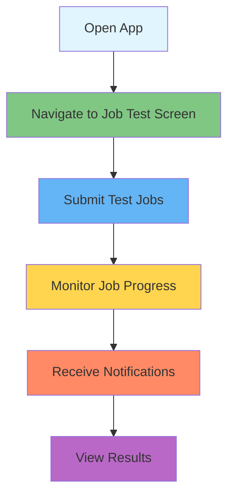

# 🧪 Async Jobs Testing Guide - Visual Documentation

## 📊 Testing Overview

This guide provides a comprehensive visual approach to testing the async jobs system in the Trading Dummy app. The system allows you to submit stock analysis jobs that run in the background, with notifications when they complete.

## 🎯 Quick Start - Visual Testing Flow



## 🚀 Method 1: In-App Testing Interface

### Accessing the Test Screen

The app includes a built-in `JobTestScreen` specifically designed for testing async jobs:

```dart
// Navigate to the test screen from your app
Navigator.push(
  context,
  MaterialPageRoute(builder: (_) => const JobTestScreen()),
);
```

### Visual Layout of Test Screen

```
┌─────────────────────────────────────────┐
│  Job System Test              [↻ Refresh]│
├─────────────────────────────────────────┤
│ 🧪 Phase 7 UI Testing                   │
│ Test all Phase 7 UI components...       │
├─────────────────────────────────────────┤
│ 1. Job Submission Widget                │
│ ┌─────────────────────────────────────┐ │
│ │ Ticker: [_______]                   │ │
│ │ Trade Date: [2024-01-20]            │ │
│ │ Priority: [Normal ▼]                │ │
│ │         [Submit Analysis]           │ │
│ └─────────────────────────────────────┘ │
├─────────────────────────────────────────┤
│ 2. Active Jobs List                     │
│ ┌─────────────────────────────────────┐ │
│ │ 🟡 AAPL - Running (High Priority)   │ │
│ │ 🟢 TSLA - Queued (Normal)           │ │
│ │ 🔴 GOOGL - Failed (Critical)        │ │
│ └─────────────────────────────────────┘ │
├─────────────────────────────────────────┤
│ 3. Quick Test Actions                   │
│ [Submit AAPL] [Submit TSLA High]        │
│ [Submit GOOGL Critical] [Clear Error]   │
├─────────────────────────────────────────┤
│ System Status                           │
│ Active Jobs: 3                          │
│ Completed Jobs: 5                       │
│ Failed Jobs: 1                          │
│ Total Jobs: 9                           │
└─────────────────────────────────────────┘
```

## 📱 Method 2: Step-by-Step Manual Testing

### Step 1: Submit a Job

```dart
// Tap the quick action buttons or use the submission widget
// Each button submits a job with different priorities:

[Submit AAPL Job] → Normal Priority
[Submit TSLA High Priority] → High Priority  
[Submit GOOGL Critical] → Critical Priority
```

### Step 2: Monitor Job States

The jobs will transition through these visual states:

```
🟡 Pending → 🔵 Queued → 🟢 Running → ✅ Completed
                                    ↘
                                     ❌ Failed → 🔄 Retry
```

### Step 3: Job Priority Visual Indicators

```
🔴 Critical - Red (Highest)
🟠 High     - Orange
🟡 Normal   - Yellow
🟢 Low      - Green (Lowest)
```

## 🧪 Method 3: Automated Testing

### Running Unit Tests

```bash
# Test all job components
flutter test test/jobs/

# Test specific phases
flutter test test/jobs/domain/          # Phase 1
flutter test test/jobs/infrastructure/  # Phase 2-3
flutter test test/jobs/application/     # Phase 4
flutter test test/jobs/presentation/    # Phase 6-7
```

### Running Integration Tests

```bash
# Full E2E test suite
flutter test integration_test/jobs_e2e_test.dart

# Performance tests
flutter test test/jobs/performance/
```

## 📊 Visual Test Scenarios

### Scenario 1: Basic Job Submission

```
User Action                System Response
─────────────────────────────────────────────
1. Enter "AAPL"      →    Validate input ✓
2. Select date       →    Default to today
3. Choose priority   →    Show priority options
4. Tap Submit        →    Create job
                          Show "Job submitted" toast
                          Add to active jobs list
```

### Scenario 2: Concurrent Jobs

```
Time    Action              Active Jobs View
────────────────────────────────────────────
0:00    Submit AAPL    →   [🟡 AAPL - Pending]
0:01    Submit TSLA    →   [🟢 AAPL - Running]
                           [🟡 TSLA - Queued]
0:02    Submit GOOGL   →   [🟢 AAPL - Running]
                           [🟢 TSLA - Running]
                           [🟡 GOOGL - Queued]
0:05    AAPL done      →   [🟢 TSLA - Running]
                           [🟢 GOOGL - Running]
                           ✅ Notification: "AAPL Complete"
```

### Scenario 3: Error Handling & Retry

```
Job Lifecycle with Retry
────────────────────────
1. 🟢 Running
2. ❌ Failed (Network Error)
3. ⏳ Waiting 30s (Retry 1/3)
4. 🔄 Retrying
5. ❌ Failed Again
6. ⏳ Waiting 90s (Retry 2/3)
7. 🔄 Retrying
8. ✅ Success!
```

## 🔔 Notification Testing

### Visual Notification Flow

```
Job Status          Notification Type
─────────────────────────────────────
✅ Completed   →   "📊 Analysis Complete: AAPL"
                   "Tap to view results"

❌ Failed      →   "⚠️ Analysis Failed: TSLA"
                   "Network error - Retrying..."

🔄 Retrying    →   "🔄 Retrying Analysis: GOOGL"
                   "Attempt 2 of 3"
```

## 🎮 Interactive Testing Features

### 1. Real-Time Status Dashboard

The test screen provides live updates:

```
┌─── System Status ─────────────┐
│ Active Jobs: 3    [====----]  │
│ Completed: 5      [========]  │
│ Failed: 1         [=---------] │
│ Total: 9                      │
│ Loading: No                   │
│ Displayed Jobs: 9            │
│ Sort: createdAtDesc          │
└──────────────────────────────┘
```

### 2. Job Action Buttons

Each job card provides interactive actions:

```
┌─── AAPL Analysis ─────────────┐
│ Status: 🟢 Running            │
│ Priority: High                │
│ Started: 2 min ago            │
│                               │
│ [View Details] [Cancel Job]   │
└──────────────────────────────┘
```

## 🧮 Performance Testing Visualization

### Load Test Visualization

```
Jobs/Second Over Time
─────────────────────
100 |    ╱╲
 75 |   ╱  ╲    ╱╲
 50 |  ╱    ╲  ╱  ╲
 25 | ╱      ╲╱    ╲___
  0 |__________________|
    0   5   10  15  20s

Burst: 100 jobs in 1s ✓
Sustained: 5 jobs/s for 10s ✓
```

### Memory Usage Graph

```
Memory (MB)
──────────
100 |         ___
 75 |      __╱   ╲___
 50 |   __╱          ╲___
 25 |__╱                 ╲__
  0 |______________________|
    0   50  100  150  200 jobs

Avg per job: <2KB ✓
No memory leaks ✓
```

## 📋 Testing Checklist

### Manual Testing Checklist

- [ ] **Job Submission**
  - [ ] Submit with all priority levels
  - [ ] Submit multiple jobs quickly
  - [ ] Try invalid inputs (empty ticker)
  
- [ ] **Job Monitoring**
  - [ ] Watch status transitions
  - [ ] Verify priority ordering
  - [ ] Check real-time updates
  
- [ ] **Notifications**
  - [ ] Receive completion notification
  - [ ] Receive failure notification
  - [ ] Tap notification to view details
  
- [ ] **Error Scenarios**
  - [ ] Force a job failure
  - [ ] Verify retry behavior
  - [ ] Check retry delays increase
  
- [ ] **Performance**
  - [ ] Submit 10+ jobs rapidly
  - [ ] Monitor system responsiveness
  - [ ] Check memory usage

### Automated Test Commands

```bash
# Quick validation
flutter test test/jobs/domain/entities/
flutter test test/jobs/infrastructure/repositories/
flutter test test/jobs/presentation/widgets/

# Full test suite
flutter test

# With coverage
flutter test --coverage
genhtml coverage/lcov.info -o coverage/html
open coverage/html/index.html
```

## 🎯 Expected Results

### Success Indicators

✅ **Visual Confirmation**
- Jobs appear in active list immediately
- Status badges update in real-time
- Notifications appear within 5 seconds of completion

✅ **Performance Metrics**
- Job submission: <100ms
- Status updates: Real-time
- Memory per job: <2KB
- Concurrent jobs: 50+

✅ **Error Handling**
- Failed jobs show error message
- Retry attempts visible
- Exponential backoff working

## 🚨 Troubleshooting

### Common Issues & Solutions

| Issue | Visual Indicator | Solution |
|-------|-----------------|----------|
| Jobs stuck in pending | 🟡 Status never changes | Check isolate initialization |
| No notifications | No popup after completion | Verify notification permissions |
| High memory usage | App becomes sluggish | Check for job cleanup |
| Jobs disappearing | List suddenly empty | Check event bus connection |

## 📱 Platform-Specific Testing

### iOS Testing
```
1. Enable notifications in Settings
2. Background app refresh must be ON
3. Test with app in background
```

### Android Testing
```
1. Grant notification permission
2. Disable battery optimization
3. Test with Doze mode
```

## 🎓 Summary

The async jobs system provides multiple ways to test:

1. **Visual Testing** - Use the built-in JobTestScreen
2. **Manual Testing** - Follow the step-by-step scenarios
3. **Automated Testing** - Run the comprehensive test suite

The visual indicators and real-time updates make it easy to verify that the system is working correctly. Use the quick action buttons for rapid testing, and monitor the system status dashboard for overall health.

Remember: The best test is seeing those green checkmarks (✅) and receiving notifications for your completed analyses!